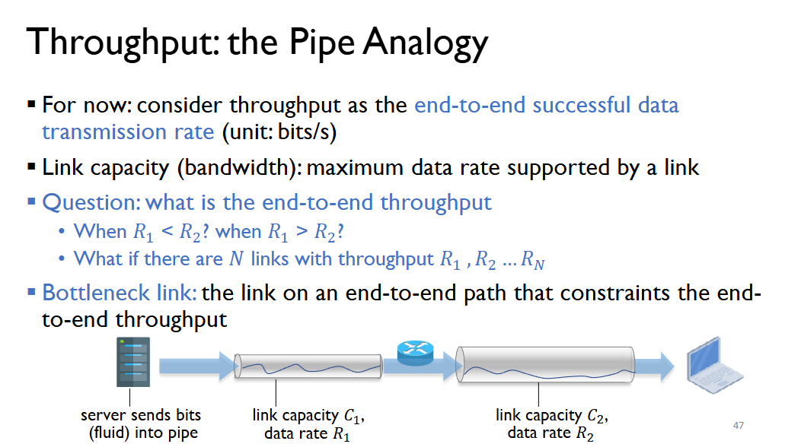
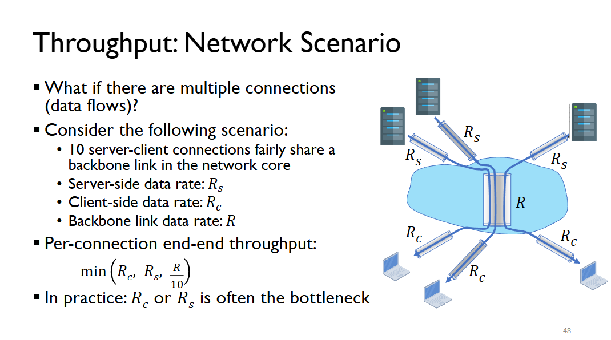
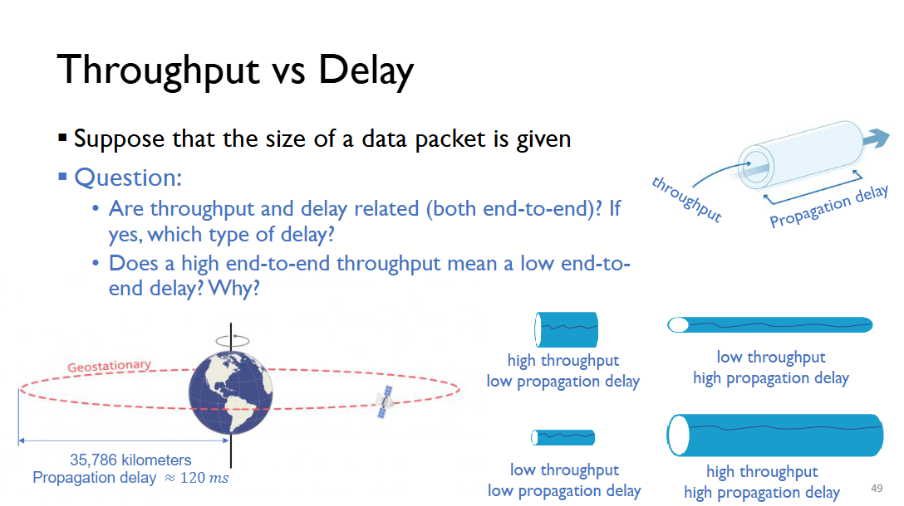

# Network Performance

## Packet Delay 
- Packet travels from source to destination via intermediate nodes
- Packet suffers from several types of delays at *each node* along the path
  - Delay: waiting time (rough understanding)

Types of delays:

1. Processing Delay 
2. Queuing Delay  
3. Transmission Delay 
4. Propagation Delay

----
## Processing Delay (Typically Microseconds (10-6s))
Time required for the router to:
- Examing the packet header 
- Detemrine where to forward the packet
- Check for errors in the packet

----
## Queueing Delay (Typically Microseconds (10-6s) to Milliseconds (10-3s))
Time a pakcet waits to be transmitted onto the outbound link.

A cause for this can be other packets at the same node.
- Outbound link may be busy sending other packets
- Empty Queue: 0 queuing delay
- Long Queue: large queueing delay 

### Cases 
Suppose that in every second:
- x new packets arrive at a node; max y packets forwarded through outbound links

Roughly 3 cases:
- x << y: average queuing delay, small
- x ≈ y: average queuing delay can be small or large 
- x > y: queuing delay is indefinite
----
## Transmission Delay (Typically Microseconds (10-6s) to Milliseconds (10-3s))
Time required to push all bits of the packet into a link
- From transmission of the first bit to transmission of the last bit
- Equal to packet length (bits) / transmission rate (bits/s)
----
## Propagation Delay 
Time required for each bit to propagate to the next node
- Equal to distance (length of link) / propagation speed 
- Propagation link depends on the physical medium of the link 
----
## Packet Loss
A router has limited buffer (queueing capacity) so when that buffer is full, a router will proceed to drop any new arriving packets making them considered as lost.

Certain protocols may include mechanisms for the retransmission of lost packets.

----
## Throughput
Relates to the rate of successful data transmission over a link.
- Unit: bits (unless stated otherwise)
- Instantaneous throughput: rate at a given point in time
- Average throughput: rate over a longer period of time. 
----

