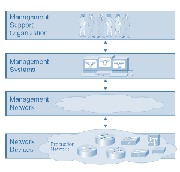
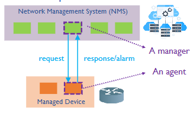
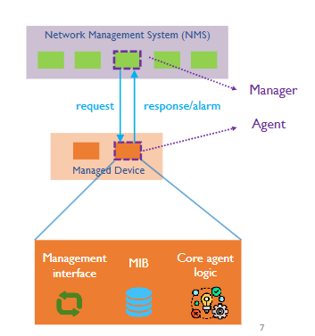
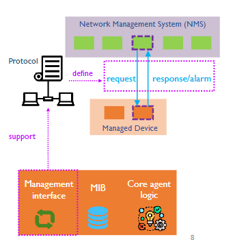
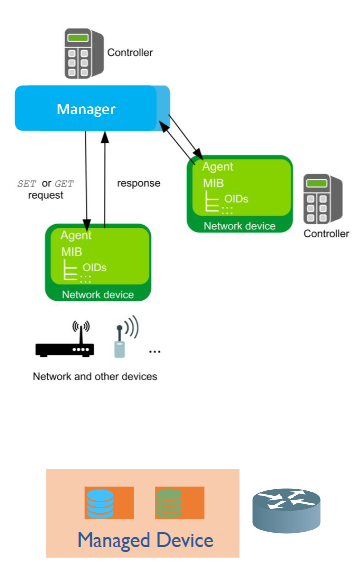
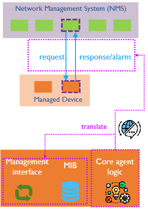
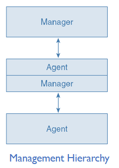
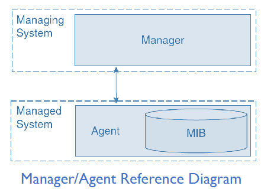
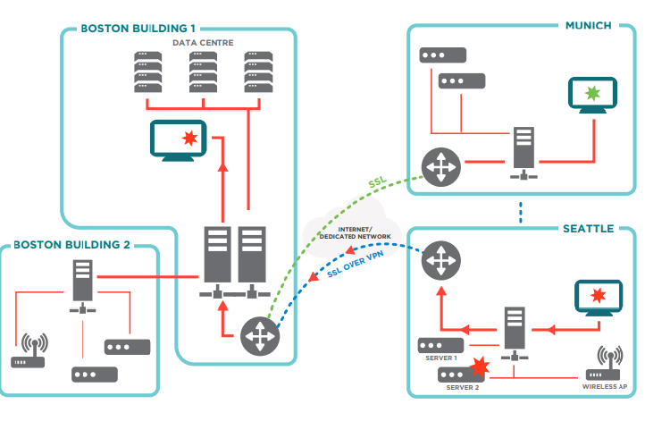

# Lecture 4

----

## Network Management Components

- Network devices
	- Managed devices/network elements
- Network management system (NMS)
	- An integrated set of tools for management 
- Management network 
	- Interconnecting managing and managed entities 
- Management support organization
	- Running the network using the management technologies

	
---- 

## Key Concept - "Manager" & "Agent"

- Network management system (NMS) includes *management applications*
	- Each management application is a manager 
	- An NMS can involve multiple managers
		
- Network devices come with software component that implements a management interface.
	- These components would be knowwn as an *agent*
	- Network devices can have multiple agents for different management functions (i.e reading data, configuring, etc.)
- Manager - agent communication
	- Manager is in charge
	- Agent plays a support role

	
---- 

## Network Devices 

- Also called network elements that includes the following:
	1. Switches
	2. Routers
	3. Gateways
	4. Can potentially include network operated servers.
		
- MUST HAVE a *management interface*
	- Allowing the management system to send messages to a device (request to configure, retrieve status data)
	- Allowing a device to send messages to the management system (response to request, unexpected event alarm, etc.)
		
----

## Components of Agent

### Agent

The software that implements the management interface for that device. This device *IS NOT* a network device, However, it represents the device when communicating with a management application (manager)

Conceptually an agent consists of three main parts:

1. Management interface
2. Management Information Base (MIB)
3. Core agent logic.
	

### Agent Part 1 - Management interface

The management interface handles management communications by *supporting a management protocol* (Rules of communication) for manager-agent communication.

With the management interface:

- Management application (manager) can *open or terminate a management session* with the Agent
- Manager can make *management requests* to the agent (requests for data, change configuration, etc.)
- The *agent can send messages* to the manager (alert of loss of communication with another device for example.)
	

----

## Management Information

An agent has a management information base (MIB)

Management information provides an *abstraction of real-world aspects of devices* for management purposes such as:

1. Version of installed software
2. Utilization of ports
3. Device temperature, voltage
4. Protocol timeout parameters
5. Firewall rules
	
----

## Agent Part 2 - MIB

MIB is a *conceptual data store* that contains a management view of the device being managed.

- Conceptual data stored in MIB - management information 
- Agent MIB - information local to the device
- Manager MIB - information of all managed devices
	
*THE MIB IS NOT A REAL DATABASE*

- An agent MIB is a "virtual" database containing management infromation - just a way to view nad organize information.
	
EXAMPLE OF MIB:

- Ports of a router represented as a table in an imaginary database
- Each port having a corresponding entry in the table
- Columns contain conceptual attributes corresponding to actual porperties of the port.

*If a device has multiple agents, each agent could have a different MIB - different views and abstraction of information*

MIB provides a foundation for network management operations

- Management operations are based on management communications
- Management communications are about exchaning information 

----

## Agent Part 3 - Core Agent logic

The core agent logic *translates* between the operation of the management interface, the MIB, and the actual device.
	
EXAMPLE:

1. Manager sends a request to "retrieve a counter" into an Agent
2. The core agent logic *receives the request through the management interface*
3. Core agent logic *checks MIB* for the referred counter.
4. Core agent logic translates the request into an operation that reads out the corresponding hardware register of the device.
	

---- 

## Managed Object vs. Real Resource

*A managed object (MO) is a chunk of management infromation* that represents one of the real-world aspects of a network device.

An MO could represent:

1. Device fan along with its operational state
2. Port along with a set of statistical data
3. Firewall rule
	
The *real-world object* that an MO represents is generally referred to as the "real resource"
- Same real resource can be abstracted in different ways corresponding to different and possibly coexisting MOs
	
> Q: can you give an analogy of different abstractions of the same object?
> 
> A person's title will change depending on who you ask with each title representing a different abstraction of the same object

---- 

## Network Management System (NMS)

- NMS provides the tools to manage a network including the following:
	- Network monitoring application & network analyzers
	- Service Provisioning systems
	- Device management applications
	- Intrusion Detection systems

----

## Distributed Network Management

An NMS is not always on one host

*Distributed network management*:
	- NMS runs on and is distributed across several hosts.
	
- Benefits of distributed management:
	1. Scalable: more hosts = greater processing, I/O and storage capacity.
	2. Robust: if one fails, NMS can still be running 
	3. Delay and overhead: managing from location close to a local network (similar to cloud vs. edge computing.)
	
----

## Management Proxy and Hierarchy

Proxy: Node acting on behalf of other nodes

A network device may act as a management proxy to another.
	- Plays the agent role in interacting with the management system.
	- Plays the manager role in interacting with another device.

This eventually forms a *management hierarchy* and the entity in the middle does not have to be a device.
	- possible a sub- or local management system.
	

---- 

## Manager - Agent - MIB Relationship

- Fundamental relationship among manager, agent, and MIB
- The manager operates on the abstraction of the agent provided through the agent's MIB:
	- Sends requests to the Agent
	- Receives responses from the Agent
	- Asks the agent to be notified of events
	
Agent: proxy for managed device
NMS: proxy for the real-world organization responsible for managing the network.

----

## Concept of Management Network 

Managers and agents need to communicate and NMS on different hosts need to be able to communicate with each other.

- Management network: the network interconnecting NMS and managed devices
- Production networks: the network providing services to the end user.
- Management and production networks can be physically separate networks or the same physical network.

----

## Connecting NMS to Network Devices

Network devices can be connected with/without a management Network and here are the following methods to do so:

1. Direct connections
	- Network devices have a management/console port (typically a serial interface)
	- A technician can directly connect a craft terminal to a device.

Issues: 
	- Needs on-site physical access to the device
	- Impractical to go from device to device in a large scale network.
	
2. Connecting through a terminal servers
	- Terminal server will have a set of serial interface ports, each connecting with one network device and a port for the craft terminal to connect to.

Issues:
	- Still needs on-site physical access to the terminal server 
	- Would also still need to go between terminal servers
	
3. Terminal server with Ethernet port and IP address
	- On-site connection to teh terminal server no longer needed
	- preliminary management Network

Issues: 
	- Keeping track of which devices are connected to what terminal server and their respective ports.
	
4. Connecting to network devices through regular Ethernet ports(In-band Management Network)
	- Skips the need for terminal servers
	- Connects to network devices using regular Ethernet ports and IP address.
	
> In-band management network
>
> Same network infrastructure and port for management and production networks (mixing network management data traffic and production data traffic

5. Connecting to network devices through management Ethernet ports (out-of-band Management Network)
	- Also skips terminal servers
	- Connects to network device using Ethernet ports and IP addresses dedicated to network management purposes.

>Out-of-band Management network
>
>Different ports for management and production networks (separating management data traffic from production data traffic.

----

## In-band vs Out-of-band Management Network

- In-band: *same network* shared by production and management traffic
- Out-of-band: *dedicated* management network 

----

## Dedicated Management Network: Pros & Cons 

To determine whether management networks are beneficial, we would need to look at the trade offs.

Which (dedicated or shared management network is better in:
- Reliability: 
	- Out-of-band because it removes the possibility of having a highly congested production traffic flow from losing management traffic which is necessary to manage production traffic in the first place.
- Quality of service (QoS) for production traffic:
	- Out-of-band works especially considering that management traffic is quite unpredictable since sometimes it will have a higher traffic rate than normal which would potentially interrupst production traffic flow.
- Ease of network planning:
	- Out-of-band: It enables us to separate the planning for how management and production traffic would go around.
	- However it is also fair to consider in-band management because it simplifies the entire process because you would have less factors to consider overall.
- Security:
	- Out-of-band: prevents unauthorized access from making changes on the management side which can potentially cause the entire network to go down.
- Cost:
	- In-band would be cheaper to implement as less time and effort would be needed in setting up the entire network infrastructure since it will all be bundled together.
		
----

## the Non-Technical aspects

*Organizational aspect* of network management:
	- Management support organization
	- Important to telecommunications service providers and large enterprises
	- Smaller businesses may not have a management support organization (but just one network administrator.
	
For large networks: *network operation center (NOC)* 