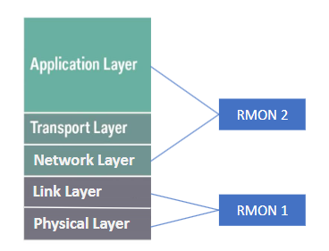
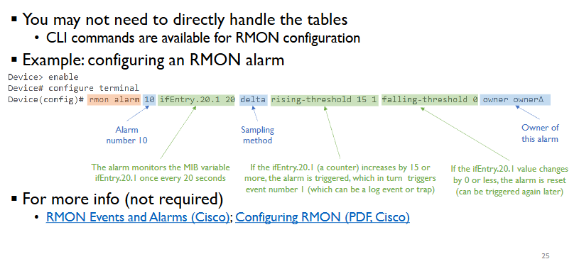

# Remote Monitoring (RMON)

## What is RMON?

the basic idea is that RMON is a monitoring service that works by remotely monitoring a local-area network using a probe in order to:
- Detect traffic congestion, exccessive packet dropping/collisions etc.
- **Probe**: Gather/analyze data, sent data/analysis result to a remote network management system

Components to implement the idea:
- **Monitoring device** - the physical probe itself
- **Software** - probe agent supporitng monitoring functions
- **MIB objects** - target infromation in remote monitoring

Narrow-sense definition of RMON:
- **Extension of SNMP** to enable detailed monitoring of network statistics
- A module in MIB-2

### RMON in Standards
RMON I: RFC 2819
- Remote Network Monitoring Management Information Base

RMON 2: RFC 4502
- Remote Network Monitoring Management Information Base V2

### RMON Probes - Physical Device 

One RMON probe for a monitored TCP/IP subnet

The physical device of RMON probe has 2 possibilities:
1. **Dedicated RMON Probes** - stand-alone devices just for RMON
2. **Embedded RMON Probes** - existing network devices that support RMON via add-on software or hardware modules

### REMON Probes - RMON Agent & MIB Module

- An RMON probe also consists of:
  - **RMON agent** for collecting an communciating infromation to a management application
  - **RMON MIB module** for defining the managed objects to be monitored
- An RMON probe may have more than one physical interfaces - possibly connected to multiple subnets.

### Role of the RMON Probe
- A probe can collect/produce data on:
  - Error statistics: the number of collisions on the MAC layer
  - Performance statistics: the number of packets delivered per second, packet size distribution, etc.
- A probe can **store packets** for traffic trend monitoring or late ron analysis
-  A probe can **filter packet**
   -  based on packet type or characteristics
-  A probe **communicates** with remote network management systems

### RMON (probe) Goals

- **Offline operation**
  - Continuously collect data even when not connected or communicatig with a management applcation
- **Proactive monitoring + problem detection/reporting** 
  - Continuously run diagnostics and log network performance
  - Recognize error conditions and continously check for errors
- **Value added data** 
  - Analyze collected data to show th ehosts generating most traffic/errors
- **Multiple managers**
  - Deal with more than one manager concurrently

### RMON Scope

RMON 1: physical-layer and data-link layer monitoring

RMON 2: extends RMON 1, add network--layer to application-layer montioring

----

# RMON 1

### RMON 1 MIB Module

- Arranged into 9 grous (child nodes)
  - **Statistics** group: statistics measure by the probe for each monitored interface
  - **History** group: records periodical statistical sampling of data
  - **Alarm** group: compares samples to thresholds, generate alarms when thresholds crossed.
  - **Host** group: statistics associated with each host discovered on the network 
  - **HostTopN** group: for describing the hosts that top a list according to some metric
  - **Matrix** group: recorindg statistics for communications between pairs of hosts, such as source/destination addresses, and the number of packets sent/received.
  - **Filter** group: controls which kind of packets to capture 
  - **Capture** group: for capturing packets and configuring capture buffer sizes.
  - **Event** group: controls the generation and notification of events (traps)

### Tables in RMON 
**Functions of a RMON probe: implemented using table rows**
- Control table may contain objects that specify the "source of data" to be collected, the "type of data", the "collection timing", etc.
- **Each row in a control table ==> one or more rows in corresponding data table(s)**

### Configure RMON
- RMON functions often require configurations
  - Each RMON function requires parameters to be set up
- Configure RMON by **configuring the control table** 
  - A management system/application sets appropriate control parameters to configure RMON to collect the desired data
  - Parameters set by **adding a new row to the "control table" or by modifying an existing row**

### Configure RMON - Creating/Deleting a Row

RMON introduces two new datatypes:
- **OwnerString**: indicates the owner of a row in control table
- **EntryStatus**: for showing the status of a row and creating/deleting a row

- Remote manager: uses SNMP messages to create a row in an RMON table
  - A **set request** message will carry variable bindings for all columns in the table
- After an RMON probe receives a request:
  - Check whether there is any error- request supported by the RMON MIB at the agent?
  - Check whether there is any implementation issue
  - If no error/issue, create the row; Otherwise respond with an error code.

### Suport Multiple Managers

Remember that an RMON probe may have to deal with multiple managers concurrently

Potential conflicts:
- Different managers may try to use **different configurations** for the probe
- **Capacity of monitoring** can be exceeded

### Support Multiple Managers - Ownership Label

A RMON probe may deal with multiple managers which may cause an issue of different managers trying to use **different configurations** for the probe.

This is solved by using an **Onwership Label** 
- Identifies the owner of a particular row of the control table
- May consist of the manager's IP address, network administrator's name
- A row in a control table can be read by other managers but **modified only by it's owner**

### Support Multiple Managers - Resource Sharing

Another issue that may come up is that the **capacity of monitoring** can be exceeded

A solution to this would be **Resource sharing**
- Manager A configures a monitoring function at probe
- Configuration creates a row in the control table and rows in the data table
- Manager B also needs the same monitoring function
- B can share the functions by reading the data in the corresponding data table
- B shares resource with A - avoids creating a duplicated monitoring function.

## Alarm Group

Define the **rising threshold (RT)** and **falling threshold (FT)** for each alarm

Alarm is triggered if:
- Alarm is not already active
- RT is crossed

Alarm is cleared if:
- Alarm is currently active
- FT is crossed

Sampling methods:
- AbsoluteValue
- DeltaValue (difference of successive sampled values) - counters usually use deltaValue.

### Filter Group
- **Select packets** on a particular interface to **capture (observe)**
- **Data Filter**
  - Check for a bit pattern that a portion of the packet matches (or fails to match)
- **Status Filter**
  - Screen packets based on their status

Data filters and status filters can be combined to form a complex filter. A stream of packets that pass the filter is referred to as a channel.

### Capture Group

**Capture: a post-filter step**
- Enables packets to be captured after thye flow through a channel

The monitor may do either of the following:
1. Capture packets that pass through the filter
2. Simple record statistics of such packets

Capture may be limited to data packet header only due to security concerns.

Parameters can be set for factors like the size of buffer for captured packets, number of captured packets, alarms etc.

----

# RMON 2

### Basics
Extension of RMON 1
- Share the same mechanism
- Both monitor traffic on Ethernet links

RMON 2 monitors traffic at upper layers (above the data link)

RMON 2 agents provide two new major functions
- Monitor traffic based on **network layer protocols and addressse**, including IP
- Monitor **traffic of specific applications**, such as email, FTP, or WWW

### RMON 2 Groups
- 10 new MIB groups
- Information related to:
  - Upper-layer protocols
  - Network-layer address
