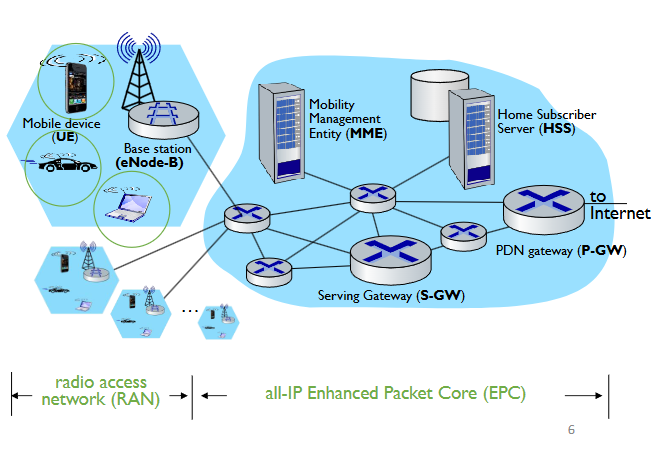
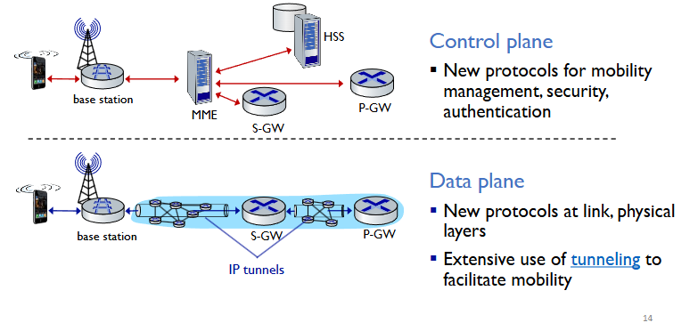

# Mobile Networks & Mobility Management

## Mobile (Cellular) Network

### 4G/5G Cellular Networks

- **Wide-area wireless networks** - solution for mobile Internet
- Widespread deployment
  - More mobile-broadband-connected devices than fixed-broadband-connected devices
- Network availability
  - Feedback from one million US mobile cellular network subscribers: can find 4G signals more than 90% of the time.
  - In Canada, its about 30% due to having larger rural areas so trying to reach the same statistic as the US would be very expensive to deploy and operate the network at that capacity.
- Downlink transmissions rates up to 100's Mbps
- Technical standards: 3rd Generation Partnership Project (3GPP)
  - 4G: Long-Term Evolution (LTE); 4.5G: LTE-Advanced (LTE-A)

**Similarities to wired internet**
- Global cellular network: a network of networks
- Widespread use of the same set protocols: HTTP, DNS, TCP, UDP, IP, NAT
- Separation of data/control planes, SDN, tunneling, etc.

**Differences from wired internet**
- Different physical and link layer technologies/protocols due to the shared wireless channel. So if there isn't the careful design thats implemented, there would be interference.
- Support for user mobility
- User "Identity" (via SIM card)
- Roaming and global access (with inter-carrier settlements and authentication)

### Elements of 4G architecture - UE
**Mobile devices**
- Smartphone, Tablet, laptop, IoT... with 4G LTE radio
- LTE jargon: **User Equipment**

64-bit International Mobile Subscriber Identity (**IMSI**)
- Unique for each UE
- Stored on Subscriber Idendity Module card (SIM)
- More recent: eSIM (digital SIM)

Each UE has a home network 

### Elements of 4G LTE Architecture - BS
**Base Station**
- At "edge" of carrier's network
- Manages wireless radio resources, mobile devices in its coverage area
- Coordinates device authentication with other elements 
- Jargon: **eNode-B** (eNB)

Similar to WiFi AP but:
- active role in user mobility
- Coordinates with nearby base stations to optimize radio use
- 5G: positioning, sensing, etc.

### Elements of 4G LTE Architecture - HSS
**Home Subscriber Services**
- Control-plan element
- Stores info about mobile devices for which HSS's network is their home network
- Works with Mobility Management Entity (MME) in device authentication.

### Elements of 4G LTE Architecture - S-GW
**Serving Gateway (S-GW)**
- Router on the data path between UE and internet
- **Mobilityanchor for UE** during inter-eNB handovers between LTE and 2G/3G
- Manages and stores UE contexts.

### Elements of 4G LTE Architecture - P-GW
**Packet Data Network Gateway (P-GW)**
- Router on the data path between UE and internet
- Often co-located with S-GW in practice 
- **Gateway to movile cellular network** - the last LTE element a packet from a UE encounters before entering the larger internet.
- Provides network address translation (NAT) services

### Elements of 4G LTE Architecture - MME
**Mobility Management Entity** 
- Control plan element 
- Device and network mutual authenticaiton - coordinated with HSS
- Mobility management: support device handover between cells; track device location 
- Path (tunneling) setup from mobile device to P-GW

----

## LTE: Data Plane/Control Plane Separation

### LTE Data Plan Protocol Stack - RAN
**LTE link layer protocols:**
- PacketData Convergence :header compression, encryption
- Radio link Control (RLC) protocol: fragmentation/reassembly, reliable data transfer
- Medium Access Control (MAC): access request, scheduling of radio transmission slots
- LTE Radio access network
  - Modulation: orthogonal frequency division multiplexing (OFDM)
  - Multiple access scheme: orthogonal frequency division multiple access (OFDMA)
  - An eNode-B can connect hundreds to thousands of devices
- Theoretical LTE data rates:
  - Downlink: <= 300 Mbps per device 
  - Uplink: <= 75 Mbps per device
- Theoretical LTE-A data rates
  - Downlink: <= 3 Gbps per device
  - Uplink: <= 1.5 Gbps per device
- Mobile datagram encapsulated using GPRS Tunneling Protocol (GTP), sent inside UDP datagram to S-GW
- S-GW re-tunnels datagrams to P-GW

### GTP Tunneling

Supporting mobility: **only tunneling endpoints change when a mobile user moves**

### LTE Data Plane: Associating with a BS
1. BS broadcasts **primary synch signal** every 5ms on a set of frequencies
   - A movile device may receiev synch signals from multiple carriers\
2. UE searches on all frequencies, finds a primary synch signal, then locates **2nd synch signal** on the same frequency
   - 2nd synch signal helps UE find info broadcast by BS: channel bandwidth, configurations, BS's cellular carrier info, etc.
   - UE may get info from multiple base stations, multiple cellular networks
3. UE **selects which BS** to associate with

### LTE Power Managment: Sleep Modes
- As in WiFi/Bluetooth: LTE mobile device may put radio to "sleep" to conserve battery
- **Light sleep**: after 100's msec of inactivity
  - Wakes up periodically (100's msec) to check for downstream transmissions
- **Deep sleep**: after 5-10 secds of inactivity
  - UE may change cells while deep sleeping - need to re-establish association.

----

## Global Cellular Networks: A Network of IP Networks

### 5G Cellular Networks
- Higher data rate, lower latency, higher traffic capacity