- [Management Information](#management-information)
- [MIB, MO, \& Management Protocol](#mib-mo--management-protocol)
	- [Management Infromation - Concept](#management-infromation---concept)
	- [Common Terminology](#common-terminology)
	- [Difference between MIB and Database](#difference-between-mib-and-database)
	- [MIB and Management Protocol](#mib-and-management-protocol)
	- [Categories of Management Information](#categories-of-management-information)
	- [MIB Schemas and Metaschemas](#mib-schemas-and-metaschemas)
	- [MIB vs MIB Schema](#mib-vs-mib-schema)
	- [Domain and Metaschema](#domain-and-metaschema)
	- [Metaschema - MIB Specification Language](#metaschema---mib-specification-language)
	- [Impact of the Metaschema of the Schema](#impact-of-the-metaschema-of-the-schema)
	- [Object Oriented vs Table-based Metaschema](#object-oriented-vs-table-based-metaschema)
	- [MO in Object Oriented vs Table-based Metaschema](#mo-in-object-oriented-vs-table-based-metaschema)
	- [Coexistence of MIB Schemas and MIBs](#coexistence-of-mib-schemas-and-mibs)

# Management Information

----

# MIB, MO, & Management Protocol

## Management Infromation - Concept

- Management applicaitons (managers) and managed devices (represented by agents) communicate

- Management Information
	- Anything managers need to know about managed devices
	- Carried in managemnet messages exchanged between managers and agesnt
	- Used by management functions.
	
- Important Questions:
	- *Define management information*
	- *establish common terminology* between manager and agent 
	
----

## Common Terminology 

A central aspect of management infromation which refers to a mutually understood way in which agents and managers can refer to various aspects of managed devices to prevent problems from arising.

Example Scenario:
- Manager queries an edge router for the incoming (direction A) traffic volume
- Agent has a different definition for "incoming" and returns the outgoing (direction B) traffic volume to manager
- Manager finds unusually high traffic --> Suspects an ongoing attack --> might switch off corresponding port to cut off the suspected attacker.

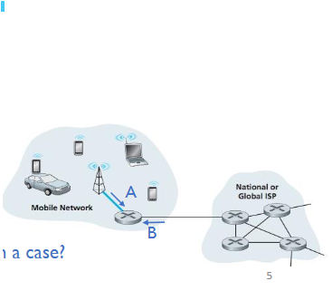

>Q: Why would the manager find it unusual in such a case
>Download vs upload speed (Down will always be higher than upload)
>

Example Scenario 2:
- Manager queries agent for information about port 1
- Agent uses different indexes for ports and refers to port 4 as port 1
- Manager confused what and who connected to the two ports
- Subsequent management decisions building on wrong facts

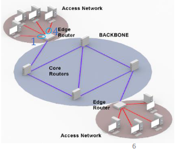

Misunderstandings:
- Type of information (incoming vs outgoing traffic in) scenario 1
- Particular instance of information (one of several ports) in scenario 2

----

## Difference between MIB and Database

Why would we be using MIB rather than a database and database management syste (DBMS)

A1: Footprint
- DBMS: heavier weight as it requires more processing resources
- MIB: Lighter weight which enables more focus on management interfaces
- Network devices have limited processing capabilities making it difficult to run a DBMS
- Much of the genera-purpose processing provided by DBMS aren't needed by a manager or an agent.

A2: Management Requirements
- A lot of management information that is hierarchical in nature
- Some management information maintained by the agent(monitoring data for example), others by managers (Configuration settings)

A3: Real effects

- MIB: Not a "passive" database but *a view on an "active" real-world system*
- Information in MIB is accessed through and affected by: management operations, control protocols, the very functioning of the device, users loggin on and reconfiguring the device etc. --> MIB cannot be managed through a DBMS.

A4: Characteristics of contained data
- Database: large volumes of data, more or less of the same structure.
- MIB: many different types of information, each with relatively few instances --> more heterogeneous (Q:why?)

----

## MIB and Management Protocol

- MIB and management protocol relationship

	- MIB: information aspect - content of communication
	- Management protocol: communication aspect - rules and procedures of communication

- Conceptually: MIB independent of management protocol
- Practically: management protocols specify the way MIBs are implemented

	- How management information is represented in the MIB
	- How MOs in the MIB are named and accessed by management applications
	- How the MIB can be structured as a whole
	- *A management protocol mandates a specific "flavor" of MIBs*

----

## Categories of Management Information

- Distinction of management information importance
	- management applications treat different categories differently

Four main categories:

1. State information - current state of resources
2. Physical configuration information - how the managed device is physically configured
3. Logical configuration information - parameter settings and configured logical resources
4. Historical infromation - historical snapshots of performance-related state information

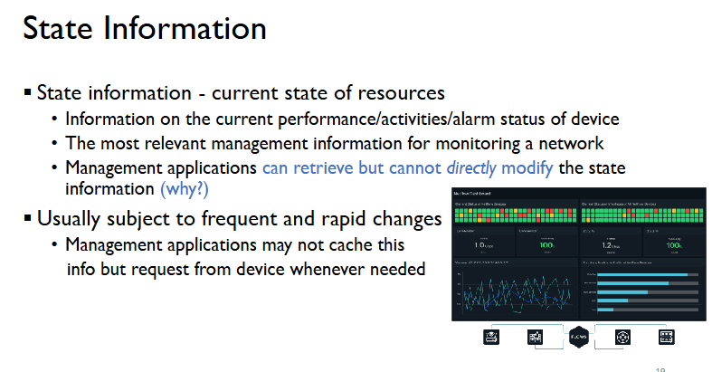
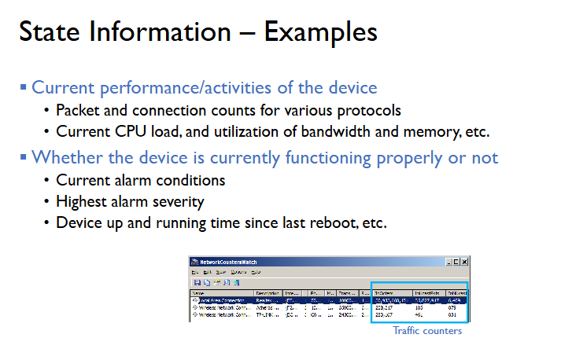
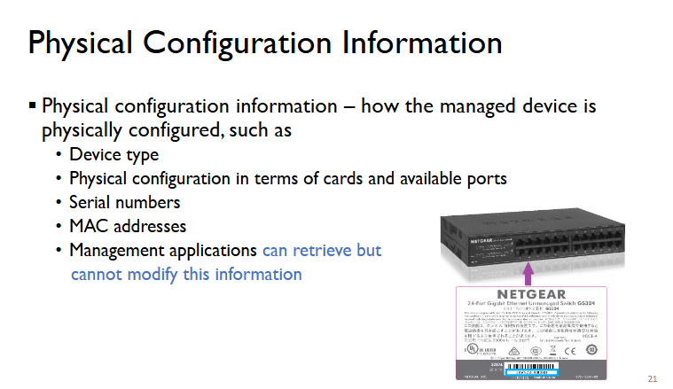
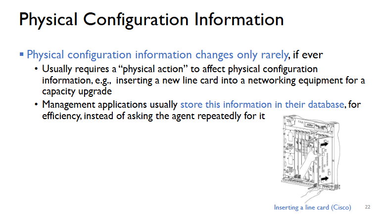
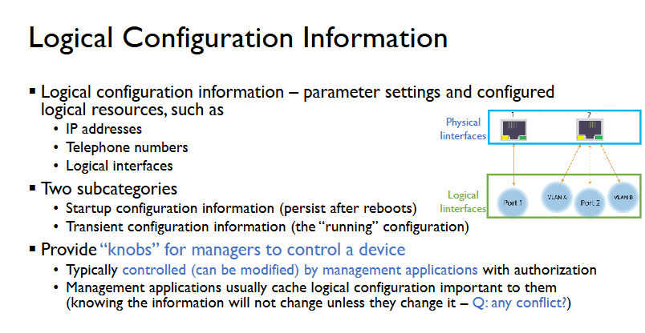
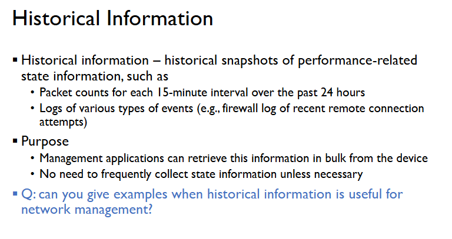

----

## MIB Schemas and Metaschemas

Strictly speaking:
- MIB  Schema: refers to a model 
- MIB: refers to an instance of the model

----

## MIB vs MIB Schema

Example of MIB Schema for the endpoint of a TCP connection
- Data items: e.g. TCP port number, IP address and port number of the remote endpoint of the connection, number of packets sent/received over the connection.
- May also incude semantic constraints: e.g the conditions under which the information about a TCP connection endpoint is removed from the MIB; whether a notice will be sent if such removal occurs

Example MIB for a particular endpoint at a particular time:
- TCP port 189, the remote endpoint's IP address 247.168.3.17, the remote end point's port number 188, and 452,895 packets sent, and 38,657 packets received.

----

## Domain and Metaschema 

MIB schema and MIB model are used synonymously	
- Both referring to definitions of MIB
- Remains constant over time

Domain:
- The underlying "real world" abstracted by the model
- The "subject domain" that the model is all about

How is a MIB schema defined:
- Metaschema - "a schema of a schema"
- Specification language that specifies the MIB schema
- A definition of how to write and interpret model definitions

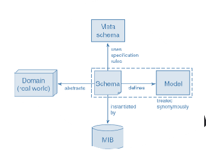

----

## Metaschema - MIB Specification Language

A few MIB specification languages exist
- Generally, each defines MIBs used in conjunction with a particular management protocol or information model standard

Examples:
- Structure of Management Information version 1 and 2(SMI and SMIv2) - used in conjuction with Simple Network Management Protocol (SNMP)
- Managed Object Format (MOF) - Used in conjunction with Common Information Model (CIM)
- Guidelines for the Definitio nof Managed Objects (GDMO), used in conjunction with the Common Management Information Protocol (CMIP)

----

## Impact of the Metaschema of the Schema

MIB model depends on what metaschema is being used 

----

## Object Oriented vs Table-based Metaschema 

Some metaschema (MOF and GDMO) are object-oriented
- Represents different aspects of device as managed object (MO) classes
- Supports inheritance - reusing and refining MO classes
- More flexible and powerful

Others (SMI and SMIv2) are table-based
- Specify MIB models in the form of tables and variables grouped in vertain ways
- Table refers to one particular aspect of the devices
- Easy to understand and implement 
- Focusing on this

----

## MO in Object Oriented vs Table-based Metaschema

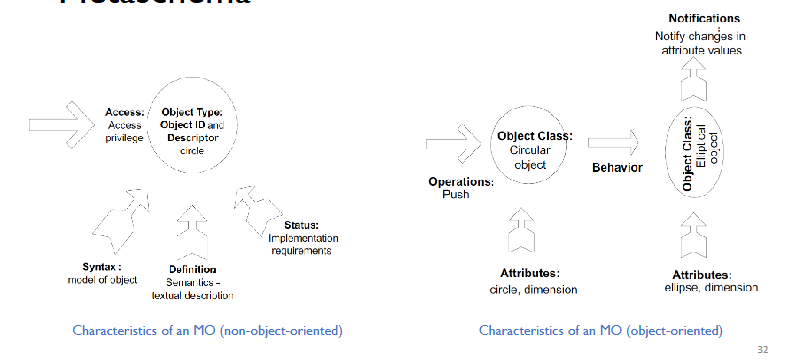

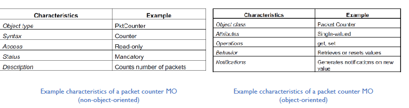

----

## Coexistence of MIB Schemas and MIBs

- Each metaschema has its advantages and drawbacks
- In practice, equipment vendors decide MIB schemas for their devices
	- Often several schemas corresponding to different metaschemas are provided simultaneously
- Users choose MIB schemas and assoicated management protocols
	- Possible different schemas and protocols for different management information/purpose
- Agents representing network equipment
	- Usually use simple metaschema
	- Limit of processing resources, simplicity of implementation
- An agent higher-up in the management hierarchy
	- May support object-oriented metaschema
	- Agent representing a computer system or a management application
	- Less constrained by computing resource, in favor of powerful metaschemas.

MIB is a view of a managed device:
- Possible to have multiple simultaneous views of the same device

With multiple MIBs of the same devices, each MIB can
- Be supported by its own management agent
- Interact with management applications through a different management protocol
- Cover a different scope/aspect of the same managed device.