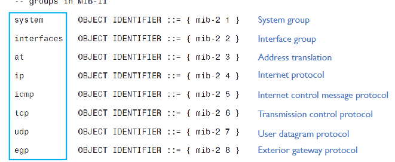

## Object-oriented Model

- Managed system class
- Physical Equipment: superclass to "managed system"
- Managed system: contains objects of class "TCP connection"
- TCP Connection: maintains relationship to objects of class "endpoint"

----

## Table-based Model

Two tables
- Managed system table: one entry (for the one deivce)
- TCP connections table: multiple entries (for multiple connections)
- A bit more "coarse" than the object-oriented model

----

## Implicit Model based on Functions

Two groups of CLI functions
- 3 "system"-related functions: retreieve/set name, up time, contact, location
- 2 "connection"-related functions: retrieve connection information

Compared with object-oriented and table-based model
- The other two models: information itself instead of how to access infromation 
- CLI-based implicit model: specific about how to access information.

----

## MIB in SNMP

What does a MIB look like in practice?

Consider the specific metaschema and schema used in SNMP
- Metaschema: MOB specification language
- Schema: model 

Metaschema:
- Structure of Management Information (SMI)
- Table-based

Schema:
- MIB-2
- For devices implementing TCP/IP, widely implemented

SMI and MIB-2 defined by the Internet Engineering Task Force (IETF)
- Standards documents published by IETF: Requests For Comments (RFC)
- RFC 793 - Transmimssion Control Protocol (TCP)
- RFC 1155 - SMI
- RFC 1213 - MIB-II

Minimize details of SMI and MIB-2

Our focus: insight into
- The level of information that is specified
- What a specification can look like

----

## Structure of Managment Information (SMI)

SMI specifies MIB models in modules 

Each MIB module serves a purpose
- Related to a device's communication interfaces
- Related to a feature embedded on a device

MIB of any managed device instantiates multiple MIB modules
- Each represents one aspect of the device & provides a structured view of the resources to be managed.
----

## Object Identifier (OID) and OID Tree

Infomration in MIB organized into a conceptual tree
- Every model in the MIB --> a node in the tree

Each node named relative to a containing node:
- Node ID: the object identifier (OID) that contains arbritary data
- Object type: Contains real information 
- OID of iso: 1
- OID of org: 1.3
- OID of dod: 1.3.6
- OID of the internet: 1.3.6.1
- The tree - OID tree

----

## Scalar and Tabular Objects

Another way to categorize: instantiated how many times in an agent?

Scalars: instantiated only *once* in an agent
- Nodes containing the host name, or a serial number of a chassis, or some global settings for the device,e tc.
- Management operations apply exclusively to scalar objects in SNMP

Tabular objects: instantiated multiple times
- Nodes representing infromation about cards in a chassis, or communication resources that are dynamically created and torn down during run time.
- Conceptual table entries for deleopers of management application to organize information in SNMP.

----

## SMI-specified Data Types

No complex data types such as arrays or lists... There are only simple data types such as:
- Integer, octet strings, etc.
- Network addresses
- Counters - increasing only until reaching max value or resetting
- Gauges - increating or decreasing

A conceptual structure can be built by grouping objects together.

----

# A Closer Look at MIB-2

----

## Defining the MIB-2 Module

Based on IETF RFC1213.

Establishes mib-2 as a new node under "mgmnt" in OID tree 

Specify submodules (child nodes) of MIB-2

- Only 8 of 200+ child nodes shown below

----

## Define A Submodule of MIB-2

- Elements of the definition of an object type
- *Syntax*: Data type (e.g "string" in sysDescr)
- *Access*: read-write (if can be set by a manager), read-only, or not-accessible
- *Status*: definition lifecycle (mandatory, optional, obsolete)
  - mandatory: every implementation of the module must include it
- *Description*: explanation
  - Intended purpose of the object type
  - Aspects to be implemented

----

## Define A (Conceptual) Table

- *TCP* (OID 1.3.6.1.2.1.6) has 20 child nodes
  - Some includes the *definition of a table*
- *Syntax* (data type): *SEQUENCE OF* another object
  - tcpConnTable is a table, each row is a tcpConnEntry object
- *Access*: tcpConnTable not accessible
- Carries no info on its own; just a container object for objects carrying info.

----

## Table Entry

- "tcpConnEntry" - a conceptual row/entry of "tcpConnTable"
  - Syntax: not a simple data type but a sequence
  - *t*cpConnEntry object and *T*cpConnEntry syntax are different
  - Index: unique to table entry objects (specifying the elements used as the index)

----

## Columnar Object

A table (and each entry of the table) has a set of columns
- Each column corresponds to a columnar object.

----

## Not-Accessible vs Accessible

- tcpConnTable not accesible - just a conceptual container for entries
- tcpConnEntry also not accesible - a conceptual container of elements
- *Columnar objects: accessible - elements of the array*

----

# Instances and Instance OID

----

## Instantiation in SNMP MIB

- Instances of an object type contain the actual values that a manager can retrieve from the agent.
- In SNMP, instances are also considered as part of the OID tree
- *Only leaf nodes can be instantiated*
  - Leaf nodes grow new leaf nodes (instances)

----

## Instance OID

Scalar Objects:
- Scalar object can have only one instance
  - Object instance has an OID too
- OID of the object instance = OID of the object  + suffix (.0)
- Consider an instance of object sysServices (1.3.6.1.2.1.1.7)
  - Instance OID: 1.3.6.1.2.1.7.7.0

Columnar Objects:
- A table can have multiple entries (multiple instances of the table entry)
  - Each entry has multiple columnar objects
  - Each columnar object needs to be distinguished

- Recall that table entries have an "index" field in its definition
  - Index field specifies the column(s) used for indexing
  - *Index* --> Used to help identify each instance of a columnar object
- OID of a columnar object instance = OID of the object + index value 
- 
