# Management Communication: Management Interaction Layers, Manager-initiated Interactions.

----

## Layers of Management Interactions

- Managers and agents talk about information of devices between each other.
- Managers and agents itneract with each other via communication

From this we can tell that management interactions strcutred in layers similarly to having general communications in a network.

> Q: What is the benefit of having layers?
>
> It allows us to create a form of separation that allows anyone to be able to see what works together.
>

- Layers of Management interfactions
  - Applications
  - Management Services
  - Management Operations
  - Remote Operations
  - Transport

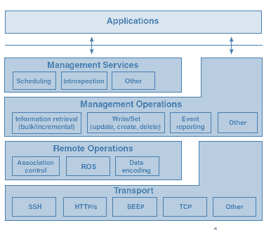

----

## Applications

This is the top most layer that provides basic communications operations to network management applications.

In this case, managers and agents are both considered applications.
- Manager-agent interactions: take place in the application layer

Management protocols (SNMP) are application-layer protocols.

----

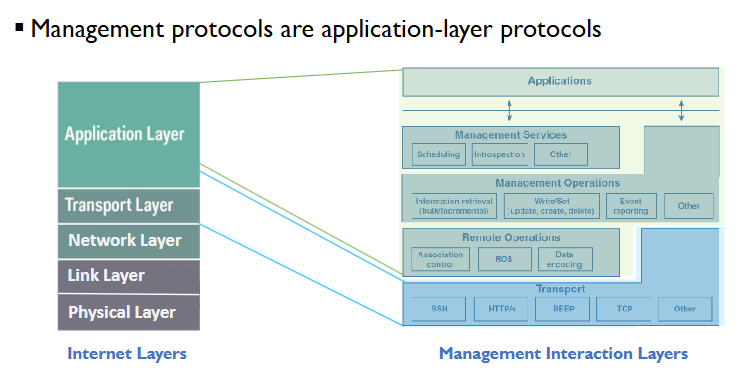

----

## Lower (Middle + Transport) Management Layers 

Q: Why do we have multiple lower management layers?

Management communications can be divided into several aspects:
- Exchange management messages
- Interpret management messages
- Agree on transport method/protocol

Transport Layer --> transport protocol

- Three middle management layers
  - Unique to management
  - In implementations: usually different parts of the same protocol.

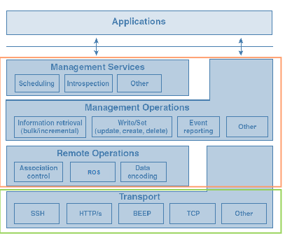

----

## Transport

Concerns aspects of communications common to management and non-management applications
- End-to-end message delivery
- Reliability (flow/congestion control)

There are many manageent protocols that have restrictions on teh transport
- Transport protocol specified when specifying a management interface.

Management protocols ma yuse an application-layer protocol as transport.

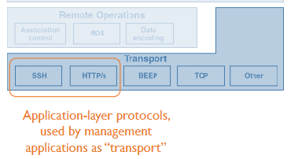

----

## Remote Operations

Offers three distinct functions to support upper layers:
1. Association control 
2. Remote oeprations support
3. Encoding of payload data

It is usually provided by the same protocol that provideds the management operations layer functions.
- All functions are not always present as the upper layer may bypass the remote oeprations layer.

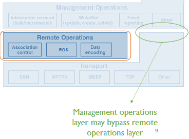

## Association Control

Establishes and tears down management sessions.

TCP already support connection management.

> Q: Why do we need to connect managers and agents on the application layer?
>
> Management applications may not even use TCP as transport to begin with. 
> 
> Furthermore, the transport layer wouldn't even be aware of management information.

Management-specific aspects that:
- Transport connection is not aware of
- Require mutual understanding between manager and agents

Examples:
- Management capabilities an agent provides
- Management functions a manager can invoke.

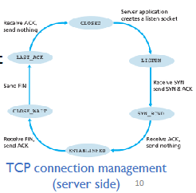

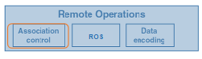

## Remote Operatiosn Support

Facilitates management requests/responses
- ROS function 1: Managing requests and response IDs
- Responses can arrive out of order (Why?)
  - Events such as a network device rebooting

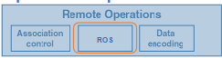

When a manager receives a response: to which management request?
- Manager: uses a unique ID for each management request
- Agent: includes ID of the original request in each management response

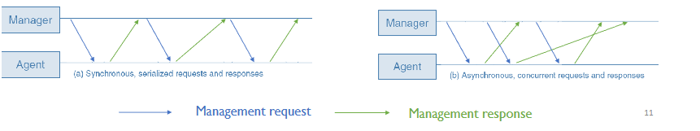

ROS function 2: Fragement/Reassemble management protocol data units (PDU's)
- A management PDU = management message

PDUs can be large in size:
- Especially in a response
- Transport layer: Imposes data size limit
- Without fragmentation and reassembly, some management requests may be answered with a "response too long" error.

----

## Remote Operations - Data Encoding

Representing information in the PDU

Common encoding schemes:
- Asbtract Syntax Notation One (ASN.1) Basic encoding rules - used by SNMP
- Extensible Markup Language (XML)
- Proprietary schemes

----

## Management Operations

The core of the management layers.

Provides management primitives - the base operations used ot manage a network
- Various managemnet requests
- Responses to management requests
- Events

What primitives are available?
- Depend on the specific managment protocol.

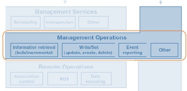

----

## Management Operations - Common Primitives

- Read primitives (get operations)
  - Used to retrieve management information 
- Write primitives (set operation)
  - Used to change/influence management information 
    - Logical management infromation
  - Subdivided into create, delete, and modify operations
- Event-reporting primitives
  - Communicate the occurences of events by agents
- Action primitives
  - Causes the managed device to "do" something

----

## Management Services

Building on management operations layer:
- Not a "layer" in the strict sense
- Management applications can directly access "management operations" layer below it.

Additional offering to management applications:
- Introduce capabilities *above and beyond the management primitives*
- Special-purpose management information 
- Special operation parameter values

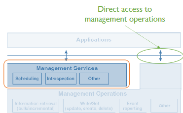

Eamples:
- Remote scheduling service
  - Allow management applications to setup a probe at agent to periodically execute a management operation at specified times
  - Without needing to issue a new request each time
    - Action primitive

- Introspection service
  - Allow management applications to retrieve information about "what management information and functions are supported on a managed device?"

- Subscription service
  - Allow management applications to subscribe to specific types of events
  - Based on filter criteria such as all events pertaining to a specific port.
----

# Manager-Initiated Interactions: Requests and Responses

----

## Requests and Responses

The most general interaciton pattern between managers and agents.

A manager makes a request:
- to retrieve a a piece of management infromation 
- to change a configuraiton setting
- for managed devices to perform an operation such as a self-test

The agent responds with:
- the requested management information
- indication on successful execution or error

----

## Parameters in a Typical Request

A typical request includes parameters that specify:
- Type of request (get/set)
- management infromation that the request applies to (for either "get" or "set")
- Additional infromation (e.g, the ID of the request, security credentials)

Other paramters may be included:
- e.g to specify what to do in a case request initially fails (keep retrying or return failure?)

----

## Agent Actions After Receiving a Request

What does an agent do upon the receipt of the request:
1. Checks validity of request
   1. Parses request to see if it can be understood
   2. Autheticates and Validates manager is who it is and is authorized to execute its request
2. If invalid, the agent immediately sends a response that indicates failure
3. If valid, the agent services the request and constructs a response with the results upon completion.

----

## Parameters in a Typical Response

At the minimum, a response includes:
- The type of response
- A response code indicating *whether the request was successful* ( and a reason if it was not)
- *result of the request* (the requested management infromation)
- Additional information (e.g, the ID of the original request.)

----

## Request and Response Patterns

To perform one management task, amangers and agents often exchange multiple requests and responses.

The patter of the multiple request and responses?
- Determines the efficiency of management communications 

The goal is always to minimize the number and feequency of exchanges without sacrificing functionality and responsiveness of the management applications

Different requests and responses pattern:
- Information retrieval
- Configuration opertations, actions, management transactions.

----

# Manager-Initiated Interactions: Requests and Responses: Information Retrieval - Polling

----

## Information Retrieval

Requests for infromation by a manager - most prevalant type of request/response management interactions
- Such as "request for infromation" also referred to as polling

Based on the basic pattern:
- Manager requests management infromation 
- Agent checks validity of request
- If valid, agent retrieves information; otherwise, indicates failure
- Agnet responds with requests information (fragmented if too large) or an error with an error code.

The specific pattern may vary depending on the type of management info/tasks
- Different considerations for how to optimize the retrieval in each case

----

## Requests for Configuration Information

Request for information on the *logical and physical configuration* of devices

>Q: Does this info change frequently or infrequently?
> 
> Infrequently as it would require someone to actually go up to the devices and begin to make changes

Changes in such info:
- Not initiated by an agent
- Generally triggered by a anagement application or a system administrator 
- Example: a technician pulling a line card from a device, a management applciation configuring an interface.

Infrequent changes => rare requests (why?)
- Manager can cache the infromation 
- If change triggered by management applicaiton (manager), manager may already be aware of it.

----

## Caching Configuration Information

Manager caches the confgiuration ifnromation of managed devices
- Reduce *management traffic* over the network
- Reduce *load imposed on the device* from responding to queries
- Improve *performance of management applicaiton in delay*

Configuration infromation is only requested when:
- a manager first takes management ownership of a device - need to request infromation to cache for the first time.
- Caches infromation (in management database) is *out-of-date*
>Q: How can a manager tell?
- Ensuring that the infromation about the devices is indeed current just before services are provisioned over the network.

----

## Requests for State Information

Request for state information of devices

>Q: Does such information change frequently or infrequently?
>
> Changes frequently
> e.g Counter for bytes on an outgoing link. Some counters can increment millions of times per hour. It is usually not cached in management application's database.

>Q: Can such information be directly modified by management applications?
>
> No

- Frequent changes => frequent requests
  - Manager polls the managed device for the current snapshot of its state infromation whenever needed.
----

## Scenarios of Polling for State Information

- Several scenarios of polling a device for state infroamtion 
- Device viewing
  - A remote user wants to obtain a real-time view of a device
- Troubleshootin and diagnnostics
  - A management application needs current data from the device to determine the cause after observing an error
- "Hot spot" polling
  - A device is under scrutiny, and its state infromation therefore is polled repeatedly over an extended period of time (periodic polling)

----

## Issues with Polling

1. Expensive operation
   - Incurs load on network and devices 
   - Main job of routers is to provide services, not processing queries

Solution: Avoid frequently polling a device unless necessary

2. Missing a condition
   - Polling occurs at discrete time instants
   - Any condition occuring in-between polling instants can be missed 

3. Potential High delay
   - High delay when detecing a condition as new/missed condition will not be detected until the net instant
   - Tradeoff between polling load and delay or likelihood to miss the condition.

----

## Observe Trends without Freuquent Requests

Frequent polling is sometimes necessary to observe trends over time

More effective interaction patterns to lighten the load?
- Ask device to take snapshots at certain instants without sending a request each time

Alternative Pattern 1: Cache snapshots, transfer in bulk later.
- Applicable if no need for real-time data
- E.G - Retrieve historical information

Alternative Pattern 2: Automatically take and send snapshots
- Manager specifies once when to take snapshots
- Agent sends snapshots immediately when they are taken 
- Snapshots provied in near-real time.

----

## Incremental Requests vs Bulk Requests

Incremental request (default in most cases)
- One request for a specific piece of infromation (concerining one item at a time.)
- Corresponding management operations: incremental operations

Bulk request:
- One request for a large amount of information (that meets a certain criteria)
- e.g a request for "all state infor of a line card" or "all configuraiton information"
- Motivation: when too many iterations to retrieve the desired information with incremental requests, or when amnager not sure of what's available on agent.

----

## Scope of operation

One way for a bulk request: ask for an entire subtree

Scoped operation: operations directed not at any particular managed object but at any object under a certain parent node in a tree.

Scope of an operation: generally an entire subtree
- Example: everything related to a particular sommunications feature or contained under a particular communcations system
- Possible to specify filters

----

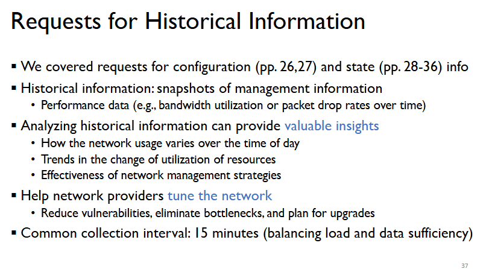
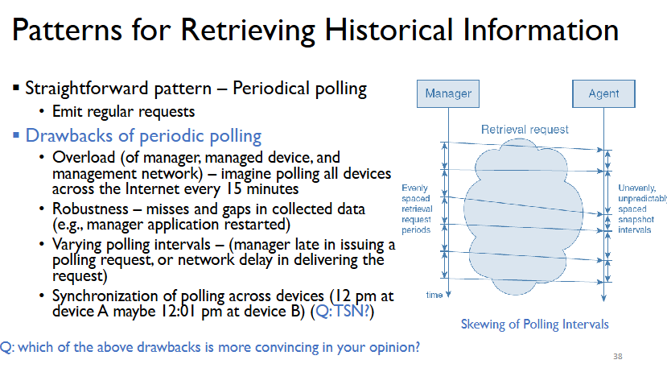
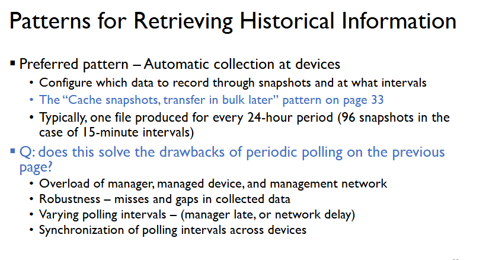

