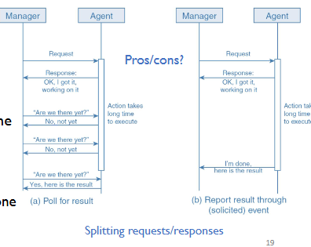
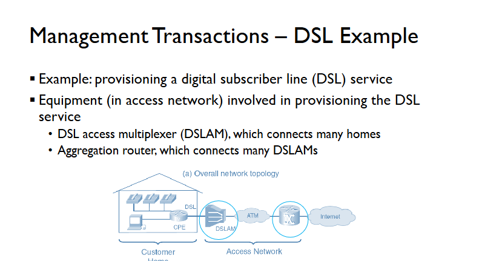
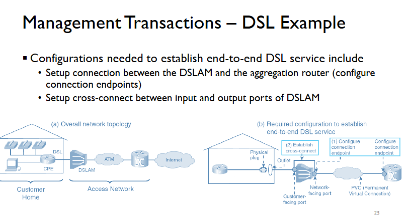
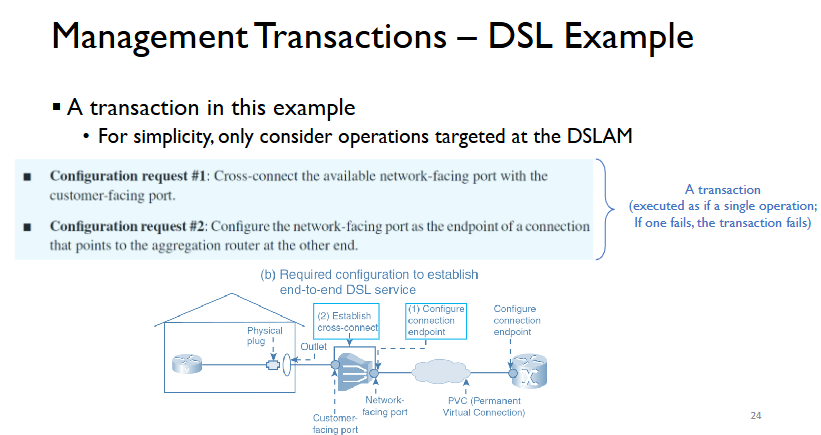
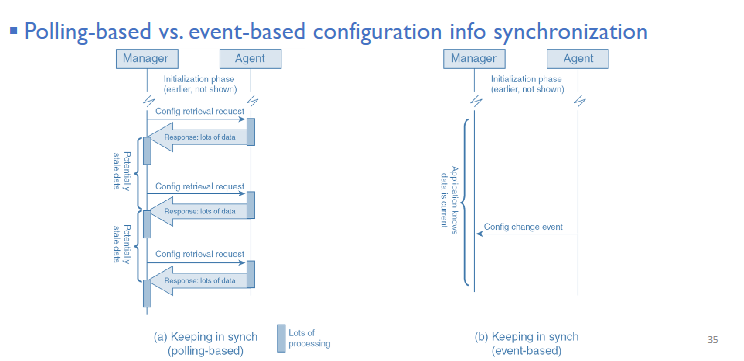

# Manager Initiated interactions (Continued)

## Communication Pattern of Configuration Operations

General communication patterns consist of requests and responses

Differences compared to requests and responses for information retrieval operations:
- Failure recovery (handling failures)
- Response size and request scoping
- Dealing with configuration files.

### Failure Recovery:

More things can go wrong when servicing a configuraiton request when compared to information retrieval because something on the deivce is to be changed

Examples:
- Request configuration option not supported (i.e configuring ipv6 address on an ipv4 only device)
- Not enough resources to fulfill the request
- Request conflicting with some other settings (Implementing an IP address with one that is beyond the subnet)

A manager that performs configuration operations should have error-handling procedures 

### Failure Recovery - Missing Response

- Missing response
- Missing response in the case of information retrieval
  - Simply resend information-retrieval request
  - Worst case scenario is receiving duplicates
- Missing response in the case of configuration
  - We could resend the configuration request however we run the risk of sending incorrect information twice in a row

Managers should be careful to deal with different possible scenarios.

It is important to differentiate the scenarios when missing a configuration response

If the device received and served the request, BUT the response was LOST.
- Do not immediately resend the request 
- Find out whether the request was successful at first

If the device did NOT receive the original configuraiton request
- Resend the configuration request

If the device is still busy executing the request
- do NOT resend the request yet... just wait.

How would a manager be able to tell the scenario?

Via a management function:
- Allows the manager to inquire about the status of a configuration given the request ID
- Agent needs to support the management function... not always the case

Via retrieving management information:
- After the request, retrieve information to see if requested configuration has been applied
- If yes, do not send configuration request

Via testing:
- If the configuration is part of provisioning a service, testing whether the service is working gives hint on whether the configuration request was succcessful.
- This method doesn't provide an absolute guarantee that recovering from an error will be successful since all you are doing is tweaking parameters in the hopes it will work.

----

## Response Size and Request Scoping

The second different between information retrieval and configuraiton operations

In the case of infromation retrieval:
- One small request could result in the return of a substantial amount of information (bulk request)
- Scoped information retrieval operations not uncommon
- Retrieving all information related to a subtree

In the case of configuration:
- The size of the response is typically similar to the size of the request
- Information carried in a response: outcome (success/error) + the new setting in effect/error code
- Scoped configuration operations possible but rare

Scenario: many instances of a managed object to be configured in the same way
- Example: same echo-cancellation setting for all DS0 port on a voice gateway
- A possibility: scoped configuration operation that configures all DS0 ports (efficient management) 
- Alternative: a single global paramter for echo-cancellation setting across a device (granular control)
- Tradeoff: granularity of control vs. management efficiency

----

## Dealing with Configuration Files

The third difference between information retrieval and configuration operations.

Sometimes, configuration infromation is simply representaed as managed objects in a MIB.
- Such configurations can be simply set

Sometimes, configuration files are involved:
- Text files containing line items with the settings in effect 
- Line items - a series of CLI commands that achieve the desired configuration
- A configuration operation may involve explicit handling of the configuration files

Configuration request done in multiple steps with configuration files:
- Preparing/downloading/telling device to switch configuration file 
- May seem cumbersome

Advantages of using configuration files:
- Allows for straightforward implementation of configuration backup & restore
- Simple to maintain different configuration versions
- Apply the same configuration file to different devices of the same type across the network, with minimal customization

A hybrid approach is applicable in many cases:
- Such as with Cisco IOS routers
- Hybrid: setting managed objects in MIB + setting configuration files

Requests to change a router's current configuration (running config)
- Apply the change to the current configuration of managed objects maintained in the router's memory
- Does not require explicit handling of configuration files.
- Running configs disappears after rebooting

The router reboots with a configuration stored in a file (startup config)
- Startup config saved in non-volatile memory
- Requests can be made to save the running config as the startup config

----

# Actions (Manager-initiated Interactions)

Some management interactions cause the device to perform a certain action, such as
- Reboot itself
- Perform a self-test
- "ping" another device
- Load a software image

Straightforward "request and response"
- A request sent to perform the action; a response indicates the outcome.

## Long-Running Action

- Tricky situation: when a requested action takes a long time
  - What should the manager do if no response is received
- If requst lost/action encountered error
  - Manager should resend the request instead of waiting in vain 
- If the agent is still working on the original request
  - Resending the request is useless and can make things worse

It would be helpful if the request/response interaction can be split into multiple parts.

Additional requests/responses - there are two options for this

Common to both: an initial response
- An extra response just to indicate the successful reception of the request

Option 1: Polling based pattern
- Additional requests and responses
- Subsequent request to inquire about the status of the requested action and to retrieve the results

Option 2: Report based patter
- No subsequent request
- Agent reports the result when action done

----

# Management Transactions

## Concept

A management transaction is the grouping of several operations together and executing them as one unit as if it were a single operation.

It is very important and nontrivial category of interactions between managers and agents.
- Requires careful design of management applications
- Transaction successful only if all operations in it are successful
- Handling the failure of some operation(s) in a transaction.

## Difficulties

Nontrivial to support transactions in network management operations
- Unlike the case of database transactions
- An agent is a view of the real device, without full control

Difficulties towards supporting transactions
- Possibility of interference: network administrator configuring device manually (circumventing a management application)
- Delay of management communications: device state changing between requests (due to network control protocol, failure of components, etc.)

## Handle Failures

Transactions are difficult - managemnt applications must adapt
- Prepare to handle exceptions - adding to the complexity of management applications.

Verification before applying operations (in a transaction) to the network
- e.g syntax and semantics checks (to increase the likelihood of success)

Verification after applying operations (in a transaction) to the network
- Check whether the operations generated intended effect
- Rollback or "roll forward" of operations when part of the transaction fails

Rollback: the undoing of the effects of oeprations that have succeeded
- Some oeprations (e.g a reconfiguration of a port that disconnected a service) cannot be "rolled back" - already had an effect

Managers should *explicitly deal with failures in transactions*
- includes rollback and "roll forward" scenarios

An agent can also be enhanced to better support transactions

Claims of agent "supporting management transaction" by a vendor can be ambiguous.
- Providing syntax checks for transactions?
- Some form of error recovery when things do go wrong?
- Ask what "supporting management transaction" means exactly for the agent.

----

# Events (Agent-initiated interactions)

### Event Messages

Interrupts that help managers do their job better:
- Initiated by an agent to bringg something to the managers attention
- Referred to as "traps" in SNMP

Carry various information such as:
- Devices overheating
- Suspicious activity
- New device configuration setting gone into effect

"event" is used to mean both an actual event and event message:
- Actual event = event occurence (e.g buffer overflow)
- Event message = event notification (report of buffer overflow)

### Taxonomy of events
Any event includes the following:
- System from which the event originated 
- Time stamp of when the event occurred
- Type of event that occured
- Details of the event

Some events carry additional info such as:
1. Sequence number of event
2. Additional information for the sepcific type of event.

### Types of Events

1. Alarms: unexpected condition requiring attention
   - E.g: device failing
2. Configuration-change events: configuration change taken effect
   - Example: update of a device's running config
3. Threshold-crossing alerts: a performance-related statae variable crossed a threshold
   - Example: link usage / CPU usage/packet loss/tunneling delay exceeding a threshold
4. Logging events: events not requiring immediate attention but logged for analysis
   - Operator activity - trails fo commands that had earlier been directed at network devices
   - System activity - detailed execution traces useful in debugging a network
   - Other activity on the network and services - service related events, provide data for accounting

### Alarms 

Types of alarms
- Communications alarms
- Quality of service alarms
- Processing-error alarms
- Equipment alarms
- Environmental alarms

Infromation in alarms that aren't always included:
- Proposed action to address alarm
- List of other alarms potentially related to the same issue
- Infromation for troubleshooting the alarm.

Any given alarm is cleared via an "alarm clear" message upon to remission of the unexpected condition.

### Configuration-Change Events

Processing configuration-change events
- Efficient technique to update cached configuration information
- A major factor in event-based management
- Release manager from periodical check for changes in device configuration info

Optional information included in configuration-change events:
- The configuration change applied - configuration parameters and managed objects affected and their new settings
- Originator of the change request - management session that initiated the configuration change
- Request ID - trace the steps that led to the configuration change in case any issues come up later.

### Threshold-Crossing Alerts (TCAs)
Threshold - preconfiguraed value for some monitored MIB object or managemnt variable

TCAs enable network management to be proactive (not just reactive)

Example: Link utilization exceeds 80 percent - may need to increase the links capacity.

TCAs: Another enabler of event-based network management
- Useful in many situations, such as proactive fault management.
  - Events are necessary for proactive network amnagement.

TCAs are also sent when the management variable dropped back below the threshold:
- A "TCA Clear" message gets sent 

Information in TCAs:
1. Name of the threshold or MIB variable being monitored (can be multiple)
2. Value of the threshod
3. Whether the threshold has been crossed or cleared.

Monitored variable may oscillate around the threshold.

Q1: Whats the issue when oscillation happens
A: Could potentially trigger an event multiple times when not intended

Q2: How can we address such an issue?
A: Set threshold as a range

**Hysteresis threshold** - a second and lower threshold
- TCA clear is only issues when a variable dropped below the hysteresis threshold.

----

# Event-based Management (Agent-initiated Interactions)

## Two Network Monitoring Patterns

There are two fundamental communication patterns for monitoring networks:
- **Polling based**: manager relies on **periodic requests and responses**
- **Event based**: manager relies on **event messages** from the agent

### Considerations when deciding the Pattern

- Timeliness
  - Managemetn infromation eneded in real time, near-real time or non-real time?
- Processing laod
  - Message processing consumes computing resources
  - Can a managed device handle frequent polling wihtout impeding its other functions
  - Can the manager afford the processing load to frequently poll all devices?
- Managemnt Bandwidth 
  - Message exchange consumes comunication resources 
  - ow much bandwidth is consumed when exchanging messages?
- Wastefulness
  - Even with enough resources, what portion of exchanged data is not used.

### Event-based Management - Advantage

- More timely
- More efficient on bandwidth and processing
- Less wasteful 
- More scalable

Event-based management --> pattern of choice wherever possible.

### Reliable Events
In event-based management, manager must be confident that:
- All event occurrences are indeed reported
- Recall how polling may miss events

In an ideal world, there should be no missed events.

So occasionally polling will be used to ensure that nothing important is missed which means that as such, managemnet applciations are **event-directed but polling based**

### How to make events more reliable

- Use a **reliable transport protocol**
- Add **sequence number to events**
  - Helps to identify gaps in received events
- Enable **retransmission upon request**
  - Require buffering of transmitted events at agent
  - Manager can initiate retransmission when missing an event
- Use **acknowledgement (ACK) for events**
  - Require buffering of transmitted events at agent
  - increases communication load 
  - Agent can initiate retransmission when missing an ACK

### Difference between Management & Control 

**Management** - in **management network**
- requests/responses/events - management traffic in the management network 
- Managed devices do not make requests

**Control** - in **production network**
- Controlled devices may make requests to other systems.
- Such requests - production traffic, going through the production network.

Managemnet - less stringent performanc requirements
- Typically afford to take at least a few seconds to carry out a task 
- Loading a software image can wait for a few seconds.

Control - more stringent performance requirements
- Responses typically in the subsecond range
- a phone call being dialed must cause the phone on the other end to ring immediately.

