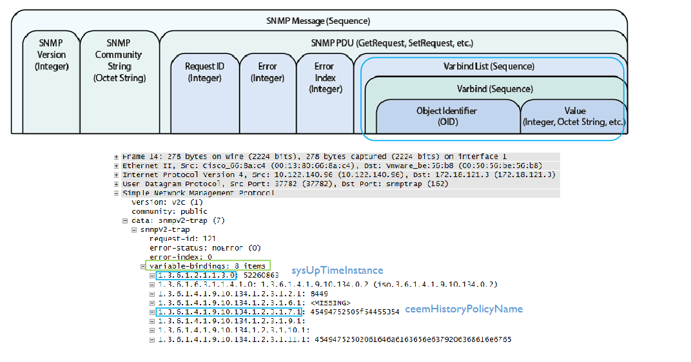
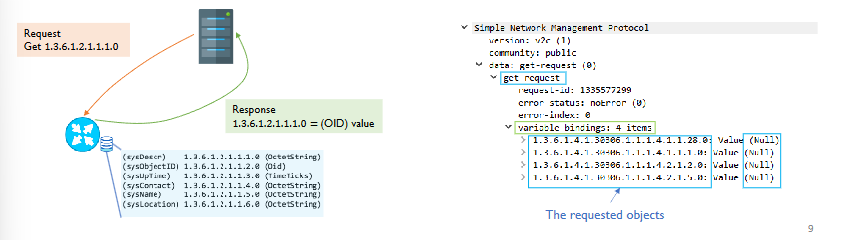
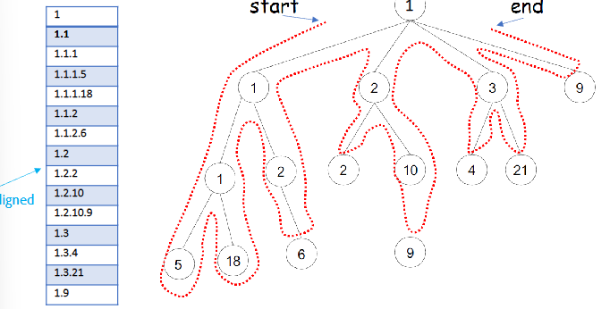
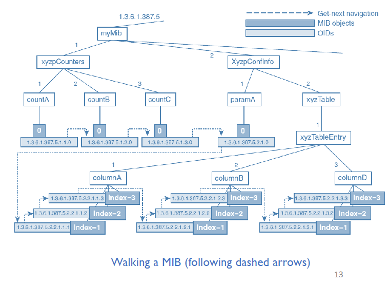
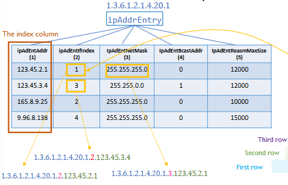
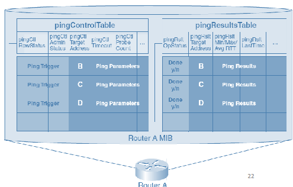
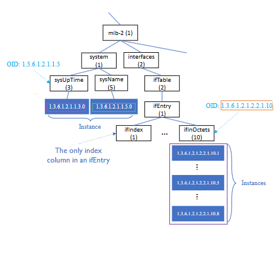

# Common Management Protocols

## Part One - SNMP

### SNMPv1 Operations 
Three versions:
- SNMPv1 - original 
- SNMPv2 - builds on v1
- SNMPv3 - builds on v1 and v2

However, SNMPv1 is still widely used 


### SNMPv1
Pros:
- Designed to be simple
- Simple to implement for agents on managed devices with constrained resources

Cons:
- Functionality offered by SNMP agents aren't always powerful or elegant
- Not necessaril simple for management applications to use

The main tradeoff is functionality for simplicity.

Motivations for design choice:
- More types of agent implementations than manager applications
- More resources available to management applicaitons
- Analogy: accepting coins on busses (when norm is presto/tap)

### SNPv1 - Basic Operations 
SNMP defines **five operations** to access a MIB and interact with it.

1. Get request
2. Get-next request
3. Set request
4. Get response
5. Trap

### SNMPv1 - Variable Binding

SNMP operations commonly include a parameter containing a list of variable bindings

**Variable Binding** - name/value pair - OID to identify a MIB object + value of the object



### SNMPv1 - Get Request

For retrieving management information (MIB object instance) from an agent
- Corresponds to "read primitive" in management operations layer 
- Support **retrieving multiple objects** but delivery is not guaranteed if the message is too long.

Content consists of:
1. Request ID
2. List of variable bindings (name/value pairs) - values in a get request set to "null"



### SNMPv1 - Get-Next Request
Also used for retrieving MIB objects from an agent

Different from a regular get requests as the OID in the variable bindings does not direclt yspecify the object to be retrieved.
- Agent returns the object instance and value with the OID right after the requested OID. (In lexicographical oredr)
- The requested OID in the request may not be an OID of an actual object.

**Lexicographical order**

Very sinilar to preorder traversal (root --> left ---> right)



Get-Next is executed this way due to the following reasons:
- Managers might not know what objects are in a MIB
- Get-next allows manager to **discover agent's MIB**

**Walking a MIB** - iterative get-next requests
- Start with an OID of 0 to retrieve the first object
- Use the retrieved object's OID to retrieve the next one.



Walking a MIB is useful when traversing a MIB table
- Entries may be dynamically created and deleted (e.g routing table)

Traverse a table using get-next requests:
- Manager sends "get-next" request with the OID of the table
- Agent returns the instance of the 1st columnar object of the first row
- Manager sends "get-next" request with the returned OID of the instance
- Agent returns the instance of the 1st columnar object of the 2nd row.
- Continues until getting an object that isn't in the table.

**Mib Tables are traversed by column - NOT by row** 

- OIDs of instances in a table = **OID of the object + index value**
- Denot table OID by s (e.g s = 1.3.6.1.387.5.2.2) => Table entry OID: s.1
- OIDs of columnar objects in the ith column: **s.1.i.** *index value*

Bold = OID of object

This is all based off of the table below:



For every request, you will traverse multiple/all columns each time.
- Specify OIDs in multiple/all columns in each get-next request
- If all columns, traverse one row at a time

### SNMPv1 - Set Request 

Usage 1: **Writing to a MIB** - set a MIB object to a particular value
- It is possible to set multiple objects in one request (subject to message size limit)

Similar structure to get and get-next
- Difference: object values **not null** in the variable bindings (but the values to use)

Usage 2: **create/delete table entries**
- No dedicated SNMP operations for creating/deleting table entries

Using **set request** on special-purpose columnar object "row-status"
- An additional column in all tables.

Usage 3: Ask the device to **perform an action**
- Stretching the "set" semantics;merging "action primitives" into "write primitives"


It is posible to use the **set request** to make device **perform a "Ping" action**

Figure below shows part of the MIB



pingControlTable - for control
- **Setting a corresponding table entry in the pingControlTable triggers a ping action**
- One entry for each potential target to ping
- Columns: IP address to ping, how often to ping, etc.

pingResultsTable - to record results.

### SNMPv1 - Get Response

Sent by an agent to a manage rin response to a **request**
  - **For responding to either get, get-next, or set requests** (Contrary to what the name suggests)

Content of a get response
  - Request ID
  - An error status (success or error)
  - Error index (if error occurs)
  - A lit of variable bindings (object OIDs + values)

Variable bindings also in the response to set requests
  - OIDs of the objects that were set + the values they were set to
  - Basically repeating the infromation in the set request - as a confirmation.

### SNMPv1 - Trap 
Sent by an agent to a manager to **convey an event**
- Unconfirmed - the manager is not expected to send a response back to the agent

Contents of a trap:
- **who**: the address of the agent and the type of system emitting the trap.
- **what**: parameters identifying the type of event
- **when**: time stamp - when was the trap generated?
- **additional information**: a list of variable bindings (object OIDs + values)

Additional information: save manager from issuing get requests to find details
- Increase management communication efficiency, reduces reaction time

Example variable bindings in a trap (from a jammed printer)
- Location of the printer, the identifier of the print job when the jam occured, the user of the print job.

### SNMP Message Structure
**SNMP messages** carry SNMP operations

There are 3 parts of an SNMP message:
- SNMP version number
  - SNMPv1, SNMPv2c, or SNMPv3
- Community string
  - Like a password - must match a corresponding string configured at the device with the SNMP agent fo rthe request to be accepted
  - Not encoded - weak security
- SNMP protocol data unit (PDU)
  - SNMP operation (encoded)
  - Includign the type of operation and oepration parameters

Syntax of SNMP message:
  - Abstract Syntax Notation 1
  - Encoding rule: BER.ASN.1
  - Deatil snot required

Message Size
- Delivery of messages is ensured only up to 484 octect (bytes)
- Limited amount of information exchanged with each request
- Many (but not all) implementations support larger messages

----

# SNMPv2 and SNMPv3

### Issues with SNMPv1
SNMPv1 got popular but recognized as too simple in some aspects

**Inefficient at retrieving large amounts of management infromation**
- Lacks support for scoping or buil requests

**Minimal security**
- Example: "community string" is not encoded
- Vulnerable to security threats
- Consequence: SNMPv1 mostly used for monitoring (but not configuring) devices

**Lack of capabilities in a straightforward manner**
- Needs to use "set request" to create and delete logical entities in SNMPv1

**Limited expressiveness of the MIB specification language SMI**

### SNMPv2 - Some Main Changes

- Two **new management operations**
  - Get-bulk request, inform request
- **Decentralized managmenet - manager-to-manager communication**
- Redefined uniform PDU formats for all operations
- **"get-response" renamed to "response"**
- 64-bit integer for data counters
  - 32-bit octet/byte counter rolls over back to 0 in < 1 minute for a 1Gbps interface
- Attempted improvement of security 
  - Still based on community strings
- SMIv2 - Enhancements to SMI
- MIB enhancements 

### SNMPv2 - Get-bulk Request

For retrieving larger chunks of management information with one request. It is similar to a get-next request except its not just the next one but the next many.

Additional paramters in get-bulk requests:
- **Max repetitions** - the # of successors to be returned for a given OID
- **non-repeaters** - Treating the first of several objects in the variable binding as "get" instead of "get-next"

Message Format:
```GetBulkRequest(non-repeaters, max-repetitions, List of variable bindings)```

- If **non-repeaters** = k, apply a "get" instead of "get-next" for the first k objects in teh variable bindings
- If **max-repetitions = n**, apply "get-next" n times for the rest of the objects in the variable bindings.

**Examples**

*all based on the figure below:*


```
GetBulkRequest(
non-repeaters = 2, 
max-repetitions = 5, 
1.3.6.1.2.1.1.3.0, 
1.3.6.1.2.1.1.5.0, 
1.3.6.1.2.1.2.2.1.10
)


Response(
1.3.6.1.2.1.1.2.0: <value>
1.3.6.1.2.1.1.5.0: <value>
1.3.6.1.2.1.2.2.1.10.1: <value>
1.3.6.1.2.1.2.2.1.10.2: <value>
1.3.6.1.2.1.2.2.1.10.3: <value>
1.3.6.1.2.1.2.2.1.10.4: <value>
1.3.6.1.2.1.2.2.1.10.5: <value>
)
```

### SNMPv2 - Inform Request
- For reliable communication of events
- Unsolicited notification (like traps) but **acknowledgements required**
- Increases complexity (buffering transmitted event messages, retransmissions)
- Most intended for **manager-to-manager communications**

### SNMPv3

Newest version of SNMP that is **more powerful, and more complex**

A secure SNMP protocol due to the following:
- Encryption of messages and authentication of senders
- e.g: access control subsystem for authentication

It has the same management operations as SNMPV2c. It is also Standardized and modularized for SNMP agent implementations.
