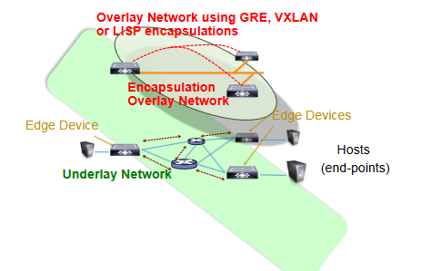
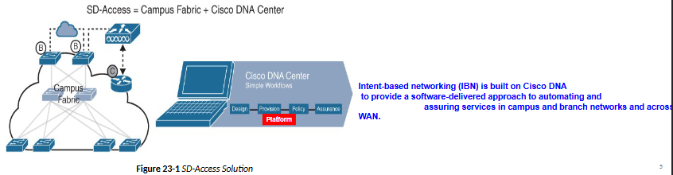
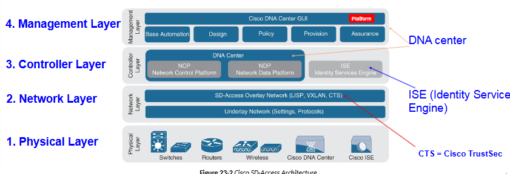
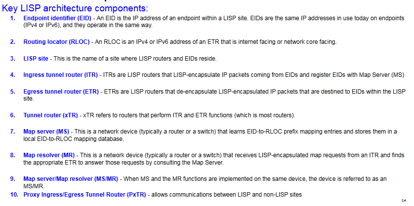
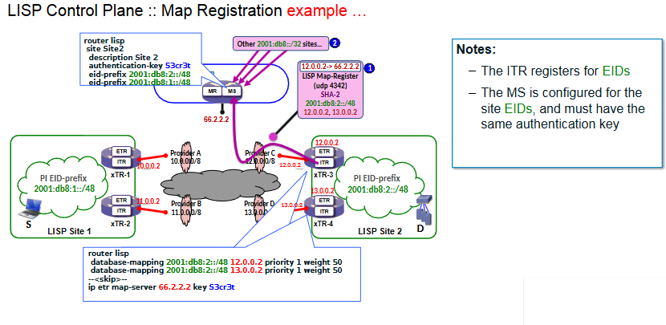
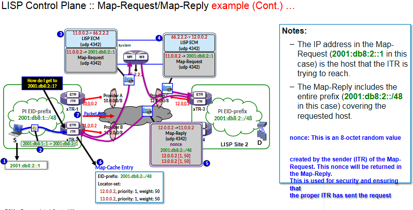
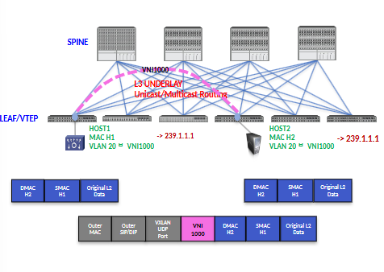
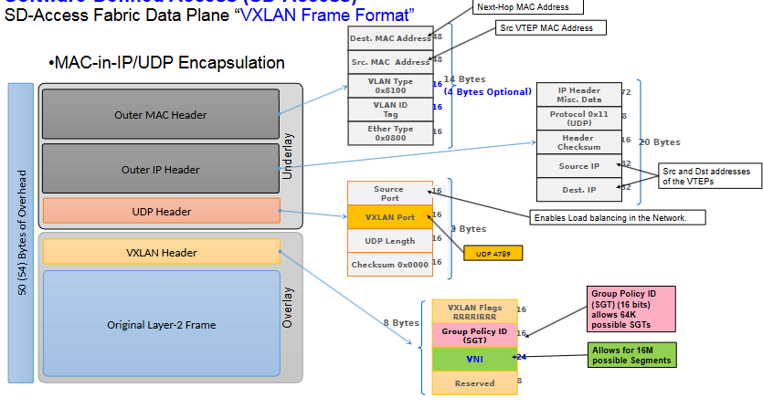

# Overlay Tunnels & Fabric Technologies

## Following content:
- Overlay Tunnels - LIPS and VXLAN principles of operation 
- Software-Defined Access (SD-Access) - Defines the benefits of SD-Access over traditional campus networks as well as the components and features of the Cisco SD-Access solution.
- Software-Defined WAN (SD-WAN) - Defines the Benefits of SD-WAN over traditional WANs as well as the components and features of Cisco SD-WAN Solution
----
## Software-Defined Access (SD-Access)
Fabric network is an overlay (virtual) network built over an underlay (physical) network using o erlay technologies (VXLAN or LISP for example).

Improves upon traditional physical networks by enableing host mobility, network automation and segmentation.

Increase in users and endpoints makes configuring user credentials and maintaining a consistent policy across the network very complex.

SD-Access has TWO main components:
1. Cisco Campus fabric solution - Cisco-validated fabrc overlay solution that includes all of hte features and protocols (control, data, management and policy plane) to operate the network infrastructure
2. Cisco Digital Network Architecture (DNA) Center - When the campus fabric solution is managed via the Cisco DNA Center, the solution is considered to be an SD-Access.

What is the SD Access fabric Architecture?

- Cisco SD-Access is based on hardware and software technologies. What makes Cisco SD-Access special is how these technologies are integrated and managed.
- It is a fabric architecture that can be divided into 4 basic layers

### 1. Physical Layer:

The following are the physical layer devices of the SD-WAN fabric:
1. Cisco switches - Provide wired LAN access to the fabric
2. Cisco routers - Routers provide WAN and branch access to the fabric
3. Cisco wireless - WLC and APs provide wireless access to the fabric 
4. Cisco controller applicances - Cisco DNA center and Cisco ISE are the two controller applicances required

### 2. Network Layer:
Network layer consists of the underlay network and the overlay network

1. Network underlay is the underlying physical layer, and its sole purpose is to transport data packets between network devices for the SD-Access fabric overlay

Two models of underlay that are supported:

*Manual underlay* - This type of underlay network is configured and managed manually

*Automated underlay* - In a fully automated network underlay, all aspects of the underlay network are configured and managed by the Cisco DNA Center LAN automation feature.

DNA center LAN automation feature creates a Layer 3 routed access campus design through the use of IS-IS as the routing protocol.

2. Overlay network is a virtual (tunneled) network tha tvirtual interconnects all of the network devices forming a fabric of interconnected nodes.

In SD-Access, the fabric Network Overlay is fully automated with 3 planes of operation:
1. Control plane, based on Locater/ID separation Protocol (LISP)
2. Data plane, based on Virtual Extensible LAN (VXLAN)
3. Policy plane, based on Cisco TrustSec

## Cisco Locater/ID Separation Protocol (LISP)

The SD-Access fabric <u>control plane</u> is based on Locator/ID Separation Protocol (LISP)

IETF standard protocol that is based on a simple endpoint ID (EID) to routing locator (RLOC) mapping system to separate the identify (endpoint IP address) from its current location (network edge/border router IP address)

LISP dramatically simplifies traditional routing environments by eliminiating the need for each router to process every possible IP destination address and route.

<b> LISP Routing Architecture</b>
- LISP separates IP addresses into endpoint identifiers (EIDs) and routing locators (RLOCs). Endpoints (hosts) can roam from site to site, and the only thing that changes is their RLOC.

<b> LISP Control Plane </b>
- Control plane operates in a very similar manner to DNS. Just as DNS can resolve a domain name into an IP address, LISP can resolve an EID into an RLOC by sending *map requests* to the *Map Resolver (MR)*
- IT DOES NOT LEARN OR ENCAPSULATE MAC ADDRESSES

## LISP Operation

----

# Virtual Extensible Local Area Network (VXLAN)

- Encapsulation protocol that provides connectivity using an overlay network to stretch Layer 2 or 3 connections over an Underlay Layer 3 IP network.
- Defines a MAC over (in) IP/UDP encapsulation scheme where the original Layer 2 Ethernet frame has a VXLAN header added and is then placed in a IP/UDP packet
- Encapsulates Layer 2 Ethernet frames in IP/UDP packets, enabling Layer 2 or Llayer 3 virtual networks that can span the underlying physical Layer 3 IP network.
- Using VXLAN allows the SD-Access fabric to support Layer 2 and 3 virtual topologies and the ability to oeprate over any IP-based network.

----

## SD-Access Fabric Data Plane "VXLAN"

- VXLAN enables an overlay network on top of IP L3 underlay network
- Original L2 packet is encapsulated with VXLAN header
- Each VLAN is mapped to a unique VXLAN Network Identifier (VNI) to extent L2 segments over data centers
- Each VXLAN Segment is identified by a unique 24-bit segment ID called a VXLAN Network Identifier (VNI) which is associated with a specific VLAN 
- Only hosts on the same VNI are allowed to communicate with each other.

- Data Plane Learning techniques for VXLAN (BUM traffic handling) is <u>is based on flood and learn mechanisms</u>
- VLAN is mapped to a unique VNI
- VNI is mapped to a multicast group on a VTEP to handle BUM traffic
- Local MACs are learned over a VLAN (VNI) on a VTEP
- BUM traffic are "flooded" to the delivery multicast group for that VNI to all members of that multicast group. Multicast protocol (PIM) is enabled in the Underlay network.

## VXLAN Frame Format

## VXLAN Network Identifier (VNI)

VNI is a 24-bit identifier which allows for up to 16 million VXLAN segments to coexist within the same infrastructure

- Located in the VXLAN shim header that encapsulates the original inner MAC frame originated by an endpoint.
- VNI is used to provide segmentation for Layer 2 and Layer 3 Traffic
- Each Virtual Tunnel Endpoint (VTEP) has two interfaces:
  - Local LAN interfaces - These interfaces on the local LAN segment provide bridging between local hosts
  - IP interface - This is a core-facing network interface for VXLAN. The IP interface's IP address helps identify the VTEP in the network.

----

## VXLAN frame format update

- Original VXLAN specification was enhanced for SD-Access to support Cisco TrustSec Security Group Tags (SGTs)
- This enhancement added new fields to the <u> first 4 bytes </u> of the VXLAN header in order to transport SGT tags.
- The new format is called VXLAN Group Policy Option (VXLAN-GPO). The new fields in the VXLAN-GPO packet format include the following:
  - Group Policy ID - 16 bit identifier thaat is used to carry the SGT tag
  - Group Based Policy Extension Bit (G Bit) - 1 bit field, when set to 1, indiciates an SGT tag is being carried within the Group Policy ID field and is set to 0 when it is not.

----

## Policy Frame

- SD-Access fabric policy plane is based on Cisco TrustSec (CTS). CTS SGT tags are assigned to authenticated groups of users or end devices. Network policy (for example, aCLS, QoS) is then applied throughout the SD-Access fabric, based on the SGT tag instead of a network address (MAC, IPv4 or IPv6)
- TrustSec SGT tags provide several advantages for Cisco SD-Access, such as: Network address-independent group-based policies based on SGT tags rather than MAC, IPv4, or IPv6 addresses, which reduces complexity.
----

## Controller Layer

The controller layer provides all of the management subsytems for the management layer, and this is all prvided by Cisco DNA Center and Cisco ISE.

### Controller Layer Subsystems

There are 3 main controller layer subsystems:
1. Cisco Network Control Plaform (NCP) {Automation} - Provides all the underlay fabric automation and orchestration services for the physcal and network layers.
2. Cisco Network Data Platform (NDP) {Assurance} - NDP is a data collection, data analytics and assurance subsystem that is integrated directly into Cisco DNA Center. NDP analyzes and correlates various network events through multiple sources and identifies historical trends.
3. Cisco Identity Services Engine (ISE) - The basic role of ISE s to provide all the identity and policy services for the physical layer and network layer. ISE provides network access control (NAC) and identity services for dynamic endpoint-to-group mapping and policy definition in a variety of ways

----

## Management Layer

User inteface/user experience layer, where all the information from other layers is presented to the user in the form of a centralized managment dashboard. Major configurations and oepration worflow areas:
1. Design - Configures device global settings
2. Policy - Defines business intent including creation of irtual networks, assignment of endpoints to virtual networks, policy contract definitions for groups 
3. Provision 