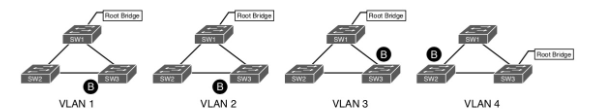
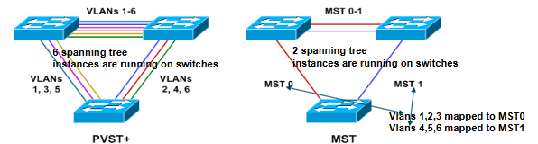
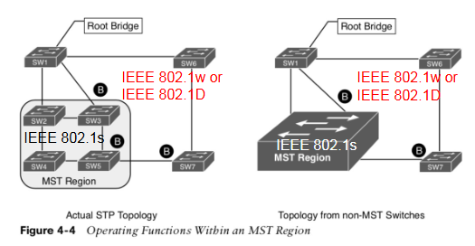
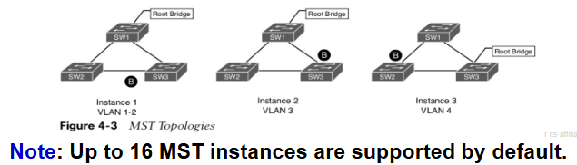
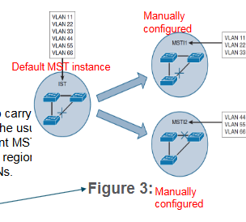
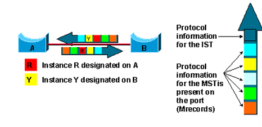
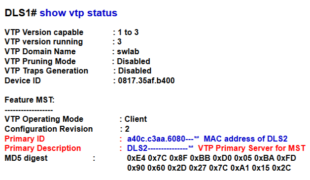

# Multiple Spanning Tree Protocol

Known in short as MST or IEEE 802.1s which is a standards based protocol that maps one or multiple VLANs to a single STP instance.

MST instances run RSTP (IEEE 802.1w) convergence mechanisms by default.

---- 

## PVST Topologies

- Per-VLAN Spanning Tree (PVST) provides a separate spanning tree instance for each VLAN configured on the network
- Topologies below show how switches maintain a different STP topology for each of the four VLANs.
	- It is important to note that in environments with thousands of VLANs, maintaining STP state for all of them can burden the switch's processor.
	


> PVST is Cisco Proprietary and only operates on Inter-switch links (ISL) Trunks, whereas PVST+ can operate on either ISL or 802.1q Trunks, and that is the difference on whether it is PVST or PVST+ that is being ran.

----

## MST topology

- MST (IEEE 802.1s) is a standard based protocol open protocol derived from RSTP (Rapid Spanning Tree Protocol a.k.a 802.1w) sharing its rapid convergence properties.
- MST is the only standardized spanning-tree protocol for VLAN-based networks that are supported by multiple vendors.
- MST maps one or multiple VLANs into one STP tree, called an MST Instance (MSTI).

The figure below show how switches maintain STP topologies for VLANs. If more VLANs were added to the environemnt, the switches would maintain two STP topologies if the VLANs alligned to one of the existing 2 MSTIs.



----

## MST Region

- A group of MST switches with the same high-level configuration is known as an MST region.
- All devices MUST have the matching characteristics otherwise it will not work:
	1. MST protocol enabled
	2. Same region name
	4. Same VLAN-to-MST instance mapping configurations
	5. Physically linked together
	
- MST incorporates mechanisms that make an MST region appear as a single virtual switch to external switches that may not be running the MST protocol.



- MST protocol can generate multiple spanning trees in an MST region
- Each spanning tree is mapped to the specific VLANs
- Each spanning tree is referred to as a Multiple Spanning Tree Instance (MSTI)
- In MST region 3 contains three MSTIs:
	- MSTI 1
	- MSTI 2
	- MSTI 0 
	
When it comes to MSTI's... 1+1=3

----

## MST Region Boundary

- The exact VLANs-to-instance mapping is not propagated in the BPDU, because the switches may only need to know whether they are in the same region as a neighbor.
- Only a digest (or hash) of the VLAN-to-MST instance mapping table is sent, along with teh MST revision number and MST the region name.
- Once a switch receives a BPDU, the switch extracts the digest (or hash) and compares this digest with its own computed digest. If they differ, the port on which the BPDU was received is at the boundary of a region or in the same MST region.

----

## MST Instances (MSTI)

- The MANUALLY created MSTIs are spanning tree instances that onlyxist inside a region. These instances run RTSP (802.1w) for rapid convergence
- MST uses a special instance, instance 0 (MST0), called the Internal spannign tree (IST)
- IST is ALWAYS the first instance and runs on all switch portinterfaces in the MST region regardless of the VLANs associated with the ports. IST is enabled by default and CANNOT be deleted.
- Additional infromation about other MSTIs is nested in teh IST BPDU that is transmitted throughout the MST region. This allows MST to advertise only one set of BPDU's, minimizing STP traffic.
- MST manually configured interfaces do not send BPDUs outside an MST region, only the IST does. This means that *IST can send BPDUs inside and outside the MST region*



- Instance 0 (MST0) is the internal spanning tree (IST)
- MST does not send BPDUs for every active STP MST instance separately.
- A special instance is designed to carry STP-related infromation.
- Topologies converge differently because root bridges are each configured differently within the MST region.



In the figure above, we can see that there are 3 independent MST instances: MST0 (IST), MST1 and MST 2. This means there are a total of 3 MST instances running on the switch.

- MSTIs do not send independent individual BPDUs. Inside the MST region, bridges exchange MST BPDUs that can be seen as normal RSTP BPDUs for the IST while contraining additional information for each MSTI.

- The following diagram shows a BPDU exchange between Switches A and B inside an MST region. Each switch only sends one BPDU, each includes one MRecord per MSTI present in the ports.



- As with teh PVST, the 12-bit Extended System ID field is used in MST, this can be used for tuning MST instances. This field carries the MST instance number.

----

## MST Region Boundary 

- The first property of an MST region is that at the boundary ports, no configured MSTI BPDUs are sent out. *Only the IST BPDUs are propogated in and outside of the MST region*.

- MST region boundary is any port that connects to a switch that is in a different MST region or that connects to IEEE 802.1d or 802.1w BPDUs.

- Propagating BPDUs at the MST region boundary involves a feature called PVST simulation mechanism. It sends out PVST +& RSTP BPDUs, one for each VLAN.

- The PVST simulation mechanism is required because PVST+/RSTP topologies do not understand the structure of IST BPDUs.

----

## MST Configuration 

```
// Define MST as the spanning tree protocol with the following command
SW(config)# spanning-tree mode mst 

// (optional) Define MST isntance priority using one of the two methods 
SW(config)# spanning-tree mode mst <isntance-number> priority <priority (0-61440 | increments of 4096)>
SW(config)# spanning-tree mode mst <instance-number> root {primary | secondary}

// Enter spanning-tree configuration mst with the following command 
SW(config)# spanning-tree mst configuration 


//Define MST region name 
SW(config-mst)# name <NAME>

// Specify the MST version 
SW(config-mst)# revision <version>

// Show commands 
SW# show spanning-tree mst configuration --> verify MST configs
SW# show spanning-tree --> Show relevant spanning-tree observations
SW# show spanning-tree mst <isntance-number> --> Show consolidated view of MST topology table
SW# show spanning-tree mst interface <int-id> --> view specific interface settings for MST.
```

----

## COnfiguring VTPv3 Primary Server for MST 

- In VTP version 3 (VTPv3) a single wsitch can be selected and configured as VTP Primary Server to propogate VLANs information, the same or different switch can also be configured as VTP primary Server for MST to propagate MST configuration amongst the switches in the VPTv3 domain.
- Only a single VTPv3 switch that is configured as the PRimary Server for MST and VLANs can propagate the respective configuraitons amongst the other switches within the domain.
- VTPv2 does *NOT* have the concept of VTP Primary Server
- In the example below: DLS2 is configured to be the Primary Server for MST 

```
DLS2# vtp primary MST
DLS2(config)# vtp mode server mst --> set the switch as the server for the MST 
```

- ALL other switches should be configured as MST clients with the following command:

```
DLS1(config)# vtp mode client mst 
DLS1# show vtp status --> should show DLS2 as the Primary server for MST 
```


