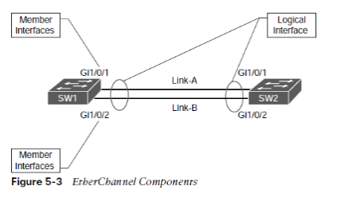
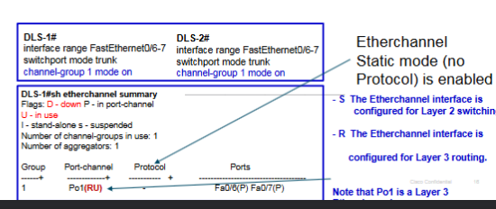
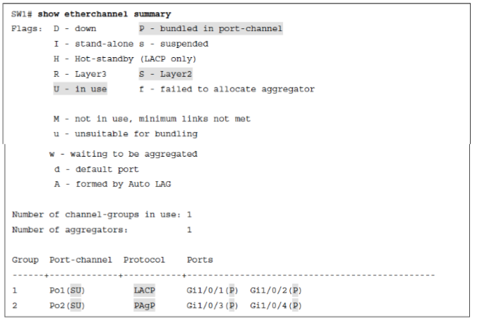
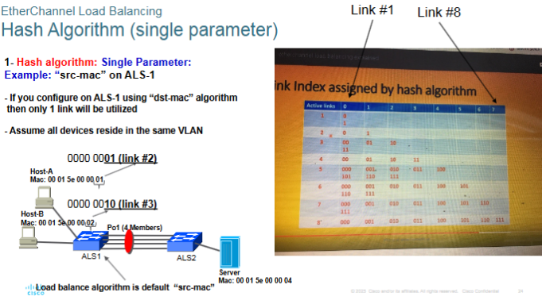
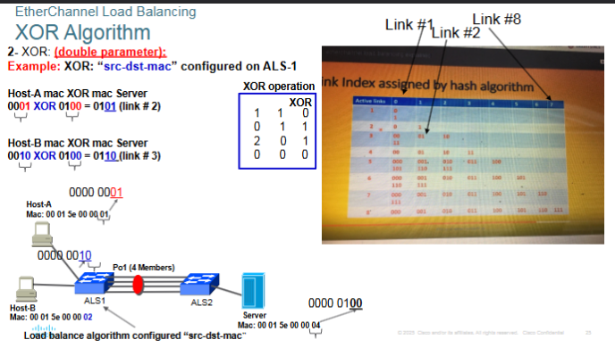

## VLAN Trunking Protocol

- Cisco created the proprietary protocol, VLAN Trunking Protocol (VTP), to reduce the burden of provisioning VLANs on switches 
- switches that participate in teh same VTP domain can have a VLAN creaed once on a VTP server and porpagated to otehr VTP client switches in the same VTP domain.

----

## Roles of VTP 

VTP Server:

- All switches are VTP servers by default
- Can create, modify, and delete VLANs and specify other configuration parameters such as VTP version and VTP pruning for the entire VTP domain 
- Sends and forwards advertisements to other switches 
- Syncrhonize VLAN configuration received from other domain switches 
- VLAN configurations are stored in the flash: vlan.dat file 

VTP Client:

- *CANNOT* create, change, or delete VLANs 
- Sends and forwards advertisements to other switches 
- Syncrhonizes VLAN configuration received from other domain switches 
- Learned VLANs are stored in the flash: vlan.dat file 

VTP Transparent:

- Does *NOT* participate in VTP 
- You can create, modify, and delete VLANs *only on the local switch* 
- Can forward VTP advertisements received from other switches in the same domain 
- Saves VLAN configurations in running config and vlan.dat 

VTP Off: 

- Does not participate in VTP (ONLY EXISTS IN VTPv3) 
- You can create, modify, and delete VLANs *only on the local switch* 
- Does not participate in VTP advertisements and does not forward them out of any ports either

----

## VTP Advertisements 

Summary Advertisements:

- Keepalives sent by VTP Servers and Clients every 5 mins. Advertising their Vtp domain name, password (if configured) and COnfiguration revision number 
- Incoming advertisements are compared with teh receiving switch VTP domain name and password 
 	- If the VTP domain name and password are different, the switch simply ignores the packet 
 	- If the VTP domain namd and password are the same, the switch then compares configuraiton revision number to its own revision number. If the revision number is lower, the packet is ignored. (This only applies to VTPv1 and VTPv2)
 	- If the configuration number is higher or equal, then an advertisement request is sent. 

Subset Advertisements:
- Sent by the VTP server every time a VLAN is added, deleted, or changed
- It increments the configuration revision number and issues a summary advertisement image.
- One or several subset advertisements follow the summary advertisement 
- A subset advertisement contains a lit of VLAN information 
- If there are several VLANs, more than one subset advertisement can be required to advertise all the VLANs.

Client Requests: 
- This advertisement is a request by a VTP Client to receive the more detailed subset advertisement.
	- This occurs when a switch with a lower reviison number joins the VTP domain and observes a summary advertisement with a higher revision that is has stored locally.
	
----

## Versions of VTP 

- VTPv1 is the default version, all switches will be set at VTP Server mode 
- VTPv1/v2 (Versions 1 and 2) have limited propagation to normal range VLANs numbered 1 to 1005
- VTP Version 3 (VTPv3) allows for the full range of VLANs 1 to 4094

> If VTP version 3 is configured, you have to configure a primary VTP server for VLANS, only the Primary server can create/modify or delete VLANs. You must set the VTP primary server

NOTE: VPTv3 is backwards compatible with VTP version 2 for normal range VLANs only.

----

## VTPv3 new features

1. Extended VLAN range supper (VLANs 1006 to 4094), TP version 3 can be used to create extended VLANs 
2. Better security:
	- VTP domain password is secure during transmission: DLS(config)# vtp password <password? [hidden]/[secret]
3. Configuraiton and database propagation via the VTP Primary Server:
	- Only the VTP primary server for VLANs is allowed to update VLAN infromation to other dvices in the VTPv3 domain. There can only be ONE Primary Server fper VT Pdomain that is allowed to have this role
4. Multiple Spanning Tree (MST) region configuration supportL
	- VTP version 3 allows for the sharing of the MST configuratoin amongst all the switches within the VTPv3 domain by the VTP Primary server for MST. Simplifies the process considerably.
	
----

## EtherChannel Bundle 

- Ethernet network speeds ar ebased on powers of 10 (10 Mbps, 100 Mbps, 1Gbps, 10 Gbps, 100 Gbps)
- When a link between switches become saturated, how can more bandwidth be added to that link to prevent packet loss?

----

## EtherChannel Components

Apsects of EtherChannel:
- Etherchannel is defined in the IEE 802.3ad link aggregation specification 
- STP operaties on a logical link and not on a physical link
- It will load balance across all the links 
- EtherChannels can be used for either Layer 2 (acces or trunk) or Layer 3 links.

----

## PAgP Etherchannel mode 

- PAgP Cisco's proprietary negotiation protocol, known as Port Aggregation Protocol 
- advertises messages with teh multicast MAC address 0100:0CCC:CCCC and the protocol code 0x0104. 

PAgP can operate in two modes:
Auto: 
- Interface does not initiate an EtherChannel to be established and does not transmit PAgp packets out of it 

Desirable:
- Interface tries to establish an EtherChannel and transmit PAgP packets out of it.

----

## LACP Etherchannel mode 

- IEEE Standards-based Etherchannel negotiation protocol, known as IEEE 802.1ax Link Aggregation Control Protocol 
- Advertises messages with the multicast MAC address 0180:C200:0002

LACP can operate in two modes:
Passive:
- An interface does not initiate an EtherChannel to be established and does not transmit LACP packets out of it

Active:
- An interface tries to establish an EtherChannel and transmit LACP packets out of it

----

## Static Etherchannel mode 

On:
- Switches support Static mode 
- No protocols is running 
- Both sides of Etherchannel have to be enabled as 'on'

----

## Verifying EtherChannel Summary Status

*You don't want to see SD under Port-channel as it means it is not operational*

----

## Troubleshooting EtherChannel

EtherChannel interfaces must have the same configurations:
1. Speed and duplex mode 
2. The same protocol and valid protocol combination 
3. The same Native and allowed VLAN range on the trunks 

For a non-trunk layer 2 EtherChannel, interfaces must be in the same access VLAN.

----

## EtherChannel Guard 

- The EtherChannel Guard feature is used to detect EtherChannel misconfigurations between connected devices.
	- Etherchannel Guard is enabled by default 
	- Misconfiguration occurs when the Etherchannel parameters do not match on both sides.
	
- If disabled, the feature can be enabled by sing the "spanning-tree ehterchannel guard misonconfig" global configuration command.

----

## Load Balancing Traffic with EtherChannel Bundles 

- Traffic that flows across a port-channel interface is NOT forwarded out member links on a round-robin basis per packet.
- Load balancing is configured on each switch side 
- Default load balancing mechanism uses "src-mac"
- The load-balancing algorithm is a system wide confiuration that uses the global configuraiton command "port-channel load-balance <algorithm>"

----

## EtherChannel Load Balancing Options 

Has two methods

Hash:
- Single parameter is used (source of destination MAC (L2) IP (L3))
	- dst-ip: Destination IP address 
	- dst-mac: Destination MAC address 
	- dst-port: Destination TCP/UDP port 
	- src-ip: Source IP address
	- src-mac: Source MAC address 
	- src-port: Source TCP/UDP port 
	
Exclusive OR (XOR): 
- For double parameters (source and destination MAC + IP
	- src-dst-ip: Source and destination IP addresses 
	- src-dst-mac: Source and destination MAC addresses 
	- src-dst-port: Source and destination TCP/UDP ports only 
	
----

----

----

## Viewing Port-Channel load balancing Algorithm 

If the links are unevenly distributed, changing hte algorithm may provide a different distribution ratio across member links.

The command "show etherchannel load-balance" displays how a switch will load balance network traffic based on its type.

> ETherchannel links should be in powers of 2 (2, 4, 8) to achieve optimal traffic distribution.

