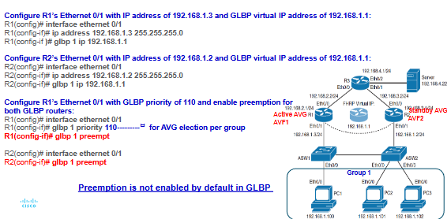

# Module 5 notes (Shortened to focus on important topics)

## NTP Network Time Protocol

The purpose of this protocol is to ensure all devices across a network will have a consistent and accurate time for validating certificate expiration and troubleshooting and event correlation.

Important notes:
- Used on UDP port 123
- Uses stratum levels to determing clock accuracy
  - Stratum 0: atomic/GPS clocks
  - Stratum 1: Directly connected to stratum 0
  - Stratum 16: Unreachable at any capacity
- Devices will synchronize with the lowest stratum number available

### NTP Peering

NTP uses peering to syncrhonize with each other using the following command:

```
R1(config)# ntp peer <ip-adress>
```

### NTP Authentication

```
1. Define Authentication key:
R1(config)# ntp authentication-key

2. Enable authentication:
R1(config)# ntp authenticate

3. Specify trusted keys:
R1(config)# ntp trusted-key

4. Configure authentication for NTP server:
R1(config)# ntp server <ip address> key <key number>
```

### NTP Versions
NTPv4 supports IPv4 and v6 as well as provides improved security.

```
Command to configure an NTP server:

R1(config)# ntp master <stratum #>
```

----

# First-Hop Redundancy Protocols (FHRP)

## Object Tracking

Offers a flexible and customizable mechanism for linking with FHRPs and other routing components.

It enables users to track specific objects in the network and take necessary action when any object's state change affects the network traffic.

```
R1# configure terminal

R1(config)# track 1 ip route 192.168.3.3/32 reachability

!! To review tracking command
R1# show track <number>
```

## Tracking an interface

Similar to object tracking however it would be applied on an interface level

```
!! Tracking R2's Gi0/1 Interface Line Protocol State

R2(config)# track 2 interface g0/1 line-protocol

!! Checking tracking status
R2# show track <number>
```

## A. Hot Standby Router Protocol (HSRP)
- Cisco proprietary redundancy protocol that requires TWO devices
  - Active router: handles traffic forwarding
  - Standby router: takes over if active fails
- A virtual IP and MAC address are assigned for the groups
- Works as a democracy through elections with the following criteria in order:
  - Highest priority (default = 100)
  - Highest IP address 

Versions:
1. HSRPv1: supports IPv4 only
2. HSRPv2: IPv4 and v6 (not backwards compatible)

There is a function called preempttion which means that when the primary router goes down, as soon as it is back up it will take over the backup router.
- This function is disabled by default

You can check the status by using the command
```
R1# show standby brief
```

SUPPORTS BOTH INTERFACE AND OBJECT TRACKING 

----

## B. Virtual Router Redundancy Protocol (VRRP)

- Industry-standard alternative to HSRP that has roles similar to HSRP:
  - Master router: actively forwards traffic
  - Backup router: takes over when master fails 

- Preemption is enabled by default
- MAC address format: 0000.5e00.01xx
- Uses the multicast address 224.0.0.18

There are two versions of VRRP:
1. VRRPv2: supports IPv4 only
2. VRRPv3: supports both IPv4 and IPv6

You can check the status of VRRP using the command:
```
R1# show vrrp brief
```

ONLY SUPPORTS OBJECT TRACKING

----

## C. Gateway Load Balancing Protocol (GLBP)

- Another cisco proprietary protocol that supports both redundancy AND load balancing
- Roles in GLBP:
  - Active Virtual Gateway (AVG): Assigns MAC addresses
  - Active Virtual Forwarders (AVF): Forward traffic
  - Supports up to 4 AVFs per group
- GLBP MAC address format: 0007.b400.XXYY
  - XX = GLBP Group (HEX)
  - YY = AVF number (8 bit value)

- Load Balancing Methods:
  - Round-robin (default)
  - Weighted (based on priority)
  - Host-dependent (ensures same MAC for a host)

- Authentication: uses MD5 hash
- Preemption is disabled by default
- Multicast address: 224.0.0.102

Configuration:


Can be checked using the command
```
R1# show glbp brief
```
ONLY SUPPORTS OBJECT TRACKING