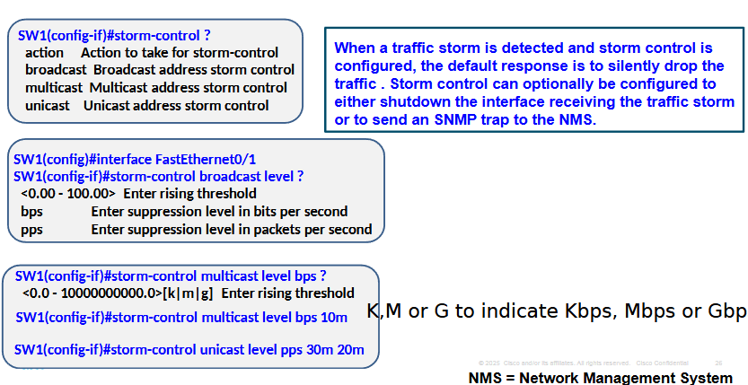

# Module 7

## Control Plane Policing 

- CoPP policy is a QoS policy that is applied to traffic to or source by the router's Control plane CPU.
- limit known traffic to a given rate while protecting the CPU from unexpected extreme rates of traffic that could impact the stability of the router
- Typical implementation uses only an inupt policy 
- CoPP policy is then implemented to limit traffic to teh control plane CPU to a specific rate for each class 
- QoS police command uses conform and exceed actions, which can be configured to transmit or drop traffic

### Configuration steps 

1. Create ACLs to identify traffic
2. Create class maps to define a traffic class
3. Create policy maps to define a service policy 
4. Apply service policy to the control plane

You can verify ACLs by using the show access-lists command


### Creating Class maps 

Class maps are composed of 3 different elements:
1. There is a name 
2. One or more match commands are used to identify the packets that are part of the class
3. Instructions on how the match commands will be evaluated.

You can verify this by using the show class-mmap command

### Creating Policy Maps to define a service policy 

used with CoPP to associate the traffic class with one or more policies, resulting in a service policy. 


In the following:
Policy map named COPP-POLICYMAP-EXAMPLE that identifies classes and policy if there are matches.

```
router(config)# policy-map service_policy_name
router(config-pmap)# class traffic_class_name
router(config-pmap-c)# police [cir | rate] conform-action [transmit | drop] exceed-action [transmit | drop]
```

This can be verified using the show policy-map command.

### Apply service policy to the control plane 

```
R1#configure terminal
R1(config)# control-plane
R1(config-cp)# service-policy input COPP-POLICYMAP-EXAMPLE
R1(config-cp)# end 
```

Can verify with the command show policy-map control-plane

----

## Port ACLs (PACLs)

- Access lists applied on Layer  ports.
- Can be standard, extended or named IPv4 ACLs for Layer 3, and they can be named MAC address ACLs for Layer 2
- few restrictions that vary from platform to platform.

Most common restrictions:
1. PACLs only support filtering incoming traffic on an interface (<u>no outbound support</u>)
2. PACLs cannot filter Layer 2 control packets, such as CDP, VTP, DTP, PAgP, UDLD, and STP
3. PACLs do not support ACLs to filter IPv6, ARP, or Multiprotocol Label Switching traffic.


Sample configuration of PACLs.

## VLAN ACLs

- Applied to VLANs
- Can filter traffic that is bridged within a VLAN or that is routed into or out of a VLAN

configuration steps:
1. Define a VLAN access map by using the command "vlan access-map name sequence"
2. configure the match statement by using the command "match {ip address {acl-number | acl-name} | mac address acl-name}
3. Confgiure action statement by using the command "action forward | drop [log]" to specify action to be taken when a match occurs
4. Apply VACL b yusing the command "vlan filter vlan-access-map-name vlan-list"
   - vlan-list can be a single VLAN, range of VLANS or a comma-separated lsit of multiple VLANS.


----

## Switch security - Attack Vectors

1. Device access attacks

Scenario: attacker tries to establish administrative access to a device.

Countermeasures:
- limit infromation available to attackers: disable CDP where not essential or intentionally used
- prevent eavesdropping on credentials: never use telnet in a production network
- use SSH with LONG RSA KEYS; use the latest version available on the device
- Use ACLs to limit access to authorized stations.

2. MAC flooding attacks

Cisco switches MUST enable port security 

- Port security limits the number of MAC addresses per port to 1 (by default) which won't be enough if VoIP phone is connected.
- If port security is enabled with 802.1X then port security will secure the mac addresses with 802.1X authenticates
- MAC addresses can be:
  - learnt normally / dynamically
  - statically configured
  - learned in a "sticky" manner.
    - will show in running but not automatically saved to startup.

There are 3 violation modes based on actions taken:
1. Protect - when the number of secure MAC addresses reaches the maximum limit allowed, unknown sources will be dropped without notification.
2. Restrict - Same as last point however, you are notified that a security iolation has occured. An SNMP trap is sent, a syslog message is logged, and the violation coutner increments.
3. Shutdown - port security violation causes the interface to become in error-disabled and shut down immediately. (THIS IS DEFAULTD)


4. VLAN attacks


