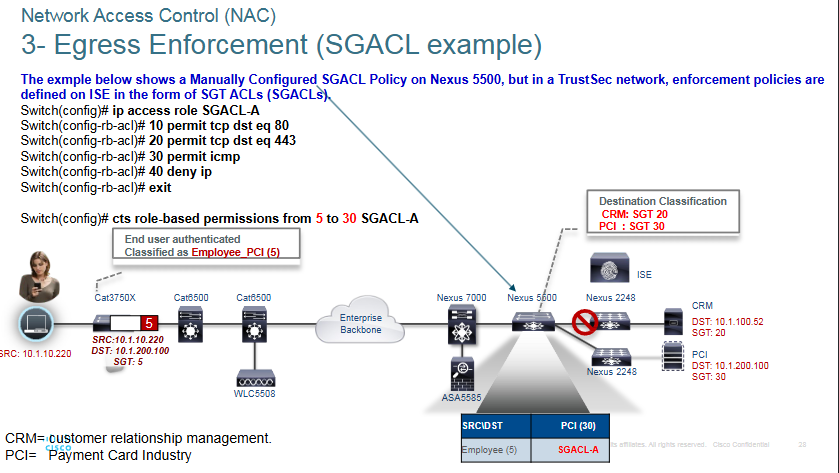

# Secure Network Access Control

## 802.1X and EAP

### 802.1X --> What is true?
- standard based protocol for port-based network access control (PNAC)
- Provides authentication mechanisms for wired local area networks and wireless local area networks.

Components:
- **Extensible Authentication Protocol (EAP)** - Provides an encapsulated transport for authentication process
- **EAP authentication method (EAP TYPE)** - Compatible with different authentication methods
- **EAP over LAN (EAPoL)** - Layer 2 encapsulation for the transport of EAP messages over wired and wireless LAN
- **RADIUS server with EAP extensions** - ONLY Radius servers with EAP extensions can be used with 802.1X

Roles:
Network devices have the following roles

1. **Supplicant** - software on the endpoint that communicates and provides identity credentials through EAPoL with the authenticator
2. **Authenticator** - Network access deviceses controls access to teh network based on the authentication status of the user or endpoint.
3. **Autnetication Server** - RADIUS server with EAP extensions, it performs the authentication of the client

>Cisco Identity Services Engine (ISE) is a consolidated POLICY-BASED access control system
> 
>Performs the following functions:
>
>1. combines authentication, authroization, accounting (AAA) into one place.
>2. Provides for comprehensive guests access management
>3. Provides suppor for POLICY-BASED placement, and monitoring of endpoint devices in the network
>4. Defines and applies the enforcement policies including security group access (SGA) through the use of security group tag (SGT) and security group access control list (SGACL)

### 802.1X Authentication
1. when a port is up, EAP over Lan (EAPoL) messages are sent to being authentication
   - sends periodic EAP-request/identify frames
2. EAP messages are relayed between supplicant and RADIUS authentication server
3. if successful, authentication returns RADIUS access-accept message

Until fully authenticated 802.1X only allows EAPOL, Cisco Discovery Protocol (CDP), and Spanning-tree Protocol (STP). Aftgerwards, data traffic can pass through the port

802.1X relies on RADIUS with EAP extensions, meaning AAA parameters on Radius server must be configured correctly.

```
SW(config)# aaa new-model
SW(config)# aaa group server radius {grp-name}
SW(onfig-sg-radius)# server 10.1.1.1 auth-p 1812 acct-p 1813
```

Three steps to complete the setup:
1. enable 802.1X globally
2. configure an authentication list
3. Apply to an access layer 2 port

### EAP Authentication Methods Comparison


### MAC Authentication Bypass (MAB)

MAB is an authentication and access control technique that enabled port-based access control using the MAC address of an endpoint if users and devices don't have an 802.1X suppplicant.

1. Switch initiates authentication by sending EAPoL identity request every 30 seconds (default)
2. Switch begins MAB by opening the port to accept a single packet to learn the MAC address of endpoint.
3. RADIUS server determines whether access is granted.

MAB authenticated endpoints should be given very restricted access and should only be allowed to communicate to networks and services the endpoints are required to speak to.

If authenticator is a Cisco switch, then many authroization options can be applied as part of the authorization result from the autehntication server, including the following:

1. Downloadable ACLs (dACLs)
2. Dynamic VLAN assignment (dVLAN)
3. Security Group Tags (SGT) tags

### Web Authentication 

Can be used by users that try to connect to the network without 802.1X supplicants AND might not know the MAC address to perform MAB.

**if both MAB and WebAuth are configured as fallbacks, when 802.1X times out, MAB is attempted first, then WebAuth**

<u>Unlike MAB. WebAuth is only for users and not devices since a web browser with manual username and password entry is required</u>

There are two types of WebAuth:
1. Local Web Authentication (LWA)
2. Centralized Web Authentication with Cisco Identity Services Engine (ISE)

#### Local Web Authentication (LWA)

- First form of web authentication
- Switch redirects web traffic to a locally hosted web portal running in the switch where an end user can enter a username and password.
- When switch sends login credentials on behalf of the user, it is considered to be LWA
- LWA web portals are not customizable
- Does not support Dynamic VLAN assignment, only ACL assignments
- LWA doesn't support the change of authroization (CoA) feature to apply new policies. Therefore, access policies cannot be changed based on posture or profiling state, and even administrative changes cannot be made as a result of malware to quarantine the endpoint.

#### Central Web Authentication (CWA) with Cisco ISE

Supports the following:
- CoA for profiling, as well as dACL and VLAN authroization options
- All the advances services: client provisioning, posture assessments, acceptable use policies, password changing, self-registration, and device registration

### Flexible Authentication (FlexAuth)

By default, cisco is configured with 802.1X, MAB, and WebAuth.

If an endpoint that does not support 802.1X tries to connect to the network, it needs to wait for a considerable amount of time before WebAuth is offered as an authentication option.

----

# Cisco TrustSec

Next-generation access control enforcement solution to aid in scalability to combat challenged related to maintaining firewall rules and ACLs by using SGT tags.

**SGT** - 16 bit value that **Identity Service Engine** assigns to the Endpoint device, or upon user login

TrustSec uses SGT tags to **<u>perform ingress tagging and egress filtering**</u> to enforce access control policy.

ISE assigns SGT tags to devices that are successfully authenticated and authorized through 802.1X, MAB or WebAuth.

Tag assignment is delivered to the authenticator as an authorization option. After the SGT tag is assigned, an access enforcement policy <u>**Based on the SGT tag can be applied at any egress point of the TrustSec Network.</u>** 

Tag Represents the context of the user, device, use case, or function.

Configuration occurs in 3 phases:
1. Ingress classification 
2. Propagation 
3. Egress encforcement 

### Ingress classification 

The process of assigning SGT tags to users, endpoints, or other resources as they ingress into the TrustSec network which can happen in one of two ways:

1. **Dynamic Assignment** - The SGT is assigned dynamically and can be downloaded as an authorization option from ISE when using 802.1X, MAB, or WebAuth.
2. **Static Assignment** - In environments such as a data center that do not require 802.1X, MAB, or WebAuth, dynamic assignment is not posssible, like servers.

Static assignment on a device can be one of the following:
- IP to SGT tag 
- Subnet to SGT tag 
- VLAN to SGT tag 
- Layer 2 interface to SGT tag


### SGT Propagation "Native/Inline and SXP"

Communicates the mappings to the TrustSec network devices that will enforce policies based on SGT tags

Two main methods:
1. Native Tagging 
2. Cisco-created protocol 

**Native (inline) tagging** - a switch inserts the **SGT tag** inside a frame to allow upstream devices to read and apply policy.


**SXP Propagation** - TCP based peer-to-peer protocol used for network devices that do not support SGT native/inline tagging in hardware.

The access layer device performs **authentication** of external source devices to determine the appropriate **SGTs** for ingress packets.

Non-inline tagging switches also have an SGT mapping database to check packets against an enforce policy.

**SXP peer that sends IP-to-SGT bindings is called a <u>speaker</u>**

**IP-to-SGT receiver is called a <u>listener</u>**.

SXP connections can be single-hop or multi-hop.

### Egress Enforcement 

**Policies can be enforced at the <u>egress</u> point of the TrustSec network.**

There are multiple ways to enforce traffic based on the SGT tag, and they can be divided into two major types:
1. Seucirty Group ACL (SGACL) - provides enforcement on routers and switches. Provides filtering and always based on source and destination SGT tags.
2. Security Group Firewall (SGFW) - Provides enforcement on firewalls. Requires tag-based rules to be defined locally on the firewall.



----

# MACsec

IEEE 802.1AE standards-based Layer 2 hop-by-hop hardware encryption method.

Provides Encryption for <u>Layer 2 wired Ethernet network</u> algorithm used fro encryption is GCM-AES-128 to offer integrity and confidentiality.

**<u>MACsec requires the clients to be authenticated via 802.1X</u>**

Traffic is encrypted only on the wire between two MACsec peers and is unencypted as it is processed internally within the switch. This allows the switch to look into the inner packets for things like SGT tags to perform packet enforcement or QoS prioritization.

There are two MACsec keying mechanisms available:
1. **Security Association Protocol (SAP)** - This is a **Proprietary** Cisco keying protocol. Used ONLY between Cisco switches.
2. **Macsec Key Agreement (MKA) Protocol** - <u>Standards based</u> keying protocol that provides the required session keys and manages the required encryption keys, it is **<u> only used between hosts and switches</u>**

Based on the Ethernet frame format; however, an additional 16-byte MACsec Seecurity Tag field (802.1AE header) and a 16-byte integrity Check Value (ICV) field are added.


