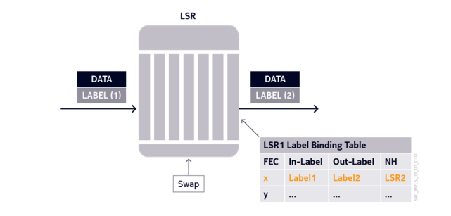
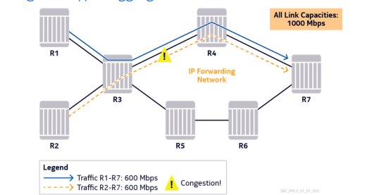

## Multiprotocol Label Switching

MPLS allows routers to forward traffic based on a simple label embedded in the packet header. A router examines this label to determine the next-hop for the packet whic hsimplifies the forwarding process and separates it form the routing protocol, which determines the route that traffic will take across the network.

It is a label switching technology that sets up a specific path for a sequence of packets, each of which is identified by a label inserted in the packet which dictates how it will be forwarded.

MPLS is independent of any routing protocol but is considered multiprotocol because it works with IP, asynchronous transport mode (ATM) and frame relay (FR) network protocols.

In the case of IP networks, any IGP routing protocol may be used to establish the IGP infrastructure.

---- 

## MPLS Label Binding Table lookup

The table contains forwarding information associated with an "exact" match rather than "longest" match (Used by regular IP routing) which enables the forwarding table to be smaller in comparison to a routing table. 

Nodes will forward traffic using a predetermined label that is sent down a preselected path and are replaced at each hop to quickly determine where the packet needs to get sent to next.

----

## Traffic Engineering - IP hyper-aggregation

Routing protocols cannot make use of all available network resources due to tehir limited mechanisms for selecting the best path as it does not provide routers with any visibility into network resource utilization, and therefore the routers do not recognize congestion on the netwokr links, underutilized alternate paths, or idle links.

Disitributing the aggregate network traffic load over all available resources becomes difficult in conventional IP routing, which leaves IP hyperaddresgation to remain a proble. MPLS allows engineers to correct these issues with traffic engineered label switched paths that are planned and designed to better balance the traffic load in a hierarchical, reliable network infrastructure.

----

## Traffic Engineering - MPLS RSVP

Traffic engineering - The ability to optimize the use of network resources, that is, utilizing all links and router processes in the most efficient way possible.

With reference to the figure below: using an IP-only network on R3, traffic from routers R1 and R2 will be forwarded to R4 based on the IGP's best path (lowest cost). This can potentially cause bottlenecking issues along the link depicted by the blue line while the links along the orange line would be underutilized or not used at all.

IP doesn't have the inherent capability to be able to tackle these issues to do its design. Equal cost multiple path (ECMP) is offered as a possible solution as 