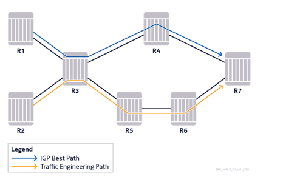
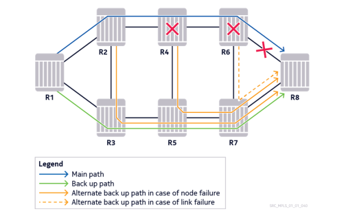
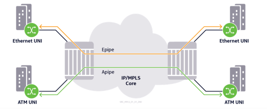
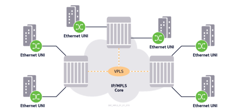
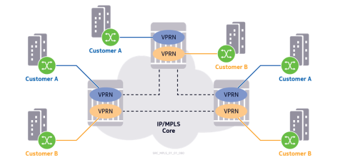
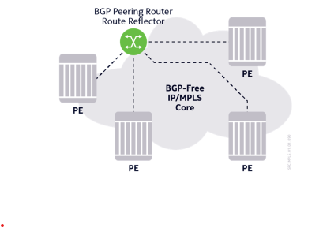
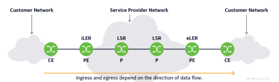

#Section 1
----
## Multiprotocol Label Switching

MPLS allows routers to forward traffic based on a simple label embedded in the packet header. A router examines this label to determine the next-hop for the packet whic hsimplifies the forwarding process and separates it form the routing protocol, which determines the route that traffic will take across the network.

It is a label switching technology that sets up a specific path for a sequence of packets, each of which is identified by a label inserted in the packet which dictates how it will be forwarded.

MPLS is independent of any routing protocol but is considered multiprotocol because it works with IP, asynchronous transport mode (ATM) and frame relay (FR) network protocols.

In the case of IP networks, any IGP routing protocol may be used to establish the IGP infrastructure.

---- 

## MPLS Label Binding Table lookup

The table contains forwarding information associated with an "exact" match rather than "longest" match (Used by regular IP routing) which enables the forwarding table to be smaller in comparison to a routing table. 

Nodes will forward traffic using a predetermined label that is sent down a preselected path and are replaced at each hop to quickly determine where the packet needs to get sent to next.

----

## Traffic Engineering - IP hyper-aggregation

Routing protocols cannot make use of all available network resources due to tehir limited mechanisms for selecting the best path as it does not provide routers with any visibility into network resource utilization, and therefore the routers do not recognize congestion on the netwokr links, underutilized alternate paths, or idle links.

Disitributing the aggregate network traffic load over all available resources becomes difficult in conventional IP routing, which leaves IP hyperaddresgation to remain a proble. MPLS allows engineers to correct these issues with traffic engineered label switched paths that are planned and designed to better balance the traffic load in a hierarchical, reliable network infrastructure.

----

## Traffic Engineering - MPLS RSVP

Traffic engineering - The ability to optimize the use of network resources, that is, utilizing all links and router processes in the most efficient way possible.

With reference to the figure below: using an IP-only network on R3, traffic from routers R1 and R2 will be forwarded to R4 based on the IGP's best path (lowest cost). This can potentially cause bottlenecking issues along the link depicted by the blue line while the links along the orange line would be underutilized or not used at all.

IP doesn't have the inherent capability to be able to tackle these issues to do its design. Equal cost multiple path (ECMP) is offered as a possible solution as it adjusts the IGP costs of both paths equally, so that the load balancing can be achieved. However a main issue would be that Not scalable and unmanageable approach for large networks as solving the problem for one section of the network or traffic flow, it would then lead to creating problems for the other parts of the network.

With RSVP-TE protocols, MPLS can offer a better and easy-to-use solution to service providers.

Using the same example from above, the network admin can easily steer traffic originating from R2 over the bottom path which would be completely different from the IGP's chosen path.

---- 

## Highly Available MPLS networks

In the event of unexpected network resource failure (within a link or complete node) the ability of the network to respond as quickly as possible becomes extremely important.

Convergence times: the total amount of time it takes to reroute traffic over other links/nodes.
- Time can depend on several factors, but in any case, they can be unsatisfactory or even unnacceptable, for certain mission-critical traffic types of customers.

MPLS is able to provide good rerouting performance with the following confiuration feature:
- Fast Reroute:
	- Each router can signal a protection LSP that takes a path away from the potential point of failure in advance. This can be the next-node or next-link along the path of the Primary LSP.
	- Has a proven field record of providing less than 50 milliseconds of convergence times for large numbers of LSPs after detecting a failure.
	
In cases where end-to-end protection of primary LSPs is required, secondary LSPs can also be used. In normal circumstances where end-to-end protection of primary LSPs is required, secondary LSPs can also be used.In normal circumstances, the traffic is forwarded over the primary LSP and if it fails, the secondary can mtake over. By using the standby option on the secondary LSP, it further improves the convergence times after failure detection.

Fast Reroute and Secondary (standby) LSP features can be used individually or in conjunction for any configured primary LSP.

----

## Layer 2 Point-to-Point VPN Services 

A Virtual Private I letwork (VPI l) offerse a private, isolated and secure connection between the customer sites. Business  VPI I Services are among the most improtant applications and are a significant source of revenue for service providers.

For the customer demanding service to connect two remote sites that require dedicated point-to-point connectivity, a Virtual Lease Line (VLL) or VPWS can be utilized. As the name implies, a VLL emulates a private leased line connection over a packet-based core infrastructure. It is the simplest type of VPI I to deploy with minimal resource requirement, which is ideal for point-to-point connectivity scenarios.

From the customer's perspective, the service provider network that provides the VLL service acts like an end-to-end wire. For this reason, this type of service is also referred to as a Virtual Private Wire Service (VPWS).
- An industry standard exists under the name "pseudowire" to allow for interoperability across different providers who are willing to provide this service. In Nokia context, this is called a Pipe service.

If the user I letwork interface at both sides of the connections is Ethernet-based, the service is called an ePipe.

An important benefit of MPLS is its ability to support legacy access technologies such as ATM, FR, or TDM. These traffic types can be easily transported through aPipe, fPipe and cPipe respectively, thank sto the transparent nature of the VLL connection.

A similar service can be provided over a pure IP-network, as well as by using Generic Routing Ecapsulation (GRE) tunnels which utilize an IP header. Security concerns can be further addressed using IPSec on top o fthe GRE tunnels through encryption. Although such solutions work, they brign high operational overhead and are slow and not scalable.

The advantage of MPLS is the ease of provisioning and maintenance and of providing a scalable, highly available, and standards-based solution.

----

## Layer 2 Multipoint VPN Services (VPLS)

In relation to the VPI I requirements presented, Virtual Private LAI I services (VPLS) enables multipoint connectivity at OSI Layer 2 for enterprise customers.

In the figure above:
- VPLS service with three participating service routers.
- Service acts as a bridged Later 2 multipoing VPI I that connects various geographically dispersed customer sites.
- Service provider network acts like an Ethernet bridge or switch, from the perspective of the customer.
- All customer end devices connected to the same VPLS service appear to be on the same broadcast domain.

Thus, there is a clear separation of functionality and responsibility between the service provider and the customer.
- Service provider simply provides Layer 2 connectivity based on MAC address communication.
- Allows customers to maintain their routing control tasks themselves.

VPLS supports features such as VLAI I trunking, double tagging (also known as Q-in-Q), VLAI I translation, and several variations of the Spanning Tree Protocol (STP) to avoid L2 broadcast storms.

Nokia Service Router implementtion addresses possible scalability concerns by introducing the Hierarchical VPLS (H-VPLS) and Provvider Backbone Bridging (PBB) features.

----

## Layer 3 Multipoint VPN Servces (VPRN)

Multipoint connectivity needs of customers can also be addressed with the use of Layer 3 (IP) VPI I Services.

Nokia calls this type of service a Virtual Private Routed I letwork (VPRI I). The term "peering model" is also used in the industry for these types of solutions because peer relationships between the customer and provider edge routers are necessary to exchange IP routing information.

Primary conerns in IP-VPI I services:
- Addressed by Virtual routing and Forwarding isntances on the service router.
- Each customer is allocated a separate VRF, which isolates routing infromation and enables the use of overlapping private IP address spaces at each customer site.

Isolation is achieved inherently in the core, thanks to tunneling concepts that uses labels.

IP-VPI I services are typically offered as managed services and are usually preferred by customers willing to offload their routing control tasks to teh service provider.

Prioer to MPLS, IP-VPI I services could still be offered on IP-only networks through routing policies and packet filters that achieve iosolation and separation between different customers. However, his approach can easily become overwhemingly complex and non-scalabe on the adminstration side.

----

## BGP-Free IP/MPLS core

Packet forwarding in a service provider IP network is possible only if the routes to all destination prefixes are known on each router.

In many deployments, BGP would be used to bring external routing information from other autonomous systems to provide connectivity to the global internet.

In the IP only case, normally all the routers in teh service provider domain need to contain these external routes in their BGP tables for packet forwarding to work end-to-end. This includes even the core (P) routers, which might not have to offer direct-BGP-related services on themselves, unlike the PE routers.

However by using MPLS shortcut tunnels between the PE devices and the BGP Peering router(s), external traffic can be trasnaprently label-switched through the tunnels form the perspective of the P or core routers, hence the term BGP-Free Core.

----
#Section 2
----

## MPLS Terminology: PE, P, CE, LER, LSR

*Provider Edge devices (PE)*
- Device that has at least one interface that is directly connected to the CE devices
- Usually has at least one interface that connects to the service provider's core devices or routers
- Must be able to connect to different CE devices over different access media
- Usually able to support many different interface types
- Customer's gateway to the VPN services offered by the service provider

*Provider Router (P)*
- Supports the service provider's bandwidth and switching requirements over a geographically dispersed area
- Does not connect directly to teh customer equipment

*Customer Edge Devices (CE)*
- Provides access to the service provider network over a link to one or more provider edge (PE) routers.
- End user typically owns and oeprates these devices
- Unaware of tunneling protocols or of VPN services that are provided by the service provider

*Label Edge Router (LER)*
- LER MPLS router resides in the boundary between the MPLS domain and the customer domain.
- May be one of the following:
	- Ingress LER (iLER) - non-MPLS traffic enters the MPLS domain through the iLER. The iLER adds a label to the non-MPLS traffic and sends it to the enxt-hop LSR.
	- Egress LER (eLER) - MPLS traffic exits the MPLS domain through an eLER. It removes the label from the MPLS packet and forwards the unlabeled packet to teh CE router.
	
*Label Switched Router (LSR)*
- Resides within the MPLS domain and connects the iLER and eLER to form a path for forwarding labeled traffic through the MPLS domain.
- When it receives labeled traffic, it replaces the incoming label with an outgoing label and forwards the labeled packet to the next-hop router.

Whether a router is iLER, eLER, or LSR depends on where that router resides in the MPLS domain, as well as the direction in which traffic flows. A different CE-CE pair or traffic flow direction could change these roles.