# Fundamentals of MPLS 

----

# Section 1 - Understanding the Dapa Plane Implementation 

----

## MPLS Label Stack Implementation 

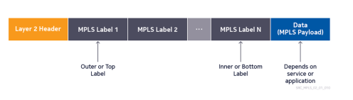

- A single data packet or frame can carry multiple MPLS labels 
- When that happens, it is said that encapsulated data carries a label stack 
- MPLS labels are inserted between OSI Layer 2 and encapsulated data (Payload)
- Labels are used to differentiate different types of services and/or customers from each other.

----

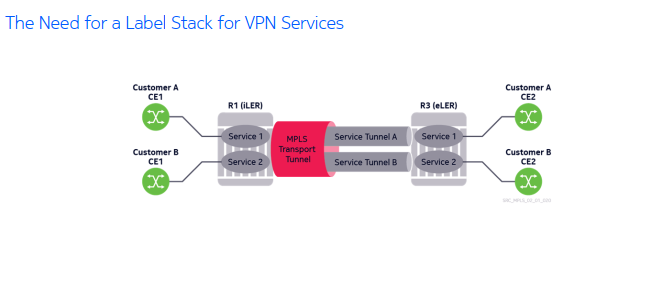

----

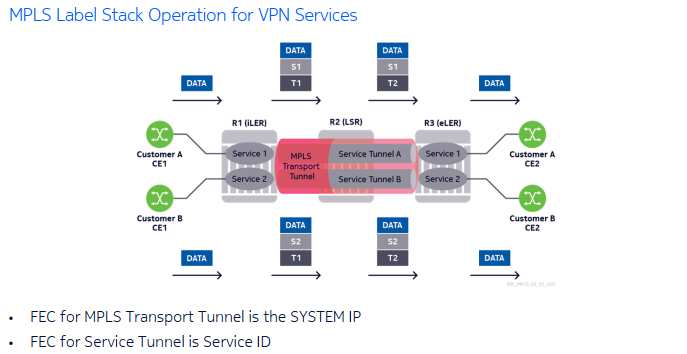

----

----

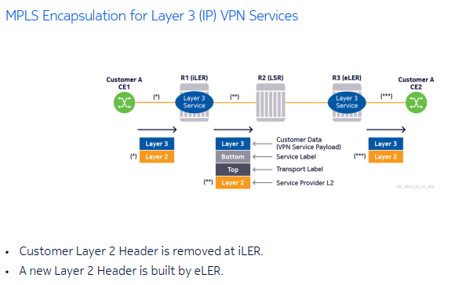

----

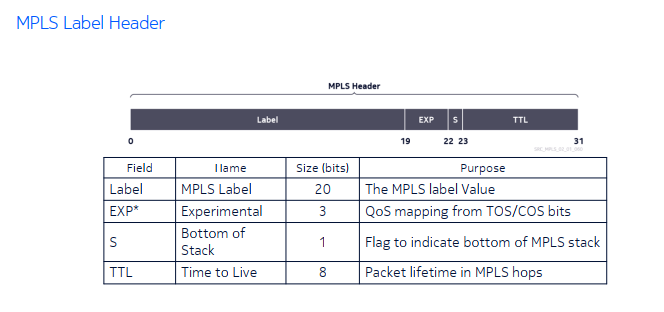

----

## MPLS Label Range Allocation on Nokia OS

- MPLS Label Field is 20 bits 
- Possible values from 0 - 1,048,575

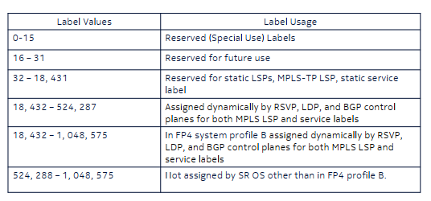

----

## MPLS Header: EXP Field 

- Consists of 3 bits 
- A.K.A Traffic Class field 
- Used solely to convey Quality of Service (QoS) information.
- Only the EXP field inside the top label is significant in processing
- Two approaches
  - Pipe mode
  - Uniform mode
- Nokia SR OS only implements pipe mode 

## Implementation

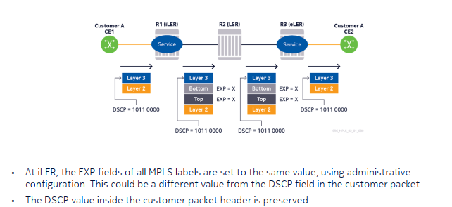

----

## MPLS Header - Bottom of Stack (S) Bit

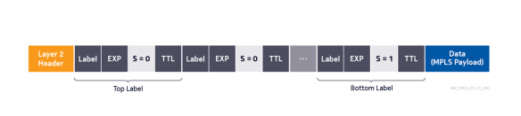

----

## MPLS Header - Time to Live (TTL) Field 

- 8 bit MPLS TTL field functions similarly to IP TTL
- Prevents forwarding loops
- When TTL = 0, packet is not transmitted to next hop
- In *MOST* cases, only the TTL field inside the top label is significant in processing
- Two approaches:
  - Pipe mode
  - Uniform Mode
- Nokia only implementts Pipe mode

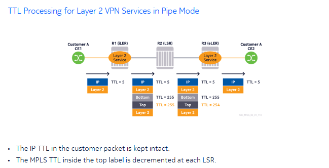
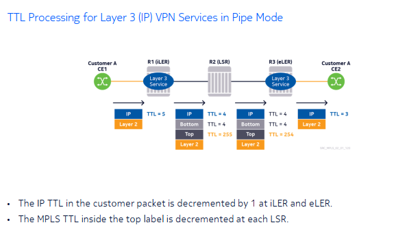

----

# Section 2 - Understanding the Control Plane implementation of MPLS

----

## Requirements for IP/MPLS Control Processes 

For tunnels to be estabilshed:
- Routers must know about each other's FECs (Essentially corresponds to an IP prefix)
- Label bindings for FECs mus tbe negotiated between routers.

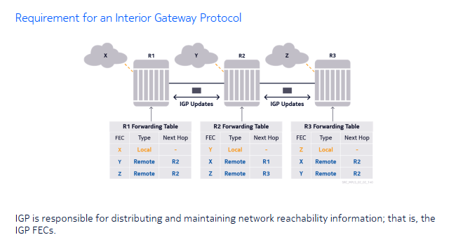

----

## Requirements for MPLS Signaling Protocols

- FECs' IP prefixes are exchanged, and the other routers tunnel destinations are known due to IGP
- Signaling protocol is needed to negotiate MPLS labels and establish tunnels

There are two main signaling protocols:
1. Label Distribution Protocol (LDP)
2. Resource Reservation Protocol (RSVP)

----

## MPLS Transport Label Signaling Protocols

Label Distribution Protocol:
- IGP-based tunnels (only)
- Simple configuration
- No Traffic Engineering Support
- IGP dependednt convergence times
- Also called Link or Interface LDP
- Advertises labels for FECs automatically
- Keeps Labels in memory for all FECs received even if they are not used 

Resource Reservation protocol with Traffic Engineering (RSVP-TE):
- Fully customizable tunnel paths
- Ability to run more complex path calculations with additional adminsitrative constraints
- Superior traffic protection mechanisms
- Higher administrative overhead
- Only advertises labels for FECs that are requested by upstream routers
- Deletes Labels for FECs that are not used

----

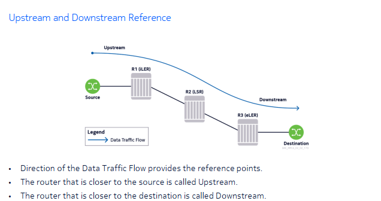

## Upstream Label Distribution

- Routers advertise label bindings for their FECs, which are propogated to the upstream routers
- Each router selects the label value that it will advertise, associated with each FEC.

## Result of Label Distribution (Data Forwarding)

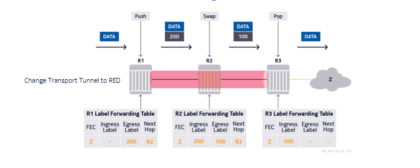

- Label Forwarding Information Base (LFIB) tables are populated and the LSP gets established 
- Encapsulated data can then be transmitted in the downstream direction.

----

## MPLS Service Label Signaling Protocols

Targeted LDP (T-LDP)
- Used for Layer 2 VPN Services 
- RFC 4447 specifies its use
- Creates an end-to-end session between two PE routers 

Multi-Protocol Border Gateway Protocol (MP-BGP)
- Used for Layer 3 (IP) VPN Services 
- Called Multi-Protocol due to its support for different address families other than standard IPv4
- Based on RFC 4364

----

## MPLS Special Use Labels

| Label Value | Label Usage               |
|----------   |----------                 |
| 0           | IPv4 Explicit Null        |
| 2           | Router Alert              |
| 3           | IPv6 Explicit Null        |
| 4-15        | Reserved for future use   |

----

## Before Implicit Null - Normal Operation

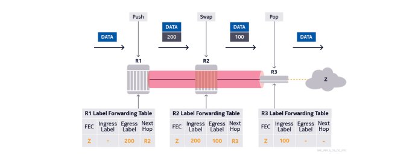

R3 receives packets destined fro FEC Z with a label of 100 and always pops them.

----

## MPLS Implicit Null

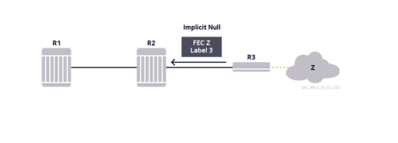

- On R3, the result of the label lookup process for packets destined fro FEC Z is always a "pop" action.
- If R3 wants to save some processing resources, it can request the penultimate router (R2) to send the packets with no transport label.
- R3 expresses this by advertising a label binding for FEC Z with a value of 3.

----

## Penultimate Hop Popping (Result of Implicit Null Advertisement)

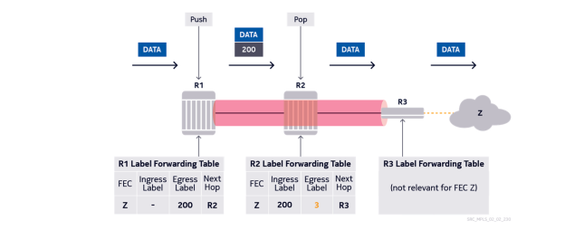

- Penultimate hop (R2) honors the request of R3 and pops the transport label 
- Although the egress label value is displayed as 3, this value can never exist in the MPLS label of a data packet.

## Nokia Support for Penultimate Hop Popping (PHP)

- As a penultimate router, Nokia routers have always had inherent support to honor any PHP request.
- Its possible to configure an SR OS router to advertise impllicit null as the last hop router
- It is supported for both LDP and RSVP-TE
- Introduced for small-scale MPLS nodes.

----

## MPLS Explicit Null 

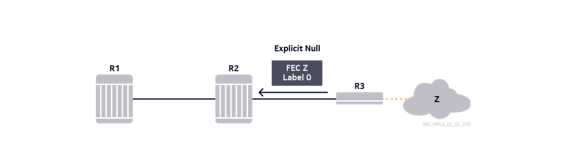

- R3 still wants to sav esome CPU resources but needs the QoS information included in the EXP bits.
- R3 sends a lebl value of 0 to router R2 
- R3 pops the label directly without doing a label lookup; R3 records the EXP bit value for QoS processing.

## Result of Explicit Null Advertisement 

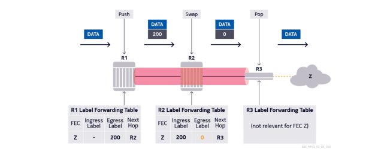
- R2 honors the request of R3 and sends the packet with a label value of 0
- R3 immediately pops the label when it sees a value of 0.

## Nokia SR OS Support for Explicit Null 

- As the penultimate router, Nokia Routers have always had the inherent support to honor any explicit null request
- Service Router does not send any explicit null requests as the last hop 
- CPU utilization is not a concern on the service router.

----

## MPLS Router Alert Label 

- Used in several OAM (Operational, Adminsitration, Maintenance) applications.
- Indicates to the receiving router that the packet must be passed to the control plane for processing.

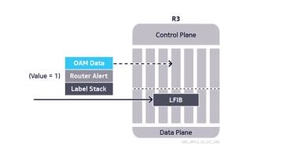

