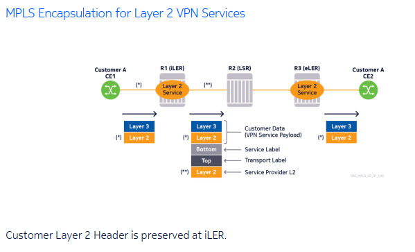

# Fundamentals of MPLS 

----

# Section 1 - Understanding the Dapa Plane Implementation 

----

## MPLS Label Stack Implementation 

- A single data packet or frame can carry multiple MPLS labels 
- When that happens, it is said that encapsulated data carries a label stack 
- MPLS labels are inserted between OSI Layer 2 and encapsulated data (Payload)
- Labels are used to differentiate different types of services and/or customers from each other.

----

----

----

----

----

----

## MPLS Label Range Allocation on Nokia OS

- MPLS Label Field is 20 bits 
- Possible values from 0 - 1,048,575

----

## MPLS Header: EXP Field 

