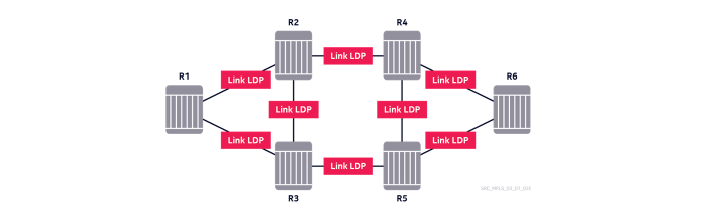
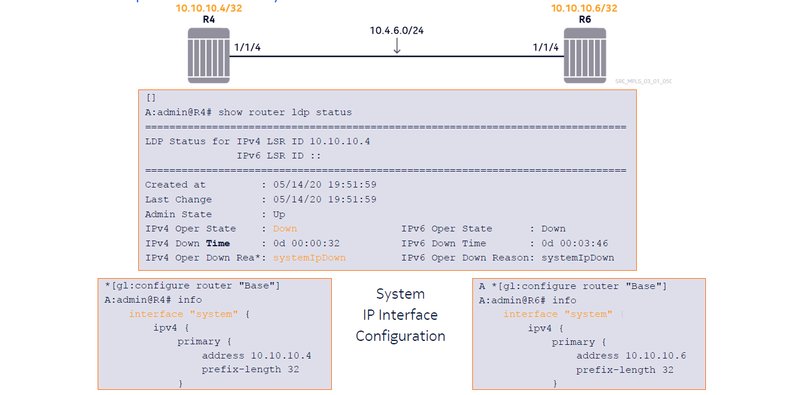
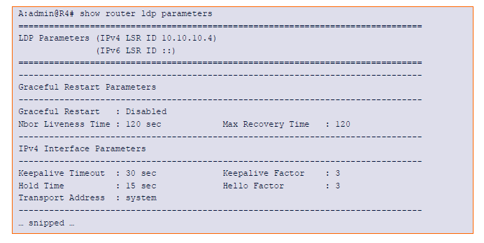
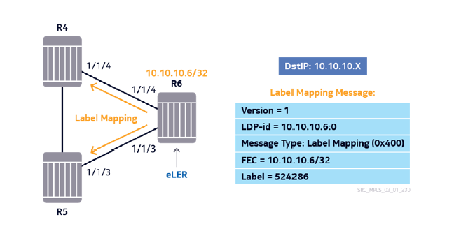
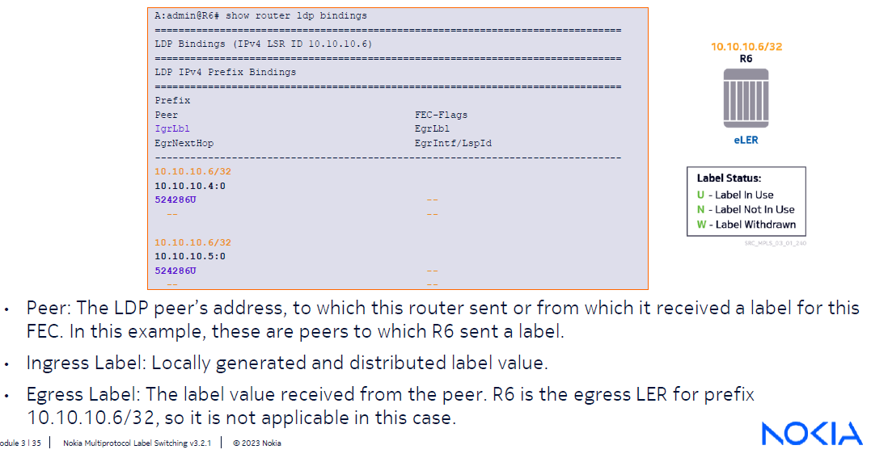
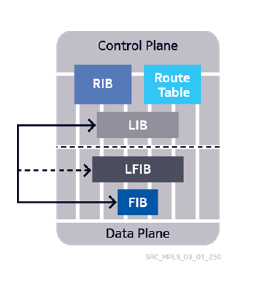
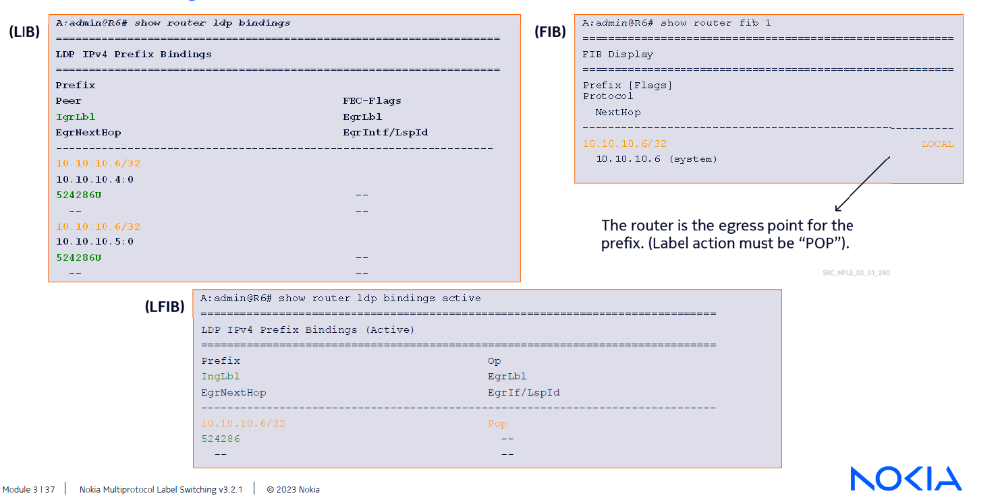
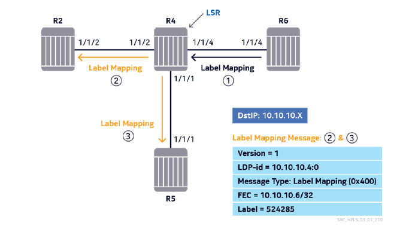
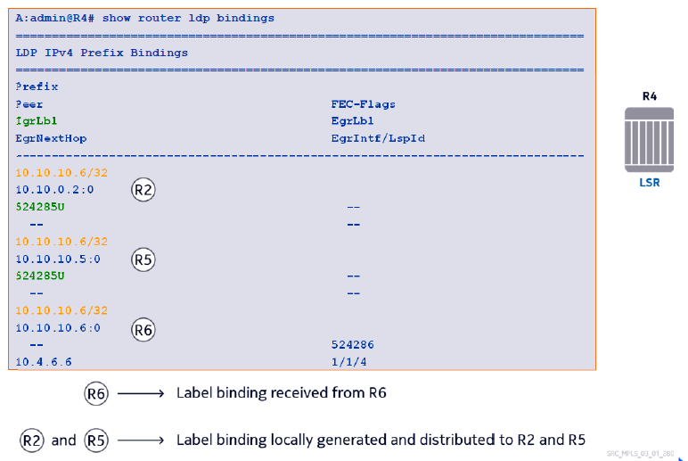
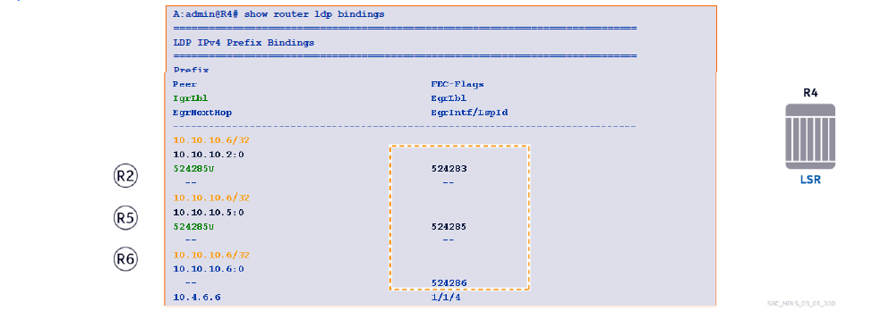

# Modules 3 - Label Distribution Protocols

## Link LDP Overview (Pages 7, 8, 12)



Link LDP requires all participating routers to establish peering relationships and sessions between each other in order to exchange label bindings with each other for selected FEC's, which would be the system interface. These sessions are maintained by exchanging keepalive messages.

Labl exchange occurs in a flooding manner which allows the router to perform a selection process to decde which next-hop router and label will be used to reach all other Label Switching Routers.
- Creates entities called Label Switched Paths (LSPs) or tunnels
- Created in a full-mesh fashion between every possible source and destination router pair in the LDP network.

### Operation

1. Peer Discovery - Routers use LDP Hello messages to automatically discover other LDP peers
2. Session Establishment and Management - LDP sessions are built between LDP peering routers. These sessions are maintained through keepalive messages
3. Label Management - After sessions are established, LDP distributes label bindings and withdraws them if necessary.
4. Notification - LD Puses notification messages to alert LDP peering routers about errors.


### Requirement for System IP Interface



Based on this image, LDP routers won't even attempt to initiate the neighbor discovery process because system IP addresses are not configured on either routers (or the system address is administratively down)

It is sufficient to use a /32 address to enable the system IP address, but each system address has to be UNIQUE within the network.
- Any overlaps between adjacent will lead to the routers being unable to establish any form of peering (IGP or LDP)
- Any non-adjacent routers will just give massive headaches in terms of trouble shooting if they have the same system address.

### Verifying LDP default settings



As seen in the image above, we can use the following command to verify parameters for LDP:

```
show router ldp parameters
```

### Label Generation and Distribution (on Router R6 for this example) (pages 34-73)



- R6 has the system address 10.10.10.6/32 which makes it the egress port for that address
- Dictates that R6 must initiate the entire label distribution process for their own IP addresses

In this case R6 picks an available label from the range allocated by MPLS protocols for dynamic assignment to associate it wiht the prefix 10.10.10.6/32. From here, a label is generated and reserved specifically for R6 to be used in LDP, NO other dynamic protocol can use the assigned label (524286)

- R6 sends out a label mapping message to R4 and R5 to inform them of the label binding with the detination IP address of the label mapping message being either 10.10.10.4 or 10.10.10.5.
  - The same label (524286) will be distributed to R6's neighbors

Since LDP operates in Downstream Unsolicited mode, R6 does not need to receive requests from neighbors to distribute its label binding.
- Any Active session will have the generated label binding distributed towards the other peer right away.
  - R6 chooses the label that it wants its peers to use when forwarding data to R6.

### Label Information Base (LIB) on Router 6



Label generation and distribution is a control plan process that needs ot take place before data packets can be delivered.

So in the same example used above, the generated label for prefix 10.10.10.6/32 is stored in a table called the Label Information Base (LIB).

A router maintains entries in the LIB for every prefix for which it has generated and distributed a label binding, as well as label bindings it has received for those prefixes.
- Since a router can have multiple directly connected peers, there can be multiple entries per prefix for each peer.

The label that is logically generated and distributed to a peer is indicated in the Ingrell Label column.
- Recall that the control plane and data plane functions operate in the opposite direction from each other.
- If Router A needs to forward a labeled packet to router B, Router A needs a label.
- Router B sens the label upstream to router A, so that router A can forward labeled packets downstream to router B.

R6 distributes a label of 524286 to its neighbor, which signals that it wishes to recieve the (ingress) labeled data packets destined to its system IP address with that label.

the Egress Label, Egress Interface and Egress Next-Hop fields are empty; therefore the ingrell labeled data packets for this prefix have no outgoing transport labels. This is an indication that router R6 terminates LSPs targeting its FEC 10.10./10.6/32 without popping in the data plane the label 524286 from ingress packets. Router R6 is where the LSP to 10.10.10.6/32 terminates or end.


### Building the Label Forwarding Information Base 




Once the operator enables LDP on the router and/or interfaces, the routers form LDP adjacencies. The Label Information Base (LIB) contains all the label beindings that have been sent to or received from the active peers.

Recalling that LDP operates downstream, there are multiple options to reach certain destination prefixes in which only the best of the possible option needs to be chosen and indicated in the data plane as the active label binding to label switch the packets.

In this context, it is important to know that there is a strong reliance on IGP. This means that LDP will use the IGP active next-hop to determine which label it will use to forward traffic for any given FEC.



In this context, we can see that R6 has not received any label bindings for 10.10.10.6/32 from its neighbors, indicated by the fact that egress label, interface, and next-hop fields are empty in the "show router ldp bindings" command that displays the LIB.

This is an expected outcome because R6 is the LER for LSPs with its own system IP address as the target.

By using the following:

```
show router ldp bindings active
```

it will show the labels that are actively being used, and the corresponding actions on teh data plane. This is the Label Forwarding Information Base (LFIB). In this example, the entry says that if the router receives data packets with the transport labels of 524286, it will POP the label and analyze the next encapsulation header.

Both the FIB and LFIB are uniform throughout the ntire data plane. Regardless of which data plane component the packet travels through, they are subject to the same treatment.

### Label Generation and Distribution on Router 4



R6 sends a label mapping message to routers 4 and 5.
- Upon the receipt of the message, router R5 receives the label binding for prefix 10.10.10.6/32 and writes it into its LIB, as an egress label towards router R6. It will add it to teh LFIB if it can validate that it is the interface towards R6 the IGP selected.

Seeing that there are other active LDP peers present, R4 generates its own label binding for 10.10.10.6/32 and distributes it to R2 and R5. The desintation IP of the label mapping message here is either 10.10.10.2 or 10.10.10.5.



In the image abovem we are seeing R4's LIB where it received from R6 the label binding 10.10.10.6/32 and distributed its own label binding to the other peers, R2 and R5.

The first two rows of the LIB display the label generated by R4 and advertised to both peers R 2 and R5. It is an ingrell label because this is the label that R4 expects to receive in the data plane, if the neighbors choose router R4 as the next-hop to reach router R6.

The rhid row indicates the label binding received from R6, the owner of the prefix. It is an Egress Label because this is the label used when sending labeled packets to router R6 in the data plane. The physical egress interface and teh resolved next-hop IP address are also included in teh output for this entry.

This howerever, is not the complete picture.

### Label Flooding

In redundant networks, a router may receive multiple label mapping messages from several peers for the same prefix.
- These messages are propagated through the network in a flooding fashion and, as a result, router R4 receives a label binding for prefix 10.10.10.6/32 from routers R2 and R5.



1. Label mappings from R2 and R5 are written into the FIB Egress Label column
2. Consequence of using Liberal Label Retention (all label bdingings are kept in the LIB)
3. R4 has chosen R6 as the active next-hop for 10.10.10.6/32; therefore, tonly the entry for R6 has an Egress Interface and Egress next-hop IP address.


