# Resource Reservation Protocol (RSVP)

## Introduction
- Initially used to signal traffic characteristics and IP traffic flow requirements 
- It is NOT a routing protocol, but works with routing protocols
- Requests resources for unidirectional flows.
  - Bidirectional flows require two RSVP sessions (one per direction)

----

## Extensions RSVP Traffic Engineering (RSVP-TE)
- Was extended to be used as a label distribution protocol
- RSVP-TE brings benefits such as:
  - The ability to administratively define LSP paths
  - Ability to make advanced path calculations that are not restricted to IGP cost values
  - Use of a rich set of traffic protection features
    - secondary paths, Fast Reroute
  - Ability to make resources reservations - Connection ADminssion Control (CAC) functionality.

### Characteristics

- LDPs are only signaled when explicitly requested
- Label distribution process starts at the egress router and progresses towards the ingress router
- Labels are cleared if not needed
- Path and Resevations messages are used to signal LSPs
- Session states are maintained on all routers along the path of an LSP


### PATH Message Flow

- Router sends a PATH message in the downstream direction and requests labels to be allocated along the path, in order to have an LSP to a tail-end router.
  - Head-end router is the ingress router of the tunnel and the egress router is called the Tail-end

### Reservation Message Flow

- RESV messages are sent in the upstream direction and labels are allocated at each hop.
- When the head-end router receives the RESV message from ts downstream neighbor, the LSP is brought up.

### Prerequisites for Configuring RSVP-TE LSP

- Ensure proper functioning of hardware 
- Configure network interfaces
- Configure IGP
- Enable MPLS context
- Configure the interfaces for MPLS
- Enable the RSVP content

Interfaces need to be enabled for both MPLS and RSVP on the main and every other router these messages will go through.

### Enabling and verifying MPLS and RSVP 

```
A:Admin@R1# configure router mpls
A:Admin@R1# configure > Router > mpls > no shutdown

A:Admin@R1# configure router rsvp
A:Admin@R1# configure > Router > rsvp > no shutdown
```

Done because both contexts are disabled by default.

### LSP and LSP-Path

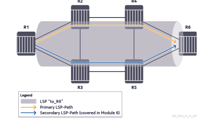

- An RSVP-TE based LSP can have multiple associated LSP-Paths
- One primary and seven secondary paths can be defined for redundancy 
- One LSP-Path is active at any given time (referred to as the primary path)

An LSP can also have Fast Reroute detour or bypass tunnels to recover traffic in the fastest way possible. (Covered further in Module 6)

### LSP Path configuration options

- At least one path definition is needed for an LSP
- Path definition may contain a list of nodes that the path must traverse
  - Explicitly defined as "loose" or "strict" (Module 5)
  - Empty list with no explicit hops
- A path definintion can be used multiple times in different LSPs, but cannot be used more than once per LSP, whether primary or secondary.

### RSVP Path Messages

PATH messages uses end-to-end addressing with a "Router Alert" option to instruct each other along the path to process the RSVP content in the control plane

**If the RSVP message does not list any hops, the IGP forwaring table is used to forward the PATH message at each router.**

### Forwarding the PATH Message from router R1 to router R2

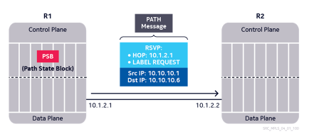

1. R1 creates the PATH message and a Path State Block (PSB)
2. R1 stores the PATH message in the PSB and forwards the mesage to the next hop
3. HOP contains R1's egress interface IP address
4. LABEL REQUEST object indicates that R1 expects a label

### From R2 to R4

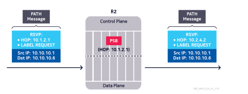
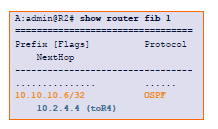

R2:
1. Receives the PATH message
2. Creates the PSB
3. Stores the PATH message in the PSB
4. Looks up destination in FIB
5. Regenerates and forwards the PATH message

### End-to-end Forwarding of the PATH message

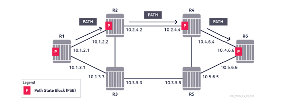

- PATH messages are forwarded downstream to R6
- A Path State Block is created at each hop, storing the PATH message sent by the upstream router
- R6 is the tunnel destination
- R6 needs to send a RESV message back to R4

### Forwarding the RESV message from R6 to R4

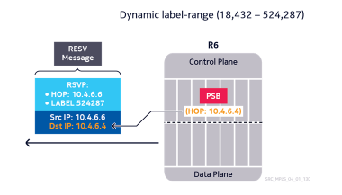

- R6 allocates a label (524287) and sends back a RESV message
- Destination IP address is the upstream router's egress interface IP address (advertised previously in the HOP object of the PATH message and stored in the PSB)

### Creating the RSVP session on R6

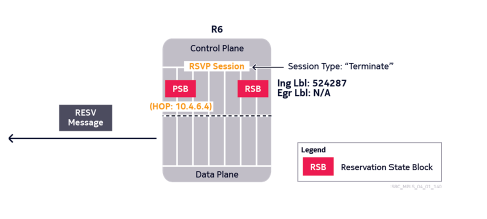

- The Reservation State Block (RSB) stores the RESV message
- When a PSB and RSB are both present, an RSVP session is created for the LSP
- Session type is "Terminate" on R6, as it is the tunnel destination.

### Forwarding the RESV message from R4 to R2

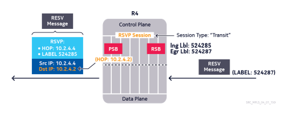

- R4 receieves the RESV message and creates the RSB
- R5 REGENERATES the RESV message and forwards it upstream
- RSVP session is created for the LSP with type "Transit"

### End-to-End Forwarding of the RESV message

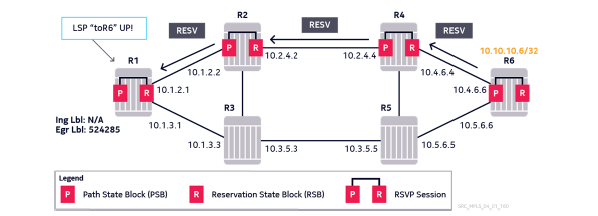

- RESV messages are forwarded upstream to route R1
- RSVP session is created on each router along the LSP
- R1 puts the LSP into an operationally Up state
- RSVP session type on R1 is "Originate"

This can be verified using the command:

```
show router mpls lsp <interface> path detail
```

### Verifying RSVP Session on the Originating Router

```
show router rsvp session originate
```

- Tunnel ID: Shared by all LSP-Paths that belong to the same LSP
- LSP ID: Each LSP-Path has its own LSP ID
- Session Name: Format "LSP-Name :: Path-Name"
- Tunnel ID, LSP ID, and Session Name are used to identify a unique RSVP session that belongs to a singaled LSP on all routers.
- Tunnel ID and LSP ID are internally assigned by the originating router (not configurable)
- Session Name is taken from the LSP configuration

### Verifying the LSP on a Transit Router

```
show router mpls lsp transit
```

this command will display the ingress and egress label along with interface information and other relevant details regarding the LSP.

### Verifying the LSP on the LAST Hop Router

```
show router mpls lsp terminate | detail
```

Simply shows where the LSP will end

### Other RSVP Message Types

- PATH Tear: Used to clear the LSP in the downstream direction toward the egress rotuer
- RESV Tear: Used to cclear the LSP in the upstream direction toward the ingress router
- PATH Error: A node reports errors related to a PATH message received from an upstream router.
- RESV Error: A node reports errors related to a RESV message received from a downstream router
- Hello: Used as a hearbeat mechanism for RSVP
- ACK: Used to acknowledge initial PATH and RESV messages (disabled by default)
- Summary Refresh: Used to replace the LSP regreshing PATH and RESV messages to reduce overhead (disabled by default)

### PathTear Message - Shutting down an LSP

- LSP is initially established
- Operator disabled the LSP 
- PathTear messages are sent downstream to clear the RSVP sessiosn and tear down the LSP

### Link Failure - ResvTear Message

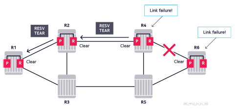

- LSP is initially established 
- Link between R4 and R6 fail
- R6 detects the failure and clears the RSVP session
- R4 does the same and sends a ResvTear message upstream

### Path Error Messages

A Path error message may be sent upstrem if a router cannot forward the PATH message any further during initial establishment. A possible reason could be that the destination address is unreachable.

### Reservation Error messages

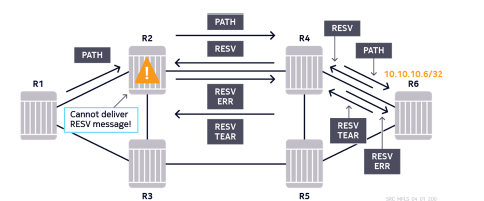

- May be sent downstream if a router cannot forward the RESV message any further
- Any sort of reservation failure or a change in the reservation status can cause the RESV error condition
- Tear may not make it to iLER if the link from R1 to R2 caused the error.


### RSVP Session Refresh

- RSVP is a soft-state protocol; sessions must be constantly refreshed
- PATH and RESV messages are exchanged between all RSVP negihbors at periodic intervals.
- Sessions time out if they are not refreshed within a certain period

### RSVP Session Timeout - PathTear and ResvTear Message


- Session times out on R4 due to missing PATH or RESV messages
- R4 clears the RSVP session
- PathTear is sent downstream 
- ResvTear is sent upstream 

### Configuring Refresh Time and Keep Multiplier

```
router rsvp refresh-time <number>
!! default time is 30

router rsvp keep-multiplier <number>
!! default is 3
```

- Refresh Time is locally configurable on each router. It determines how frequently Refresh messages will be sent 
- Applies to all RSVP sessions on the router
- Keep Multiplier is a decimal value that determines the session timeout interval 
- To restore default values, delete configured parameters.


## Section 2 - RSVP Session-Refresh Optimization

### Impact of Lower Refresh Timers for Faster Detection

- To maintain the LSP's state, routers periodically send PATH and RESV refresh messages
- The global refresh time setting tells the routers when to send refresh messages; the default refresh time is 30 seconds
- A shorter refresh time allows faster RSVP failure detection but creates greater CPU and bandwidth overhead.

### The need for RSVP Session Refresh Optimization

- A router can potentially have thousands of RSVP sessions
- Normally, each session needs to be refreshsed separately, by the constant exchange of PATH and RESV messages
- Failure detection and reduction of resource consumption need to be optimized.

### RSVP-TE Hello Protocol

- Introduced to speed up convergence without reducing refresh time
- Routers exchange Hello messages on each RSVP-enabled interface 
- Default time is 3 seconds
- Upon missing several messages, the neighbor is declared down, and all RSVP sessions related to that neighbor are cleared.

This can be configured with the following:

```
configure router rsvp interface <int name> hello-interval <time>
!! time is in seconds
!! Default = 3 
```

### Verifying RSVP neighbors

```
show router rsvp neighbor
```

- Neighbors remain Up b yconstantly receiving Hello messages
- The keep-multiplier value in the global RSVP context (configure>router>rsvp>) also determines the Hello Timeout value
- Hello Timeout = Hello-interval * Keep-multipler
- Default timeout = 3s * 3 = 9s

### Session Refresh Time Randomization
- Refreshign all (or many) RSVP sessions at the same time should be avoided
- Each time, the refresh-time transmit interval is set to a random value in the 50-150% range of the configured value
- Effective refresh timeout is also modified to accomodate this.

### RSVP Refresh Overhead Reduction
- Purpose is to reduce RSVP messaging overhead
- Maintains states of all RSVP sessions and can quickly detect message loss or network failures
- Both RSVP negihbors need to be "Refresh Reduction" capable.
- Introduces a new object "Message-ID"
- Summary-Refresh message replaces all subsequent refresh messages for all active sessions
  - Also contains a list of the Message-IDs of all active sessions
- if "Reliable Delivery" is also enabled, initial RSVP messages during LSP establishment are Acknowledged

### Message ID and Reliable Message Delivery

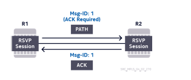

- When the refresh-reduciton feature is enabled, a unique Message-ID per RSVP session is adde to all RSVP messages (except hello)
- An Acknowledgement can be requested from the neighbor to confirm the delivery of individual messages
- If the neighbor supports the feature, it sends back an ACK message that includes the Message ID of the received message
- If a change occurs in the session state, the Message-ID is incremented.

### Rapid Retransmit Timer and Retry Limit

If no ACK is received within the "rapid-retransmit-timer" interval, the message will be re-sent a maximum of the "rapid-retry-limit" number of times.

### RSVP Refresh Reduction - Summary Refresh Message

- When both RSVP neighbors are enabled for Refresh Reduction, only a Summary Refresh message is exchanged; individual PATH and RESV (and ACK) messages are not needed to refresh each session
- The Summary Refresh message contains a list of the Message-IDs of all the RSVP sessions.
- The Summary Refresh message contains a list of the Message-IDs of all the RSVP sessions running on that interface.

```
A:admin@R1 configure>router>rsvp>interface> (name)# refresh-reduction | reliable-delivery
!! Configured on the interface

A:admin@R1 configure>router>rsvp# rapid-retransmit-time <number>
!! Default = 5

A:admin@R1 configure>router>rsvp# rapid-retry-limit <number>
!! Default = 3

!! Verify with the following command
show router rsvp neighbor
```