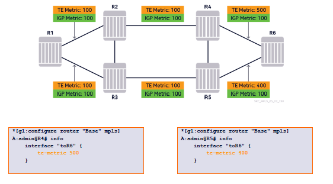
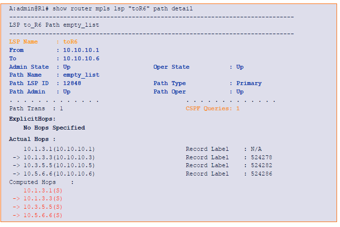
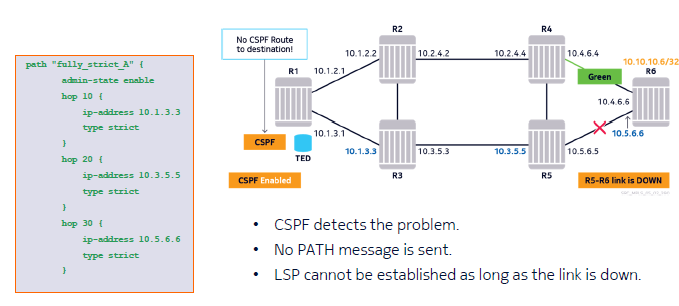
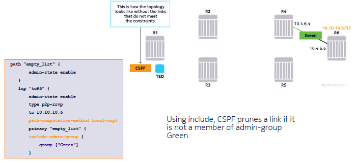
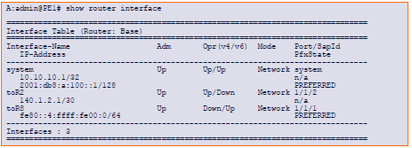

# MPLS Module 5 - Traffic Engineering

## Section 2 - Configuring Traffic Engineering in a Flat (Single Area) Network 

### Configure TE based on LSPs

Configuring LSPs using TE involves:
- Enabling TE in teh IGP configuration 
- Defining additional attributes for the links:
  - Administrative Groups
  - TE metric
  - SRLG Groups (Module 6)
- Creating a path definition 
- Specifying one or more administrative constraints in the LSP configuration 
- Enabling CSPF in the LSP configuration 

### Administrative Group Definitions


The Administrative Group name-to-value associations should be consistent on all routers.

- Defined in the configure router if-attribute context.
- The example above is a group defined with the name "Green" and assigned the value of 4.


### Traffic Engineering Metric Configuration



Note: metric can be defined on the links that can be different from the standard IGP metric.

### RSVP-TE Explicit Path Definitions

- Path definition may contain a list of nodes that the LSP path must traverse 
- Each node is called a hop.
  - A hop can be expressed as an IP address (interface or system IP address of a router)
  - Can be either "strict" or "loose"
- Path configuration is used to regulate the actual path that an LSP takes. It is considered as a constraint in the CSPF calculation.

### Strict and Loose Hop Definitions

Strict or loose describes the relationship between two consecutive hosp in the list.
- Strict Hop: Must be an immediate next-hpo router to the previous hop in the list.
- Loose Hop: Can be any downstream node to the previous hop in the list. Doesn't need to be an immediate next-hop

If enabled, CSPF:
- Calculates the intermediate hops to reach a loose hop
- Checks if a strict hop is valid
- Enabled under each LSP directly by path-computation-method command

A path definition may be composed by using:
- Fully loose or empty path list
- Fully strict hops
- Mixture of strict and loose hops.


### Fully Loose Path Configuration 


- Both path configurations above are considered as "fully loose"
- If path definition is empty, the destination address defined in the ""to" field of the LSP configuration is used by CSPF
- CSPF calculates the entire end-to-end path to 10.10.10.6

### Fully Loose LSP path Establishment


CSPF calculates the entire path from router R1 to router R6, avoiding the green links.

### CSPF Calculated Loose Path - CLI View



Can be checked by using the command: ```show rotuer mpls lsp <lsp-name> path <path-name> detail```

### Fully Strict Path Configuration 


- A strict hop must be an immediate next-hop router 
- Both interfaces (preferred) and/or system IP addresses may be used.
- The LSP must go through all the strict hops. CSPF not needed.

### Fully Strict LSP path Establishment 


The ERO is populated by the manual strict hop configurations.

### Fully Strict LSP path with CSPF disabled - CLI view 


- "Computed Hops" field is not visible if CSPF is disabled 
- CSPF can be enabled to verify the fully strict hops.

### Mix of Loose and Strict Hops Path Configuration


- Both path configurations are valid
- CSPF only calculates the "loose" portion of the path 
- CSPF also checks that the strict hops are valid.

### Mixed Hop LSP path Establishment


### Using TE-Metric in CSPF calculation


- By default, CSPF uses the IGP metric values of the links
- The "metric-type" needs to be specified as TE for CSPF to take the TE metric values into account.

### Traffic Engineering Metric Configuration 


### LSP path Failure Scenarios
LSP path establishment failures can occur due to:
- Invalid hop confgiuration in path deifnition 
- Certain hops becoming unavailable
- No path found with the given constraints

If CSPF is not enabled:
- The Head-End router can detect problems related to teh immediate next-hop only 
- In the case of other problems, the Head-End router sends an RSVP PATH message and receives a PATH Error message back, aong with the failure code indicating the root cause.

If CSPF is enabled: 
- The Head-End router validates the path in the TED and if problems are detected, a PATH message is not sent.

### Failure Case-1 - Invalid Strict First Hop


### Failure Case-2A - Incorrect Hop (CSPF NOT Enabled)


- R1 sends the PATH message despite the intermediate hop error
- R3 detects the error in the ERO then sends back a PATH ERROR 


- Next-hop (R3) returns a PATH Error message with RSVP Error Code: Routing Problem and Error Value: Bad Strict Node 
- CLI displays:
  - Failure code: badNode
  - Failure Node: 10.1.3.3 (Node that identified the error)

### Failure Case-2B - Incorrect Hop (CSPF Enabled)


- CSPF on Head-End (R1) performs a sanity check on the configured fully strict hop path and detects the problem.
- "No CSPF Route to Destination" failure code is indicated each time CSPF calculation fails with the given path definition (and constraints)

### Failure Case-3A - Strict Hop Link Failure (CSPF NOT Enabled)


### Failure Case-3B - Strict Hop Link Failure (CSPF Enabled)



### Failure Case-4A - Admin Group "Include" statement


### Failure Case-4A - CSPF View



### Failure Scenario-4B - Admin Group "Exclude" Statement

If an exclude statement is used, the router will consider all the links except those that are members of the specified admin group. By doing so, CSPF prunes just the admin-group "Green" just choosing the best path along what remains of the path.

### Using CSPF to Check TE Availability 
- It is possible to check whether a TE path is available to a certain destination without having to configure and signal an LSP.
- CSPF provides such a test function with the following command: ```tools perform router mpls cspf to destination [contraints]```
- If a source ("from") address is not specified, it is the router where the command is issued.
- A different source address can be specified
- Several constraints can be specified
- The command returns the hop information, if a path is available.

----

# CSPF Path Check example 1 - Using "Exclude-Bitmap" (Reference slide 82)

----

# CSPF Path Check Example 2 - Using "Include-Bitmap" (Reference slide 83)

----

# CSPF Path Check Example 4 - Different Source Router (Reference slide 84)

## Section 3 - Trafic Engineering in a Hierarchical Network 

### Scalability Concerns in Flat (Single Area) IPG Networks

- Scalability concerns might arise in a very large and flat IGP deployments. SPF algorithm increases with the number of links in the network
- The number of LSPs required in a large flat network can also increase with the number of MPLS routers.
- Transit LSRs, especially, might be over-burdened as they need to maintain session states for thousands of LSPs.

### IGP Hierarchy - Multiple Areas 

- IGP domain might be split into multiple areas to introduce a hierarchy.
  - Advantage: Scalability is increased
  - Disadvantage: Traffic Engineering cannoto work across areas.

### Possible Solutions
Manually define paths with strict hops end-to-end
- Too much effort and if network topology changes it would need to get updated

Implement LSP-over-RSVP
- Used T-LDP, not as commonly used and not discussed here

Inter-Area TE LSP (ERO Expansion Method)
- Easy to implement and works across multiple areas and independent of routing protocols used
- Discussed in a bit more detail here using OSPF as IGP, and the principals also apply to IS-IS based networks.


### Traffic Engineering Limitation Across Areas


- Type 10 Opaque LSAs are blocked at the Area Border Routers in the OSPF IGP case.
- Routers have TE information for only their own area.

### Traffic Engineering Based LSPs in Each Area - ERO Expansion Method


- A CSPF based LSP using TE features can be configured on PE1
- Router PE1 does a partial CSPF calculation to its local area border router ABR1 and the tail-end is included as a loose node. After ABR1 receives the PATH msg with losoe hop ERO, it calculates a partial CSPF to the next border router ABR2. This process continues until the final destination is reached.

### Configuring ERO Expansion Method
In order for the area border routers to be able to compute a path to the next area border router, "cspf-on-loose-hop" option must be enabled under the MPLS context.

```
A:admin@ABR1 configure>router>mpls> ospf-on-loose-hop true
```

If not configure don the ABR routers, there will not be a CSPF path calculated at each ABR, only at the iLER. The path will then follow the IGP after the first ABR.

For admin-groups to be propagated across different areas, the "propagate-admin-group" option must be set to TRUE under the LSP at the head-end.

```
A:admin@ABR1 configure>router>mpls>lsp> propagate-admin-group true
```

----
# Section 4 - MPLS shortcuts

### Acquiring External Routing Information


- R1 and R6 are ASBRs
- AS 100 is a transit AS forwarding traffic from AS 200 to AS 300
- R6 has learned several prefixes from AS 200 over external BGP

### Propagating Information Through Internal BGP

 


- R6 advertises the external prefixes through internal BGP to R1
- R1 first stores the prefixes in its BGP Database
- The next-hop address is 10.10.10.6/32. It needs to be resolved to a directly connected IP address in the FIB.

### BGP Default Next-Hop Resolution


- The BGP next-hop address 10.10.10.6 resolves to the directly connected interface address of R2.
- The BGP traffic is forwarded through the IP next-hop according to the FIB.

### iBGP Full Mesh Requirements in the Core


- Using IP routing, all routers along the forwarding path should have all the BGP prefixes and valid next-hop information in their FIB.
- Because of certain BGP design rules, a full-mesh of iBGP sessions are required within the core
- This can bring an additional burden to the core routers having to deal with many BGP routes.

### BGP Next-Hop Resolution through MPLS

- If an MPLS tunnel to R6 exists, the traffic towards external networks can be "label switched" instead of "routed"
- The core routers do not need to run BGP nor store many external prefixes in their FIB.

### BGP Next-hop Resolution

MPLS tunneling for BGP is enabled with the following command:

```
A:admin@R1 configure>router> bgp next-hop-resolution shortcut--tunnel family ipv4
```

There are two options that can be used:
- Resolution any:
  - Use any available LDP LSPs or RSVP-TE LSPs
  - Selection is based on tunnel manager preference
- Resolution filter:
  - Use a tunnel based on a configured resolution-filter
  - resolution-filter ldp: Use an active LDP label for the BGP next-hop
  - resolution-filter rsvp: Use a RSVP-TE LSP for the BGP next-hop

### Tunnel Table Entries


- Tunnel Preference values are fixed. RSVP-TE always has priority over LDP.
- If multiple RSVP-TE LSPs exist to the same destination, the one with the lowest metric is chosen.
- If the metrics are equal, the LSP with the lowest tunnel ID is chosen.

### RSVP-TE LSP Tunneling for BGP Traffic


- BGP-sourced traffic is now label switched through the core through the RSVP-TE based LSP
- RSVP-TE resiliency features (Fast Reroute) can bring more added value.

### LSP Tunneling for BGP Traffic

BGP-sourced traffic is now label switched through the core using the LDP signaled transport labels for the prefix 10.10.10.6/32.


### IPv6 Tunneling over MPLS
- 6PE provides tunneling of IPv6 over IPv4/MPLS network
- PE routers run both IPv4/6
- Core routers run only IPv4/MPLS
- IPv6 data is encapsulated in two labels:
  - Inner label is IPv6 Explicit Null
  - Outer label is MPLS transport label
- MP-BGP is used to exchange IPv6 routers across provider core.

### 6PE Topology


- Customer network is IPv6
- Provider network is IPv4/MPLS
- OSPFv3 or IS-IS is used to advertise customer IPv6 subnets to PE routers
- MP-BGP is configured between PE routers to advertise labeled IPv6 prefixes, meaning that an MPLS label is associated with each advertise IPv6 prefix.

### PE Configuration for 6PE



- PE has dual stack IPv4/6:
  - Customer-facing interfaces are IPv6
  - Core-facing interfaces are IPv4
- MP-BGP used to transport customer routes
- The MP-BGP address family needs to be configured as label-ipv6 addressing
- Any export policy also needs to be applied to OSPFv3 or to IS-IS that accepts prefixes from bgp-label to OSPF/IS-IS, so that the remote prefixes are propagated to the local CE.


- BGP peers must support label-IPv6
- For the BGP export policy, we aso must specify bgp-label for the protocol name.

### PE BGP Configuration for 6PE Tunnel Types

- By default, only LDP tunnels can be used as intra-region tunnels to resolve label-IP BGP next-hops
- Other intra-region tunnel types need to be enabled specifically, if available.


### IPv6 Next-Hop Resolution for 6PE


- Next-hop for IPv6 route is an IPv4 address mapped to IPv6
- Next-hop resolved through an LDP tunnel
- The IPv6 Explicit Null (2) label is used to notify about tunneled IPv6 data.

### IPv6 Routes Received for Remote Network


- IPv6 routes are received from the remote network 
- R8 can ping R7 across the provider network.


