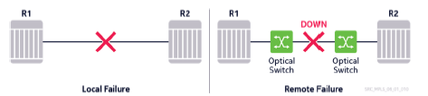
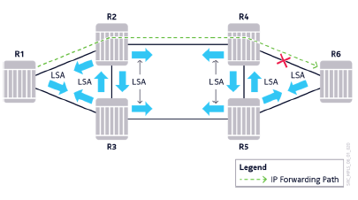

# Module 6 - Resiliency (slide 1-18 and 31-77)

## Section 1 - MPLS Convergence Overview

- Network reachability is a major concern 
- Failures can happen at any time
- Short reaction and restoration times are highly desirable 
- Convergence is the total time taken to reroute the traffic around thenetwork failure point 
- MPLS can bring superior convergence performance.

### Methods to Provide Core Netowrk Resilience

- Physical layer redundancy: Backup links, routers, router components and so on.
- Protocol redundancy: Failure detection mechanisms, timers, specialized algorithms, and so on.
- IGP can provide resilience using Loop-Free Alternate (LFA) and IP fast-re-route. (Will not be discussed further)
- Using MPLS with RSVP-TE, proactive measures can be taken before any failure is suffered
- Using LDP, the convergence times rely strictly on IGP convergence because of protocol dependence.

### Convergence Factors

- Failure Detection: Identifying and locating the failure
- Failure Propagation: Notifying other routers about the failure by disseminating the failure information
- ServiceRecover: Redirecting traffic to alternative paths and recovering services.

### Failure Detection
- Network failure must be detected before any action can be taken to recover the services
- Failure detection time is key to network convergence performance
- Detection time depends on the:
  - Nature and location of the failure
  - Mechanisms in place to detect the failure.
- The two types of failures are:
  - Local failure
  - Remote failure

### Local vs Remote failures

Local failures are immediately detected by routers:
  - When the port goes down at teh physical layer, all upper protocol layers are notified to trigger convergence.

In the case of a remote failure:
  - The link between two transmission devices goes down
  - The local router ports may stay up, if the transmission equipment does not propagate the failure
  - In that case, the routers need to rely on additional mechanisms, such as IGP or RSVP hellos, to detect that the adjacency is down.

### Failure Detection Mecahnisms at PRotocol Level

- IGP Hello: with default timers, it takes approx. 30 seconds to detect the adjacency going down.
- RSVP Hello: with default timers, it takes approx. 9 seconds to detect that the adjacency is down
- The minimum value for the IGP and RSVP Hello timer is one second
- Setting these timers values very low is not recommended because of control plan overhead
- Alternative mechanisms (preferred):
  - Bidirectional Forwarding Detection (BFD) - a lightweight Hello protocol, used as a hearbeat. Runs at IP-level
  - Ethernet in First Mile (EFM) - Standard Ethernet link-level OAM implementation. Also referred to as 802.3ah
  - Both BFG and EFM can provide sub-second detection times.

### Failure Propagation in IGP

- Using link-state routing protocols (OSPF and IS-IS), updates are event triggered
- LSAs are propagated through the network as soon as the failure is detected.

### Failure Propagation Using Secondary LSP-Paths

