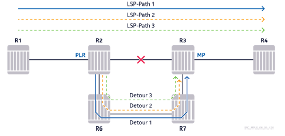
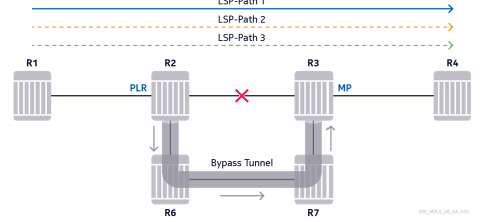
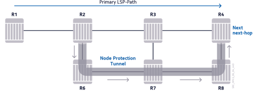
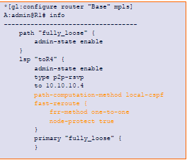
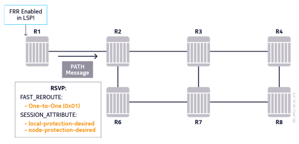

# Module 6 - Resiliency

## Section 1 - MPLS Convergence Overview (1-18)

- Network reachability is a major concern 
- Failures can happen at any time
- Short reaction and restoration times are highly desirable 
- Convergence is the total time taken to reroute the traffic around thenetwork failure point 
- MPLS can bring superior convergence performance.

### Methods to Provide Core Netowrk Resilience

- Physical layer redundancy: Backup links, routers, router components and so on.
- Protocol redundancy: Failure detection mechanisms, timers, specialized algorithms, and so on.
- IGP can provide resilience using Loop-Free Alternate (LFA) and IP fast-re-route. (Will not be discussed further)
- Using MPLS with RSVP-TE, proactive measures can be taken before any failure is suffered
- Using LDP, the convergence times rely strictly on IGP convergence because of protocol dependence.

### Convergence Factors

- Failure Detection: Identifying and locating the failure
- Failure Propagation: Notifying other routers about the failure by disseminating the failure information
- ServiceRecover: Redirecting traffic to alternative paths and recovering services.

### Failure Detection
- Network failure must be detected before any action can be taken to recover the services
- Failure detection time is key to network convergence performance
- Detection time depends on the:
  - Nature and location of the failure
  - Mechanisms in place to detect the failure.
- The two types of failures are:
  - Local failure
  - Remote failure

### Local vs Remote failures


Local failures are immediately detected by routers:
  - When the port goes down at teh physical layer, all upper protocol layers are notified to trigger convergence.

In the case of a remote failure:
  - The link between two transmission devices goes down
  - The local router ports may stay up, if the transmission equipment does not propagate the failure
  - In that case, the routers need to rely on additional mechanisms, such as IGP or RSVP hellos, to detect that the adjacency is down.

### Failure Detection Mechanisms at Protocol Level

- IGP Hello: with default timers, it takes approx. 30 seconds to detect the adjacency going down.
- RSVP Hello: with default timers, it takes approx. 9 seconds to detect that the adjacency is down
- The minimum value for the IGP and RSVP Hello timer is one second
- Setting these timers values very low is not recommended because of control plan overhead
- Alternative mechanisms (preferred):
  - Bidirectional Forwarding Detection (BFD) - a lightweight Hello protocol, used as a hearbeat. Runs at IP-level
  - Ethernet in First Mile (EFM) - Standard Ethernet link-level OAM implementation. Also referred to as 802.3ah
  - Both BFG and EFM can provide sub-second detection times.


### Failure Propagation in IGP


- Using link-state routing protocols (OSPF and IS-IS), updates are event triggered
- LSAs are propagated through the network as soon as the failure is detected.

### Failure Propagation Using Secondary LSP-Paths


- Only the Head-End router of the LSP is aware of the availability of a pre-configured secondary LSP-Path
- The Head-End router must be notified of any failure that affects the primary LSP-Path 
- The router that detects the failure sends a PATH ERROR or a RESV TEAR message

Operator can protect the primary path (at the Head-End) with secondary LSP-Path which can be either:
- **Cold-standby secondary paths** - The Head-End only signals these if a failure occurs on the primary path and teh Head-End cannot move the primary to another path
- **Hot-standby secondary paths** - Become oeprational even before any failure takes place.


### Failure Propagation Using Fast Reroute


- Using Fat Reroute, the router that detects the failure can take a local decision to recover the traffic
- A PATH ERROR or a RESV TEAR message is still sent to inform the LSP Head-End

Alternatively, Fast Reroute protection tunnels can be created on routers along the primary LSP-Path prior to any given failure. Should a link failure occur, the router that is connected to the failing resource can locally make a decision to recover the traffic; that is the closest point to the failure, and it is responsible for taking service recovery action.

The Head-End still needs to be informed of this decision as it may take further action to move the traffic to a better path. This will still send a RSVP PATH Error message towards the Head-End for this purpose.

### Service Recovery Using IGP


- Link-State Databases are updated with new LSA information
- All the routers make a new SPF calculation and re-evaluate their IP Forwarding Tables
- The whole convergence can take up to several seconds, depending on the size of the network, the number of routes, and so on.

This occurs after a failure propagations on all routers. 
- In the case of link-state protocols, when a new link-state update is received, a topology change is implied and all routers need to make a new calculation of the SPF algorithm to re-evaluate the path reachability to destinations in the network.
- Total network convergence only occurs when all routers reach new steady-state conditions after updating their Forwarding tables.
  - Traffic is prone to discards, black-holees, or loops during this time so it is essential to keep convergence times low.

### Service Recovery Using Secondary LSP-Paths


- When the Head-End receives the PATH ERROR/RESV TEAR messages, it switches the traffic over to the secondary LSP-Path.
- The key factor is the propagation time of the PATH ERROR/RESV TEAR message
- The switchover from the primary to teh secondary path is fast with minimal traffic loss.

Once notified of the failure impacting the primary LSP-Path, the Head-End performs a traffic switchover to the secondary LSP-Path, if it is already established.
- This is the case host standby secondary LSP-Path is enabled.
- The switchover is mostly hitless and there is no traffic loss in most of the cases

### Service Recovery Using Fast Reroute


- Using Fast Reroute, traffic is recovered in less than 50ms after the failure is detected.
- The first upstream router from the point of failure switches traffic to the backup tunnel that was established before the failure.

### LDP Convergence 

- LDP has a strong dependence on IGP
- LDP next-hop for a prefix must be the same as the IGP next-hop. Label switching cannot take place otherwise
- After failure detection, the most important factor is IGP convergence
- Using Liberal retention, routers keep the redundant labels from neighbors other than the IGP next-hop. This helps improve convergence times.

### LDP Convergence example on slide 18

----

## Section 3 - Secondary LSP-Path Protection with RSVP (31-77)

### Secondary LSP-Path Protection Overview

- Up to 8 LSP-Paths can be configured at the Head-End router of an LSP
- There can be only 1 primary, and up to 7 secondary, LSP-Paths
- Only one LSP-Path forwards the traffic at any time
- As long as it is operationally up, the primary path is always preferred
- If the primary path failes, one of the available secondary paths can forward the traffic

Can be configured as:
- Hot Standby Secondary 
- Non-Standby Secondary 

### Standby Secondary - Primary LSP-Path setup


```
lsp "toR6" {
    no shutdown 
    type p2p-rsvp
    to 10.10.10.6
    path-computation-method local-ospf
    primary "prim_path"{      
    }
    secondary "stdby_sec" {
      standby true
    }
}
```

- LSP is enabled
- Primary LSP-Path is signaled first

### Standby Secondary - Secondary LSP-Path setup


- Standby secondary is configured
- Signalled right after the primary LSP-Path 

This is configured by the secondary "stdby_sec" configuration from the section above this.

### Normal Conditions - Using the Primary Path


- As long as it is operationally up, the Primary LSP-Path forwards the traffic
- The standby secondary path is also established and remains ready, in case of a failure that affects the primary LSP-Path

 ### Failure Case - Switchover to Standby Secondary

 

 - R4 sends a path error message upon detecting the link failure 
 - As the Head-End router, router R1 is responsible for recovering the traffic
 - After receiving the path error message, R1 switches the traffic to the standby secondary path 

### Non-Standby Secondary - Primary LSP-Path Setup 


Similar to the previous scenario, we instead don't set standby to true for the secondary path.

### Failure Case - Non-Standby Secondary LSP-Path Setup


- R1 receives the path error message from R4
- Needs to signal the secondary LSP-Path to restore traffic
- Traffic is discarded until the secondary path is established.

### Failure Case - Switchover to Non-Standby Secondary LSP-Path

Once the secondary path is established:
- R1 switches traffic to the established path 
- Continuously tries to re-establish the primary path

### Primary LSP-Path Recovery with a Non-Standby Secondary 

Once the failure is removed, R1 re-establishes the primary path and switches the traffic back on it and PATH TEAR messages are sent upstream to tear down the non-standby secondary path.

### Secondary LSP-Path Selection - Overview
- As long as it is operationally up, t he primary LSP-path is always preferred
- Multiple secondary LSP-Paths can be configured
- If the priamry LSP-path goes down, traffic is switched over to one of the secondary LSP-Paths.
- There are two modes in selecting the secondary LSP-Path:
  - Default mode, without secondary path-preferences
  - Non-Default mode, with secondary path-preferences.

### Default Secondary LSP-Path Selection - Criteria

- Secondary LSP-Paths are used in the following order:
  - Standby secondary path
    - In case of multiple standby secondary paths, the one with the highest uptime is used
  - Non-standby secondary path
    - In case multiple non-standby secondary paths, the first one in the order of configuration is used.
- When an active secondary LSP-path fails, another available secondary LSP-path can be used
- If the previously failed secondary LSP-path is recovered, the router does not revert to it.

### Default Secondary LSP-Path Selection - Initial Condition


### Primary Down 


### Standby 1 Down


### Stamdby 1 Recovered


Once the primary finally comes back, traffic is immediately swapped back to the primary path.

### Secondary LSP-Path Selection Using Path-Preferences

- Path-preference can be defined for standby secondary LSP Paths
- This is not applicable for non-standby secondary LSP-Paths
- Possible values are from 1 to 255
- The lower configured value, the more prefereable the LSP-Path
- **Default value**: 255
- **The selection is preemptive**: If a standby secondary comes up witha  better preference, it becomes the active LSP-Path

### Standby Secondary Path Preference Case study (Slide 50 - 54)

### Maintaining Path Diversity with Secondary LSP-Paths

- Care should be taken to avoid sharing links between the primary and secondary LSP-Paths
- Multiple alternative solutions can exist, depending on the topology, administrative configuration, and so on.

Possible methods to achieve path diversity:
- Using Fully Strict Hop LSP-Paths
- Using Admin Groups
- Using Shared Risk Link Groups

### Using Fully Strict Hop Path Definitions for Path Diversity


- Primary and secondary LSP-Paths can be configured with fully strict hops
- **Higher administrative control** - Create exact, pre-determined paths for data flow
- **Less flexibility** - The LSP paths cannot be established if one of the strict hops go down
- Can be hard to manage and scale on a large network.

### Primary and Secondary Using Fully Strict Hop Paths


### Unutilized Links Using Strict Hop Paths


- Using strict hops, the LSP-Paths must go through the specified hops
- Alternative links cannot be utilized in case of failure (unless Fast Reroute is in place)

### Path Diversity Example Using Administrative Groups


- In this example, redundant links in the upper and lower planes are assigned to different administrative groups.
- Primary and secondary LSP Paths can be configured with loose hops that exclude either one of the groups.

### Using Administrative Groups for Path Diversity

The following configurations are examples of routers with links that are members of the adminsitrative groups:


- Redundant links in th eupper plane are members of the administrative gorup "UPPER"
- Redundant links in the lower plane are members of the administrative group "LOWER"

### Configuring LSP-Paths with Administrative Constraints

The following configuraiton is done at the Head-End router of the LSP, R1 in this example:


Other design solutions, using administrative groups are possible (using "include", "exclude", and so on).

### Diverse LSP-Paths Using Administrative Groups


- The primary LSP-Path can use any of the links in the upper plane.
- The secondary LSP-Path can use any of the links in the lower plane 

In this example, the Primary LS-Path can go through:
- R1-R2-R4-R6
- R1-R2-R7-R4-R6

The secondary LSP-Path can go through:
- R1-R3-R5-R6
- R1-R3-R8-R5-R6

### Using SRLG to Maintain Path Diversity with Secondary LSP-Paths

- Using administrative groups, primary and secondary LSP-Paths can use only a certain group of links
- SLRG feature gives the primary path freedom in making path decisions
- The secondary LSP-Paths are automatically disjoint from the primary LSP-Path, if configured for SRLG
- The rule for CSPF in this case is: Do not use any of the links that are in the SRLGs that the primary LSp-Path goes through.
- When the path-preferences of multiple standby LSP-Paths are equal, the SRLG-enabled standby LSP-Path(s) is preferred.

### Path Diversity Example using SRLG


- Redundant links in the upper and lower planes are assigned to different SRLGs
- In general, SRLG memberships can also be defined according to transmissions (L1) characteristics.

### Configuring Shared Risk Link Groups

The following configurations are examples of routers with links that are members of the SLRGs:


- Redundant links in the upper plane are members of the SRLG called "SRLG-U"
- Redundant links in the lower plane are members of the SRLG called "SRLG-L"

### Configuring Secondary LSP-Path with SRLG Constraint

The following configuraitons is done at the Head-End router of the LSP, R1 in this example:


- CSPF avoids the link that the primary goes through when calculating the secondary LSP-Path.
- The secondary path failes if it cannot avoid using links in the same SRLGs as the primary path.

### SRLG Example (Page 68 - 71)

### RSVP Sessions for standby Secondary paths

A separate RSVP session exists for each standby secondary LSP-Path, resulting in more resource use:


- The primary and secodnary LSP-Paths share the same Tunnel ID
- primary and secondary LSP-Paths have different LSP IDs

----

## Section 4 - RSVP Fast Reroute

### Fast Reroute Overview
- MPLS Fast Reroute (FRR) defines ways of automatically establishing protection paths before a failure.
- Allows for sub-50ms failover after link failure detection.
- Applicable for LSPs established using RSVP-TE
- CSPF plays an important role
- Allows proection to be applied as close to the point of failure as possible.

### FRR Protection Methods 
- Two methods:
  - One-to-One Backup
  - Facility Backup
- Each LSP can use only one method 
- The protection method needs to be specified in the confguration of the protected LSP
- FRR can only protect the primary LSP-Path of an LSP

### Fast Reroute One-to-One Protection Model 


- All three LSPs go through the same path
- They all request Fast Reroute One-to-One
- A separate protection tunnel is established for each LSP 
- The protection tunnel for one-to-oone is called a detour

### Fast Reroute Facility Protection Model 

- All three LSPs go through the same path
- Thy all request Fast Reroute Facility
- They can all be protected with the same protection tunnel 
- The protection tunnel for facility is called a Bypass Tunnel.

### FRR Protection Types
- From a topological perspective, both one-to-one and facility backup can protect different network elements:
  - Node Protection - Protects against the failure of the next downstream router.
  - Link Protection - Protects against the failure of the link to the next downstream router.

- Possible configuration for an LSP are:
  - One-to-one node protection 
  - One-to-one link protection 
  - Facility node protection 
  - Facility link protection 

### Fast Reroute Node Protection Model


- The primary LSP-Path has requested node protection 
- R2 establishes a protection tunnel that detours around the next downstream router, R3
- R3 and all its links are avoided on the protection tunnel path.

### Fast Reroute Link Protection Model 


- The Primary LSP-Path has requested link protection 
- R2 establishes a protection tunnel that detours around the link, to the next downstream router
- Only the link is avoided on the protection tunnel path

### Node and Link Protecction Types
- Default method is node protection
- if desired:
  - router attempts to establish a node protection tunnel 
  - If this cannot be accomplished, as a result of toplogical or other constraints, the router reverts to link protection.
  - In the background the PLR will try to find a new path to establish node protection every 60 seconds.
- Node protection can be disabled in the LSP configuraiton
  - In this case, the routers only attempt link protection.

### Fast Reroute Router Roles

- **Head-End Router** - where the primary (protected) LSP-Path is configured and where it originaltes
- **Tail-End Router** - Where the primary LSP terminates
- **Point of Local Repair (PLR)** - Where the protection tunnel originates 
- **Merge Point (MP)** - Where the protection tunnel terminates and merges into the original protected LSP-Path

### PLR and MP Roles of Routers in FRR

- PLR is the router where the protection tunnel originates. When the link failes, the LSP traffic is lcally recovered at this point
- Merge Point (MP) is the router where the protection tunnel terminates and merges into the original LSP-Path

R1 = Head-End
R2 = PLR
R3 = MP
R4 = Tail-End

The link between R2 and R3 is where we are trying to get the detour.


### Fast Reroute LSP-Path and CSPF Requirements

- For Fast Reroute to function, the Head-End needs to know the exact path of the LSP-Path before signaling it.
- This can be accomplished in serveral ways:
  - Path with fully strict hops (CSPF doesn't need to be enabled)
  - Path with loose hops (CSPF must be enabled)
  - Path with a mixture of strict and loose hops (CSPF must be enabled)
- For a rimary LSP-Path that has:
  - Loose-hops in path definition
  - Fast-Reroute enabled
  - CSPF disabled

The LSP will be in a **DOWN** operational state, with failure code "looseHopsInFRRLsp"

### Fast Reroute Configuraiton Requirements
- Fast Reroute is only configured on the LSP Head-End
- All routers along the primary LSP-Path are required to automatically establish protection tunnels, based on the configured method and type
- No extra configuration required on the other routers.

### Confgiuring an LSP for Fast Reroute One-to-One Confgiuring an LSP for Fast Reroute One-to-One



- One-to-one protection is the default method
- Node-protect is enabled by default 
- If the path definition contains loose hops, CSPF needs to be enabled.

### Fast Reroute Signaling Requirements 
- RSVP-TE ptorocol was extended to allow for the automatic signaling of the protection tunnels
- Introduces two objects:
  - Fast-Reroute Object
  - Detour Object (only for one-to-one method)
- The new objects are also carried in the RSVP Path messages

### Signaling the FRR Options
- When Fast Reroute is enabled on an LSP, the HEad-End includes an additional Fast_Reroute object in the PATH message
- The protection method is signaled in the Flags field of the Fast_Reroute object:
  - One-to-one (0x01)
  - Facility (0x02)
- In the Session_Attribute object of the PATH message, the router also indicates the following flags:
  - local-protection-desired
  - node-protection-desired (unless disabled in configuration)

### Signaling the FRR Options in the PATH message 



- LSP is confgiured for Fast Reroute with:
  - One-to-One
  - Node Proection

### Signaling the Primary LSP-Path

- After the LSP is enabled, primary LSP-Path is signaled first
- Fast Reroute protection is not attempted yet

### Timing for Fast Reroute Detour Creation
- Rotuers wait for the second RESV message before calculating and signalingthe detours
- This is to ensure that the primary LSP-Path is successfully established end-to-end

### Calculating the Protection Tunnels

- Upon receiving the second RESV message, all routers along the primary LSP-Path (except the Tail-End):
  - Assuming the PLR role
  - calculate separate protection tunnels that originate on themselves, onsidering the protection method and type.
- Protection tunnels are calculated locally on each PLR
- Calculation is done through the internal CSPF processs on each PLR
- Traffic-Engineering must beenabled in the IGP of all the routers.

### CSPF Calculation Constraints For FRR
- When computing a protection path on a PLR, the constraints for CSPF are:
  - Node-protect - To find a protection path for the primary LSP that avoids the downstream node and all its network links
  - Link-protect - to find a protection path for the primary LSP that avoids only the link connected to the downstream node
- The rotuer just before the Tail-End always performs link-protection (failure of the Tail-End router is catastrophic for the LSP)
- FRR protection tunnels do not follow any protected path constraints other than hop limit (if configured) and SLRG ("srlg-frr" option needs to be enabled in the global MPLS context, if that is desired)

