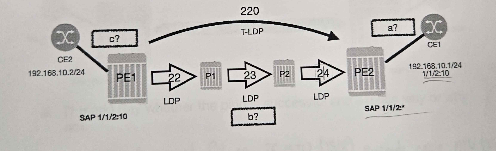
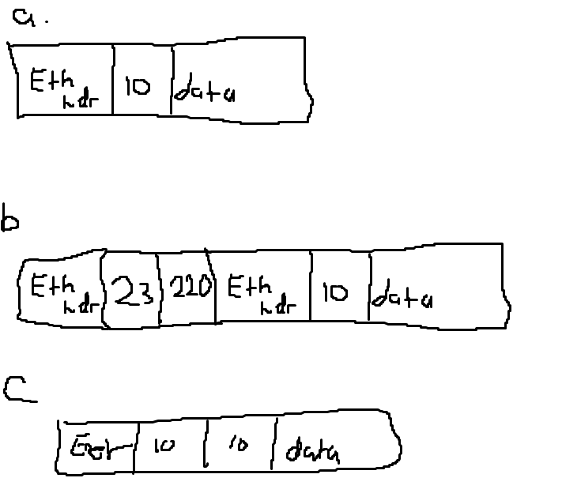
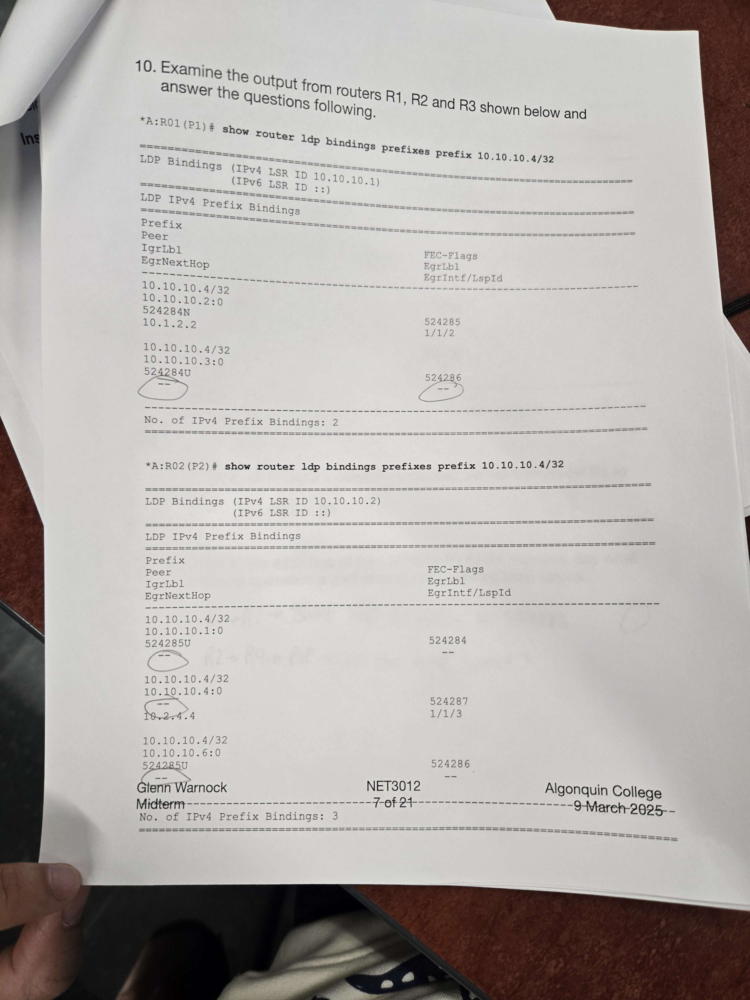
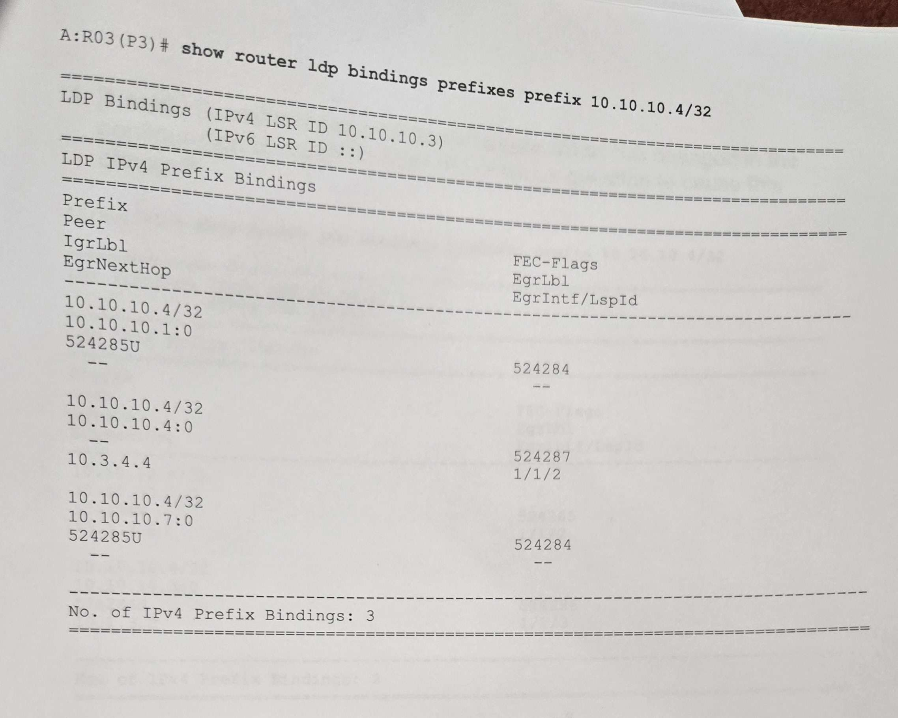
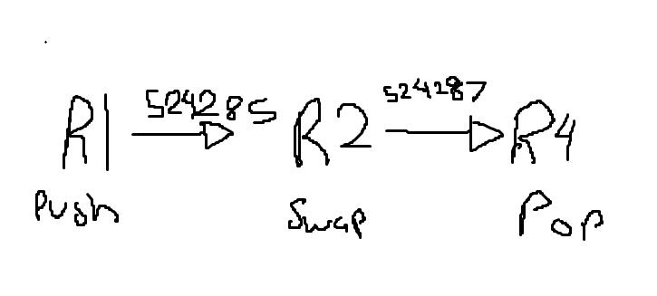
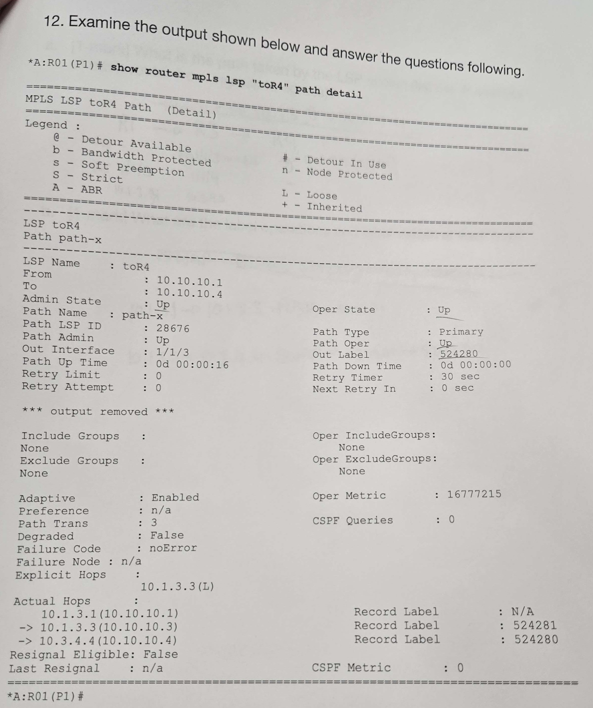
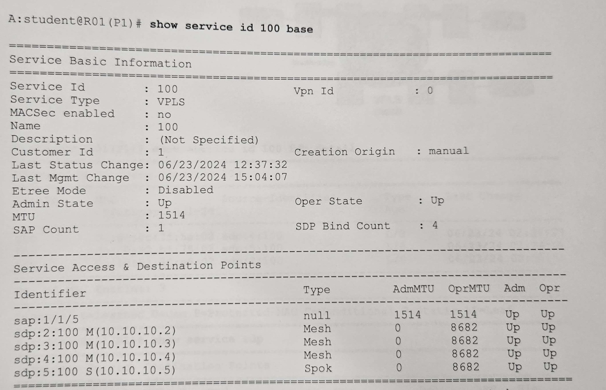
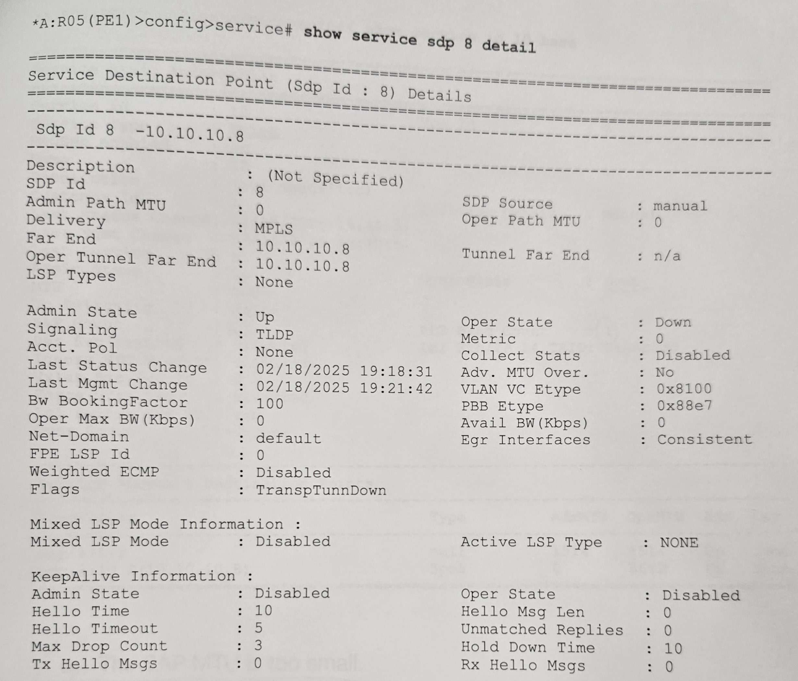
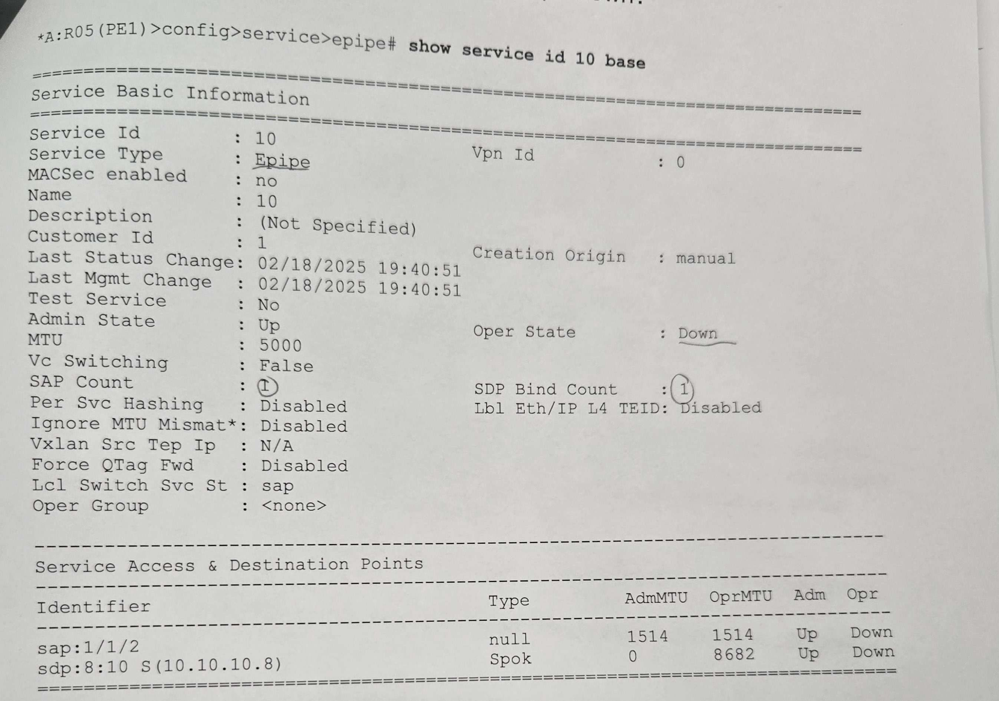

# Midterm/Exam review Looking over what I got wrong

## Short answers

### List 3 Types of MPLS routers and give the label operation performed

- iLER, performs push operations
- eLER, performs pop operations
- LSR, performs swap oeprations
----

### How many service tunnels can a single MPLS transport tunnel carry?

There is no limit

----

### Based on the following diagram:



a. Frame transmitted from CE1 to SAP on PE2

b. Frame transmitted from P2 to P1

c. Frame transmitted from PE1 to CE2



----

### All interfaces on the PE and P routers in our lab topology are configured for LDP except the diagonal P links (R1 to R4 and R2 to R3). The route table for R1 shows the diagonal link as the next hop to R4. From which router or routers will R1 install an egress label in the LFIB for 10.10.10.4?

There would be no egress label because LDP isn't configured on the interface that links R1 to R4.

----

### For each of the following RSVP-TE messages, say whether it flows downstream or upstream


1. Path - downstream
2. Resv - upstream
3. Path Tear - downstream
4. Resv Tear - upstream 
5. Path Err - upstream 
6. Resv Err - downstream 

**The error messages will always flow in the opposite direction of the creation and tears**

----

### How does the head-end router determine where to send the Path message to signal an LSP-Path when there are no hops specified in the primary path?

Follows the IGP path to the tail-end router

----

### List the Ethernet port encapsulation types supported on the Nokia 7750 SR and describe each one

note: This question focuses on the PORTS so don't consider services

null: no VLAN tags

dot1q: one VLAN tag

QinQ: two VLAN tags

----

### Examing the output from routers R1, R2 and R3 shown below and answer the questions following:





**b. For each hop of the LSP from R1 to R4 inclusive, say what the label operation is and what are the relevant label values**



----

### Examing the output from below. What changed in the configuration of R1 from the previous question to cause this change



**b. what are the label operations and label values at each hop?**

10.1.3.1 --> 10.1.3.3: PUSH --> 52481

10.1.3.3 --> 10.3.4.4: SWAP --> 524281 --> 524280

Label is POPPED at R4

**This only got me 0.5, pop was missing for full marks**

----

### In the VPLS on R1 shown below, a broadcast frame is received from R5 (10.10.10.5). Describe how the frame is flooded by R1



The frame gets flooded to all SAPS and Mesh SDPs

----

## Multiple choice

2. Which statement is correct regarding the definition of a P roter in an MPLS network providing VPN services?

```
a. P routers are service-aware
b. P routers are typically LERs
c. P routers perform label PUSH and POP operations
d. P routers perform label SWAP operations
```

Correct answer: d

6. A Nokia 7750 SR enabled with LDP has multiple equal cost paths to a given FEC. After ECMP is enabled on the router, which of the following statements will be FALSE?

```
a. Number of entries in teh LIB will increase
b. Number of entries in the FIB will increase
c. The router will have multiple LSP tunnels for the given FEC
d. The rotuer will generate a single label for the given FEC
```

Correct answer: a

8. What are the minimum two elements required to configure an RSVP TE LSP

```
a. A SAP and spoke-sdp or mesh-sip
b. A primary path and the address of the tail-end router
c. A primary and a secondary path 
d. an IGP and adminstratively enabling RSVP
```

Correct answer: b

10. An MPLS router is signalled a label of 3 for a FEC by its downstream router. What does the router do when it receives a data packet for this FEC from an upstream router? Choose the best answer:

```
a. Performs a label SWAP and trasmits the data packet with a label of 3
b. PUSHes a label of 3 and transmits the data packet
c. silently discards the packet
d. Sends the packet to teh CPM for OAM operations
e. it POPs the outer label and forwards the data packet to the downstream router
```

Correct answer: e

11. Which of the following is an advantage of LDP over RSVP-TE as an MPLS label signalling protocol

```
a. LDP requires fewer router resources than RSVP-TE
b. LDP supports the signalling of LSPs that follow a path other than the one provided by the IGP
c. LDP supports the signalling of one or more secondary LSP-Paths that can be used as a backup if the primary goes down
d. LDP supports the use of constraint-based routing the calculate diverse paths for its LSPs
```

Correct answer: a

12. When an operatre uses the *show router ldp bindings* command, which construct is viewed?

```
a. RIB
b. FIB
c. LIB
d. LFIB
```

Correct answer: c

14. Which of the following describes the purpose of ADSPEC in signalling an RSVP-TE LSP

```
a. ADSPEC allows the primary LSP-Path to follow a route other than the best IGP route
b. ADSPEC causes the routers to record the MTU at each hop in order to calculate the maximum path MTU of the LSP-Path
c. ADSPEC causes the head-end router to signal a secondary LSP-Path to be used as a backup if the primary fails
d. ADSPEC allows the LSP to be advertised by the IGP routing protocol so that it can be used for BGP shortcuts
```

Correct answer: b

16. Which of the following best describes a VPLS from the customer's perspective 

```
a. The service provider network appears as a single MPLS switch between customer locations
b. The service provider network appears as an Ethernet leased line between customer locations
c. The service provider network appears as an Ethernet switch between customer locations
d. The service provider network appears as an IP router between customer locations
```

Correct answer: c

17. Which of the following statements regarding MTUs for an epipe service is FALSE?

```
a. SAP MTUs must be greater than or equal to the service MTU
b. SDP path MTU must be greater than or equal to the service MTU
c. The SDP path MTU must be greater than or equal to the MTU of every network port used by the epipe
d. Epipe services configured on the same PE can have different service MTUs
e. None of the above is false
```

Correct answer: c

18. An epipe SAP on a PE router receives a frame carrying an IP packet from a CE router that is too large for the service. What action does the PE router take?

```
a. silently discards the frame
b. discards the frame and sends a notification to the CE router
c. fragments the frame as long as the do-not-fragment bit is not set
d. truncates the frame to fit the service MTU
```

Correct answer: a

19. SDP 8 on router R5 is down as shown below. Why?



```
a. An RSVP-TE LSP or LDP is not configured in the SDP
b. There is no SDP to this router configured on 10.10.10.8
c. There is no epipe to this router configured on 10.10.10.8
d. The epipe configured on 10.10.10.8 is using the wrong VC-ID
```

Correct answer: a

20. Consider the output below. Why is the epipe down?



```
a. The SAP MTU is too small
b. The spoke-sdp MTU is too small
c. Port 1/1/2 is shutdown
d. The epipe is administratively shutdown on this router
e. The epipe is administratively shutdown on the far-end router
```

Correct answer: a