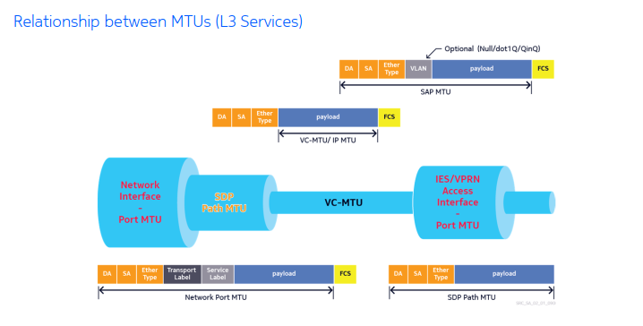
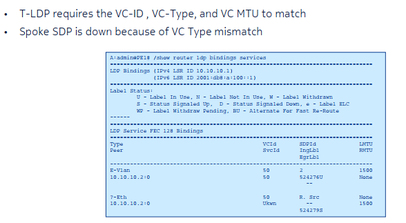

# Virtual Private Wire Services

----
# Section 1 - ePipe
----

## ePipe SAP Encapsulation

SAP encapsulation provides the router with a way of delineating services 

Ethernet encapsulation:
- Null - supports a single service on a port
- Dot1Q (802.1q) - supports multiple services for a single customer or multiple services for multiple customers
- Q-in-Q - provides a way to differentiate between customer services based on Q-tags

VLAN tag is used to determine which service the frame belongs to.

Multple SAPs can be defined on a single port for different services.

Null:
- Service is delimited by the port (SAP 1/1/1)
- The physical port belongs to a single service and a single customer
- VLAN tags are treated as customer data and are transparent on the network.

Dot1Q:
- Service is delimited by the VLAN tag (SAP 1/1/1:10)
- Allows more than one SAP to be configured on each physical port.

Q-in-Q:
- Service is delimited by 2 VLAN tags as port:outer.inter (SAP 1/1/1:10.100)
- Can specify a top and bottom VLAN ID to be matched.

----

## Ethernet Frame Encapsulation in an ePipe Service

Service delimiting VLAN tags are stripped at the SAP ingress along with the Frame Check Sequence (FCS) for the frame.

----

## Special SAP Values - dot1q

Default SAP (port:*)
- Receives all untagged frames and any frames with tag values that are not used as a service-delimiting value on another SAP
- VLAN tags are not stripped and are passed transparently
- e.g sap 1/1/3:*

Null SAP (port:0)
- Receives all untagged frames and all frames with a VLAN tag of 0
- e.g sap 1/1/3:0

Null and defaulat SAP are mutually exlusive on a port.

---- 

## Special SAP Values - Q-in-Q 

Wildcard SAP (port:x.*)
- Receives all frames with outer tag value x, regardless of the inner tag 
- Outer tag is stripped, and the inner tag is passed transparently.
- E.G - sap 1/1/3:10*

Null SAP (port:0.*)
- Receives all untagged frames and/or any frames with an outer VLAN tag of 0
- E.G - sap 1/1/3:0*

Null bottom SAP (port:x.0)
- Receives all frames with outer tag value x and inner tag of 0, or no bottom tag.
- E.G sap 1/1/3:10.0

An encapsulation of (port:*.* or port:*.x) is not valid on Nokia 750 SR 

----

## Ethertype Values 

IEEE 802.1Q specifies a hex value of 0x8100 in the Ethertype field to identify the frame as a tagged frame.

Can be configured as seen below:

Frames with non-matching Ethertypes are treated as untagged frames.

----

## Maximum Transmission Unit (MTU)

- Important in Layer 2 and 3 services
- For IP/MPLS networks, the following MTUs must be considered:
  - Access port or SAP MTU 
  - Service MTU and ip-mtu (vc-mtu)
  - SDP path MTU 
  - Network port MTU 
- Oversized frames arriving at a Layer 2 interface are not fragmented 
- Layer 3 services will fragment oversized packets for transmission but only for IPv4 traffic, since IPv6 does not fragment.

----

## SAP MTU 

- Defines the max packet size that can be handled by a SAP 
- Can be changed by configuriing the access port MTU 
- NULL encapsulated SAP has a default MTU of 1514
- dot1q encapsulated SAP has a default MTU of 1518
- Q-in-Q encapsulated SAP has a default MTU of 1522 
- When VLAN tags are service delimiting, they are stripped at the SAP

----

Service MTU 

- Defines max customer payload carried in a Layer 2 service 
- Default service MTU for an Ethernet VPN service is 1514 bytes:
  - 1514 bytes = 14 bytes Layer 2 header + 1500 bytes (payload)
- SAP MTU must be > or = service MTU 
- When VLAN tags are not service delimiting, they are not stripped at the SAP

----

## SDP Path MTU 

- Max packet size that can be sent over the SDP
- By default, SDP path MTU is derived from the network port MTU 
  - SDP path MTU = network port MTU - MPLS overhead - Layer 2 Header 
- Can be changed by configuring the network port MTU or SDP MTU 
- SDP path MTU does not have to match on both sides of the SDP 
- SDP path MTU >= service MTU 

----

## SDP Path and Network Port MTU Example

- gigabit Ethernet network port has a network port MTU of 9212 (default on Nokia 7750)
- if SDP uses MPLS encapsulation:
  - SDP path MTU = 9212 (net port MTU) - 14 (Ethernet header) - 4 (transport label) - 4 (service label) = 9190 bytes
- GRE encapsulation:
  - SDP path MTU = 9212 (net port MTU) - 14 (Ethernet header) - 20 (IP header) - 4(GRE header) - 4 (service label) = 9170 bytes

----

## SDP Path MTU Configuration

----

## Port MTU Default Values 

| Port Type        | Mode     | Encap Type  | Default (Bytes) |
|----------        |----------|----------   |----------       |
| Ethernet         | access   | null        | 1514            |
| Ethernet         | access   | Dot1Q       | 1518            |
| Ethernet         | access   | Q-in-Q      | 1522            |
| Fast Ethernet    | Data     | -           | 1514            |
| Gigabit Ethernet | Data     | -           | 9212            |

----

## VC-MTU for Layer 2 services 

- Maximum IP payload size to be carried in the service tunnel 
- Derived from the service MTU 
  - VC-MTU = service MTU - 14 (Ethernet overhead)
- Default L2 service MTU is 1514
- Negotiated by T-LDP and should match the router on the other side

----

## VC MTU for Layer 3 services 

- Layer 3 services do not have the concept of service MTU 
- VC-MTU is derived from the SDP path MTU 
  - VC-MTU = SDP path MTU - 14 (Ethernet overhead)
- VC-MTU can be manually set by configuring the IP-MTU for the Layer 3 service interface

----

----

# Page 124 - 141 for Case study

----

## SDP and VC Type 

- RFC 4448 defines two VC types for the Ethernet pseudowire
- VC type is specified when the SDP is bound to the service and is signaled by T-LDP.
  - Ether - specifies raw mode (default)
    - service delimiting VLAN tag is stripped at the ingress and is not carried across the ePipe 
- VLAN - specifies tagged mode 
  - VALN tag is carried in the Frame
  - Supported on Nokia 7750 SR, mainly for interoperability with systems that only support tagged mode 

----

## VC Type Configuration 

----

