# Service Overview and Implementation

Section 1

----

## Telecommunication Services Technologies

Service Provider Telecommunications Network:
- Internet Protocol (IP) is now the most used
- Ethernet Layer 2 transportation is also common
- Frame Relay and Asynchronous Transfer Mode (ATM) are less common
- Time Division Multiplexing (TDM) technologies are used in older networks.
- Sonet transportation is not common, now replaced with direct optical networks.

----

## Converged Network Infrastructure Requirements

Service providers consolidate the delivery of multiple service types onto a single network technology because of:
- High cost of maintaining and operating legacy networks
- The need to continue support high revenue legacy services (Frame Relay , Sonet, TDM)
- Consumer demand for new services that require higher bandwidth service at decreasing prices.

----

## Nokia solution: Nokia 7750 Service Router

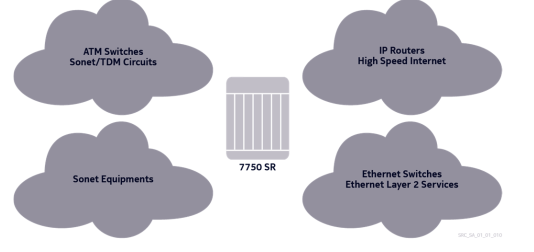

A single network device using IP/MPLS core network to support a range of Virtual Private Network (VPN) services.

----

## VPN Service

VPN is a network built over a shared infrastructure to provide private services to its users.
- Virtual - VPN to service provider is a virtual Network
- Private - VPN to customer is a private Network
- Network - A collection of devices that communicate with each other

Service:
- Logical entity that refers to a type of connectivity
- Each service is uniquely identified by a service ID.

----

## Provider Terminology CE, PE and P

Customer Edge (CE) Routers:
- Located at customer premises
- Service unaware

Provider Edge Routers (PE):
- Have at least one interface outside the provider domain facing the customer

Provider Core (P) Routers:
- Have all interfaces internal to the provider domain
- Service unaware, focus on forwarding packets through the tunnel with minimal configuration

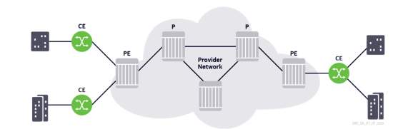

----

## Typical IP/MPLS Serice Network Components


- Service router functions as the PE router in a service Network
- PE router provides the itnerface beteween the customer network and the core service provider network.

---- 

## Nokia 7750 SR Service types

- VPN services:
	- Virtual private wire service (VPWS) - provides point-to-point service that emulates a leased line
	- Virtual private LAN services (VPLS) - provides a multipoint Ethernet service similar to an Ethernet switch
	- Virtual private router network services (VPRN) - provides a multipoint IP routed service
- Internet Enhanced Service (IES)
	- Provides the customer with a Layer 3 IP int to send and receive internet traffic
- Mirroring Services

----

## Virtual private wire service (VPWS)

- Layer 2 point-to-point service also known as Virtual Leased Line (VLL) Service
- defines a virtual point-to-point service that emulates a private leased line connection
- encapsulates customer data and transports it across the service provider's network in a Generic Routing Encapsulation (GRE) or MPLS tunnel

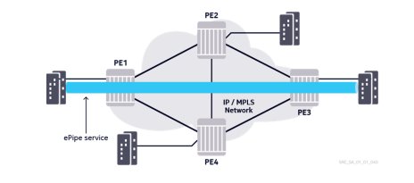

Types of VPWS:
- ePipe - emulates a point-to-point Ethernet service 
- aPipe - emaulates a point-to-point ATM service
- fPipe - emulates a point-to-point Frame Relay circuit
- cPipe - emulates a point-to-point TDM circuit
- iPipe - provides IP interworking capabilities between different L2 technologies.

VPWS Advantages:
Customer perspective:
- Supports ATM, Frame Relay, TDM or Ethernet
- Service provider (SR) network appears as a leased line between the two customer locations
- Transparent to customer data.

Service provider perspective:
- Only the PE device is aware of the service
- Scalability & flexibility
- Apply QoS, billing, ingress/egress traffic shaping, and policing on a per-service basis.

---- 

## Virtual Private LAN Service 

VPLS is an Ethernet service that connects multiple sites in a single switched domain over a provider-managed IP/MPLS network.

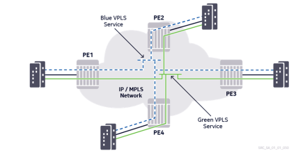

VPLS Advantages:
Customer perspective:
- It appears as if all sites are connected to a single-switched VLAN
- Transparent to the customer's data
- Can operate over a single local site or over multiple sites in different geographic locations
- Frames are only forwaded across the required links in the network

Service Provider's perspective:
- Similar to VPWS

----

## Virtual Private Router Network (VPRN)

Layer 3 service that connects multiple sites in a routed domain over a provider-managed IP/MPLS network.

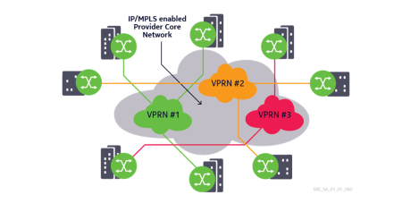

VPLS Advantages:
Customer perspective:
- Sites are connected to a private routed network that is administered by the service provider for that custmer only.
- There are separate and independent IP address plans for each VPRN 
- VPRN can operate over a single local site or over multiple sites in different geographic locations.

Service Provider's perspective:
- Similar to VPWS or VPLS service

----

## Internet Enhances Service (IES)

- IES provides customers with direct Internet access through a Layer 3 IP interface
- Customers see IES as providing a direct connection to the Internet
- Service provider can apply all billing, ingress/egress shaping, and policing to the customer.

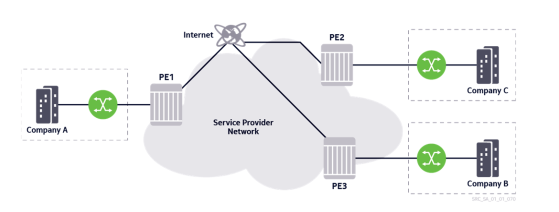

----

Section 2

----

## Transport Tunnels and Service Tunnels

- Transport tunnels are used to transmit customer data acros the service provider Network
- Either MPLS or GRE tunnels can be used as transport tunnels 
- Service tunnels are used to transmit customer data for a specific service 
- Multiple transport tunnels can be carried over a single network port
- Multiple service tunnels can be bound to the same transport tunnel

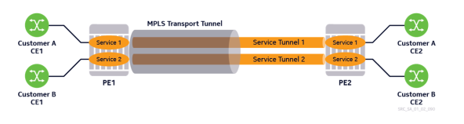

*Transport tunnels:*
MPLS
- Labels are signaled using the Resrouce Reservation Protocol - Traffic Engineering (RSVP-TE) or Label Distribution Protocol (LDP)
- Customer Data is MPLS encapsulated and forwarded to egress PE

GRE 
- Customer Data is IP encapsulated and forwarded to egress PE 
- The source IP address is the ingress PE router, and the destination address is the egress PE router
- this is typically used when some routers in the transport network do not support MPLS

*Service tunnels*
- Multiprotocol-Border Gateway Protocol (MP-BGP)
- Targeted-Label Distribution Protocol (T-LDP)

----

## Transport and Service Label Encapsulation 

*MPLS Encapsulation of VPN Service Traffic*

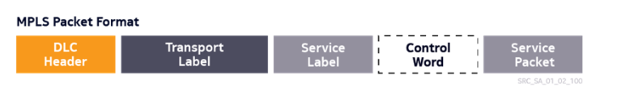

- DLC header - Layer 2 header used to transport the MPLS packet
- MPLS transport (outer) label - label signaled by the next-hop router 
- Service (inner) label - The service, or virtual circuit (VC) label identifies the service that the packet belongs to
- Control word - optional and primarily used for ATm or Frame Relay services
- Service packet - The customer data being transported by the service

GRE encapsulation of VPN service traffic

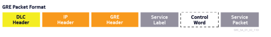

- IP header and the GRE header are used instead of the MPLS transport label 
- A service label is still required to demultiplex the packet to the appropriate service.
- The service provider routers use the IP header to route the packet across the network.

----

## MPLS Transport and Service Label Signaling

- LDP or RSVP-TE is used to establish label-switched paths (LSPs)
- LSPs can carry multiple service tunnels 
- Service labels, or VL labels, are used to encapsulate and identify customer traffic that belongs to a particular service 
- A service label is applied to the customer traffic before the transport label, or LSP label, is applied 
- VPLS and VPWS service labels are signaled using T-LDP 
- VPRN service labels are signaled using MP-BGP

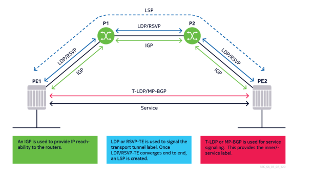

----

## Transport Label Signaling PE2 to PE1 

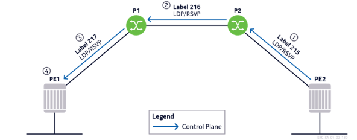

Transport labels are exchanged when the MPLS protocol (LDP/RSVP) is enabled:
1. PE2 advertises Label 215 to P2
2. P2 advertises Label 216 to P1
3. P1 advertises Label 217 to PE1 
4. A unidirectional LSP is now established from PE1 to PE2

----

## Service Label Signaling 

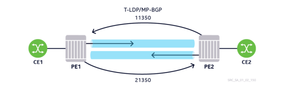

Service labels are exchanged when the service is created:
1. PE2 sends PE1 a service label (11350)
2. PE1 sends PE2 a service label (21350)
3. Unidirectional service tunnels are created 

----

## Transport Label and Service Label Use Case 

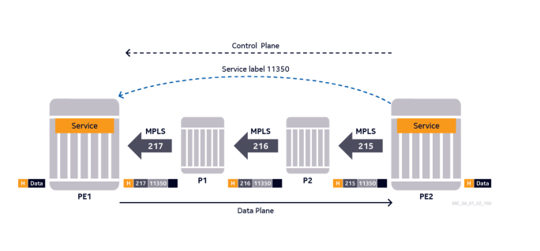

----

Section 3

----

## Service Components

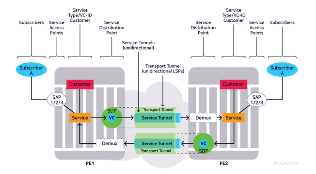

----

## Customers and Subscribers

Customers: those responsible for the service from an administrative standpoint.
- Customer ID is assigned when the account is created 
- ID must be associated with the service at the time-of-service creation
- can be associated with multiple services 
- ID *CANNOT* be changed once the service is created

Subscribers: users of the service (CE)

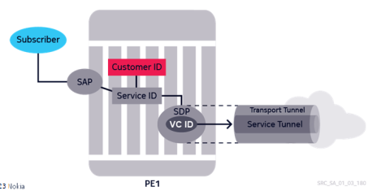

----

## Customer Creation Configuration 

```
(MD-CLI)
*(gl)[/configure]
service customer 100 

*(gl)[/configure service customer '100']
description *VPWS_Customer"

*(gl)[/configure service customer '100']
phone 1-111-111-1111

*(gl)[/configure service customer '100']
commit 

(My Guess on Classic CLI)

configure service customer 100 

description VPWS_Customer

phone 1-111-111-1111

exit 

admin save

(SHOW COMMAND)

show service customer 
```